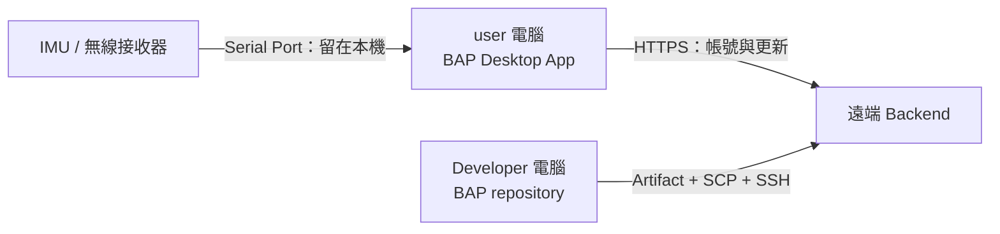
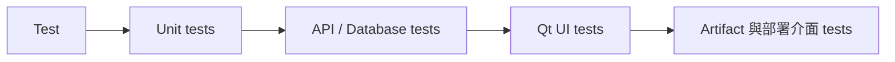
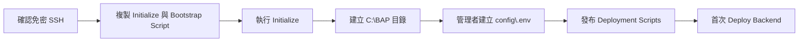
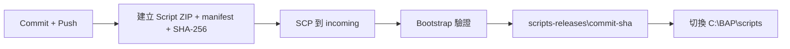
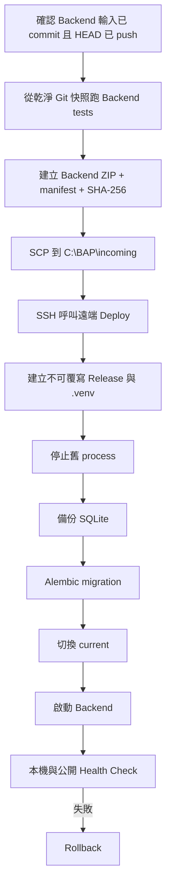

# BAP（Boxing Analysis Platform）

## 名詞定義

| 名詞 | 定義 |
|---|---|
| BAP | 本專案與 Desktop App 的名稱，全名是 Boxing Analysis Platform。 |
| Developer 電腦 | 保存 Git repository、撰寫程式、執行測試與發起部署的 Windows 電腦。 |
| 遠端 Backend | 位於 `140.114.75.84` 的 Windows Server，程式資料放在 `C:\BAP`。 |
| Initialize | 第一次準備遠端 Backend 目錄及檢查執行環境。平常更新不需要重跑。 |
| Backend Artifact | 從已 commit 的 Git 快照建立，檔名為 `bap-backend-<commit-sha>.zip` 的部署檔。 |
| Deployment Scripts Artifact | 只包含遠端部署 Scripts 的版本化 ZIP，不包含 Backend source code 或 Secret。 |
| `current\` | 遠端 `C:\BAP\current` Junction，指向目前運行的 Backend Release。 |
| Deploy | Developer 執行一個本機 Script，之後由 Script 自動 Build、SCP、SSH、Migration、切換與 Health Check。 |
| Rollback | 新版本失敗時，將 `current\` 指回上一版，必要時還原 SQLite 備份。 |
| Public API | Desktop App 使用的公開網址：`https://imuapp.lab2312.cs.nthu.edu.tw/api/`。 |

## 這個專案做什麼

BAP Prototype 包含三個主要部分：

1. **Desktop App**：user 安裝在自己的 Windows 電腦上，進行帳號登入、IMU 連線測試與進入拳擊測量項目。
2. **本機 IMU 服務**：只在 user 電腦讀取 Serial Port、解析 IMU 資料及產生暫存 CSV，不把 IMU 資料上傳到遠端。
3. **遠端 Backend**：提供帳號、登入狀態與 Desktop App 更新資訊 API，不接收 IMU 或拳擊測量資料。



## Repository 導覽

| 路徑 | 用途 |
|---|---|
| `bap_desktop/` | PySide6 Desktop App。 |
| `bap_backend/` | FastAPI Backend、帳號與更新 API。 |
| `bap_common/` | Desktop 與 Backend 可共同使用的規則。 |
| `anrot_imu_driver/` | Serial Port 與 ANROT IMU parser。 |
| `migrations/` | Alembic Database migration。 |
| `deployment/windows/backend/` | Backend Build、Deploy、Update、Start、Stop、Status、Health Check 與 Rollback Scripts。 |
| `packaging/windows/` | PyInstaller 與 Inno Setup Desktop App 包裝。 |
| `tests/` | 自動測試。 |
| `openspec/` | 需求、設計與工作清單。 |
| `dist/` | 本機 Build 產物，不提交 Git。 |

## 1. 安裝開發環境

**在哪裡執行：** Developer 電腦。  
**前置條件：** 已安裝 Git，repository 位於 `D:\repos\BAP`，並可使用 `C:\Users\user\.local\bin\uv.exe`。

```powershell
C:\WINDOWS\System32\WindowsPowerShell\v1.0\powershell.exe -NoProfile -Command "C:\Users\user\.local\bin\uv.exe sync --all-extras --group dev"
```

**預期結果：** 建立 `D:\repos\BAP\.venv` 並依 `uv.lock` 安裝相依套件。  
**常見錯誤：** 找不到 uv 時，先確認 `UvPath` 是否與電腦上的實際安裝位置相同；不要刪除 `uv.lock` 來避開版本問題。

## 2. Test

### 預設自動測試

```powershell
C:\WINDOWS\System32\WindowsPowerShell\v1.0\powershell.exe -NoProfile -Command "D:\repos\BAP\.venv\Scripts\python.exe -m pytest -q"
```

### 只測 Backend

```powershell
C:\WINDOWS\System32\WindowsPowerShell\v1.0\powershell.exe -NoProfile -Command "D:\repos\BAP\.venv\Scripts\python.exe -m pytest D:\repos\BAP\tests\backend -q"
```



**預期結果：** 所有測試通過；標記為 `hardware` 的測試預設不執行。  
**常見錯誤：** 若 Qt 在無畫面環境無法啟動，可在 CI 設定 `QT_QPA_PLATFORM=offscreen`。需要真實 IMU 的測試應在有硬體時另外執行，不可假裝已通過。

## 3. 第一次 Initialize 遠端 Backend

Initialize 只做一次。它會檢查 Python 3.12、uv、既有 `user` 帳號、OpenSSH Server 與 `administrators_authorized_keys`，然後建立 `C:\BAP` 目錄；不會建立新帳號、修改 SSH 設定或刪除既有資料。



### 3.1 從 Developer 電腦確認免密 SSH

```powershell
C:\WINDOWS\System32\WindowsPowerShell\v1.0\powershell.exe -NoProfile -Command "C:\WINDOWS\System32\OpenSSH\ssh.exe -o BatchMode=yes -o StrictHostKeyChecking=yes -p 22 user@140.114.75.84 whoami"
```

**預期結果：** 不詢問密碼，並顯示遠端 `user`。  
**常見錯誤：** `Permission denied` 代表 Public Key、`administrators_authorized_keys` ACL 或遠端帳號需要檢查；Host Key 錯誤時要人工核對 Fingerprint，不可停用 `StrictHostKeyChecking`。

### 3.2 複製並執行 Initialize

```powershell
C:\WINDOWS\System32\WindowsPowerShell\v1.0\powershell.exe -NoProfile -Command "C:\WINDOWS\System32\OpenSSH\scp.exe -P 22 D:\repos\BAP\deployment\windows\backend\Initialize-BapBackendHost.ps1 D:\repos\BAP\deployment\windows\backend\Update-BapDeploymentScripts.ps1 user@140.114.75.84:C:/Users/user/"
```

```powershell
C:\WINDOWS\System32\WindowsPowerShell\v1.0\powershell.exe -NoProfile -Command "C:\WINDOWS\System32\OpenSSH\ssh.exe -p 22 user@140.114.75.84 C:\WINDOWS\System32\WindowsPowerShell\v1.0\powershell.exe -NoProfile -ExecutionPolicy Bypass -File C:\Users\user\Initialize-BapBackendHost.ps1"
```

```powershell
C:\WINDOWS\System32\WindowsPowerShell\v1.0\powershell.exe -NoProfile -Command "C:\WINDOWS\System32\OpenSSH\scp.exe -P 22 D:\repos\BAP\deployment\windows\backend\Update-BapDeploymentScripts.ps1 user@140.114.75.84:C:/BAP/bootstrap/Update-BapDeploymentScripts.ps1"
```

**預期結果：** 遠端建立 `releases`、`incoming`、`config`、`data`、`logs`、`backups`、`scripts`、`scripts-releases`、`bootstrap` 與 `run`。重跑 Initialize 不會覆寫 `.env` 或 Database。  
**常見錯誤：** Python、uv 或 OpenSSH 檢查失敗時，先在遠端補齊前置條件，再重跑相同 Script。

### 3.3 建立正式 `.env`

由 Server 管理者直接在遠端建立 `C:\BAP\config\.env`。至少設定 production mode、外部 SQLite 路徑及足夠長的 JWT signing key。**不要把正式值貼進 README、Git、Artifact 或聊天記錄。**

## 4. Update Deployment Scripts

先 review、commit 並 push，然後在 Developer 電腦執行：

```powershell
C:\WINDOWS\System32\WindowsPowerShell\v1.0\powershell.exe -NoProfile -ExecutionPolicy Bypass -File "D:\repos\BAP\deployment\windows\backend\Publish-BapDeploymentScripts.ps1"
```



**預期結果：** `C:\BAP\scripts` 指向已驗證的 `scripts-releases\<commit-sha>`。  
**常見錯誤：** working tree 未 commit、HEAD 未 push、checksum 不符或 `known_hosts` 沒有固定 Host Fingerprint 時，Script 會在修改遠端前停止。

## 5. Deploy Backend

部署 Script **不會替 Developer commit**。先完成：

```powershell
C:\WINDOWS\System32\WindowsPowerShell\v1.0\powershell.exe -NoProfile -Command "C:\Program Files\Git\cmd\git.exe -C D:\repos\BAP status"
```

```powershell
C:\WINDOWS\System32\WindowsPowerShell\v1.0\powershell.exe -NoProfile -Command "C:\Program Files\Git\cmd\git.exe -C D:\repos\BAP push origin HEAD"
```

再執行：

```powershell
C:\WINDOWS\System32\WindowsPowerShell\v1.0\powershell.exe -NoProfile -ExecutionPolicy Bypass -File "D:\repos\BAP\deployment\windows\backend\Publish-BapBackend.ps1"
```



**預期結果：** 遠端 `current\` 指向新 commit，Backend 監聽 `0.0.0.0:12345`，本機與公開 `/health` 都成功。  
**常見錯誤：** Backend 相關檔案未 commit、commit 未 push、SSH Key 或 Host Fingerprint 不正確、Artifact checksum／manifest 不一致、Migration 或 Health Check 失敗。失敗時先閱讀 Developer terminal 與 `C:\BAP\logs`；不要直接覆寫 `current\` 裡的 source code。

## 6. Start、Stop、Status

以下指令在**遠端 Backend Terminal**執行。

### 背景啟動

```powershell
C:\WINDOWS\System32\WindowsPowerShell\v1.0\powershell.exe -NoProfile -ExecutionPolicy Bypass -File "C:\BAP\scripts\Start-BapBackend.ps1"
```

### 前景啟動，供除錯

```powershell
C:\WINDOWS\System32\WindowsPowerShell\v1.0\powershell.exe -NoProfile -ExecutionPolicy Bypass -File "C:\BAP\scripts\Start-BapBackend.ps1" -Foreground
```

### 查看狀態

```powershell
C:\WINDOWS\System32\WindowsPowerShell\v1.0\powershell.exe -NoProfile -ExecutionPolicy Bypass -File "C:\BAP\scripts\Get-BapBackendStatus.ps1"
```

### 停止

```powershell
C:\WINDOWS\System32\WindowsPowerShell\v1.0\powershell.exe -NoProfile -ExecutionPolicy Bypass -File "C:\BAP\scripts\Stop-BapBackend.ps1"
```

`Stop-BapBackend.ps1` 只會停止 PID file 指向且 command line 符合 BAP 的 Python process，不會停止電腦上所有 Python。Prototype 尚未建立 Windows Service，所以 Windows 重開機後要人工執行 Start。

## 7. Rollback

Deploy 的新版本 Health Check 失敗時會自動要求 rollback。若管理者需要人工切回指定上一版，在遠端執行：

```powershell
C:\WINDOWS\System32\WindowsPowerShell\v1.0\powershell.exe -NoProfile -ExecutionPolicy Bypass -File "C:\BAP\scripts\Rollback-BapBackendRelease.ps1" -PreviousRelease "C:\BAP\releases\<previous-commit-sha>" -DatabaseBackup "C:\BAP\backups\<backup-file>.db"
```

**預期結果：** 停止失敗版本、`current\` 指回上一版、必要時還原 Database、重新啟動並通過 Health Check。  
**常見錯誤：** 指定路徑不在 `C:\BAP\releases` 或 `C:\BAP\backups` 時，Script 會拒絕操作。

## 8. 驗證本機與公開 HTTPS

Backend 在 Server 內監聽 `0.0.0.0:12345`；Desktop App 不使用這個 bind address。既有 Caddy 負責將公開 HTTPS 轉送到 Backend。

在遠端 Server 執行：

```powershell
C:\WINDOWS\System32\WindowsPowerShell\v1.0\powershell.exe -NoProfile -Command "Invoke-WebRequest -UseBasicParsing http://127.0.0.1:12345/health"
```

在可連網電腦執行：

```powershell
C:\WINDOWS\System32\WindowsPowerShell\v1.0\powershell.exe -NoProfile -Command "Invoke-WebRequest -UseBasicParsing https://imuapp.lab2312.cs.nthu.edu.tw/health; Invoke-WebRequest -UseBasicParsing https://imuapp.lab2312.cs.nthu.edu.tw/openapi.json; Invoke-WebRequest -UseBasicParsing https://imuapp.lab2312.cs.nthu.edu.tw/docs"
```

若 Backend 尚未啟動，公開網址回傳 `502 Bad Gateway` 是預期現象。本專案的部署 Script不修改 DNS、TLS certificate、HTTPS termination 或 Caddy 設定。

## 9. Build Windows Desktop App

**在哪裡執行：** Developer Windows 電腦。  
**前置條件：** 已安裝 locked dependencies 與 Inno Setup 6。

```powershell
C:\WINDOWS\System32\WindowsPowerShell\v1.0\powershell.exe -NoProfile -ExecutionPolicy Bypass -File "D:\repos\BAP\packaging\windows\Build-BapDesktop.ps1"
```

**預期結果：** `dist\BAP\` 包含 one-folder App，`dist\BAP-Setup-<version>.exe` 是 per-user installer。user 不需要先安裝 Python。  
**常見錯誤：** 找不到 Inno Setup、PyInstaller build 失敗，或 build runner 的 PATH 混入不相容 DLL。Build spec 會避免把非 Windows 系統 ICU 誤包進 App。Prototype 預設未簽章，公開發行前請依 `docs/guides/desktop-release.md` 加入 code signing。

## 安全與資料邊界

- SSH／SCP 使用 Public Key 與 `BatchMode=yes`，不把密碼寫進 Script。
- Private Key、`.env`、Database、Log、Token 與 user 資料不得進入任何 Artifact。
- Backend Artifact 只來自已 commit 的 Git 快照；部署前還會確認 HEAD 已 push。
- Desktop App 的 IMU bytes、CSV 與拳擊測量資料不會上傳遠端 Backend。
- GitHub Actions 自動部署不在 Prototype 第一版；目前由 Developer 人工執行 Publish Script，之後的步驟自動完成。
