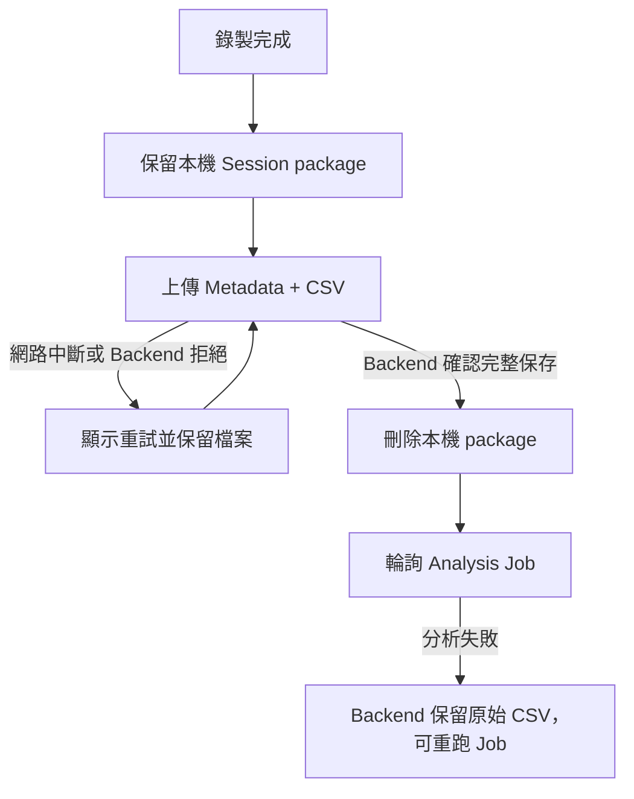

# Analysis Session 開發與除錯指南

## 名詞定義

| 名詞 | 定義 |
|---|---|
| 本機 E2E | 在開發者電腦以臨時 SQLite、真實 HTTP 與測試 Executor 驗證完整流程。 |
| Session package | Desktop 暫存目錄中的 `metadata.json` 與一份以上 CSV。 |
| Candidate E2E | PR CI 解壓 Backend Artifact、安裝 Desktop Installer 後執行的正式格式測試。 |
| Retry | Backend 尚未確認完整接收時，沿用同一份 Session package 再次上傳。 |

## 執行本機測試

在 repository 根目錄執行：

```powershell
C:\WINDOWS\System32\WindowsPowerShell\v1.0\powershell.exe -NoProfile -Command "& 'D:\repos\BAP\.venv\Scripts\python.exe' -B -m pytest tests\test_analysis_contracts.py tests\backend\test_analysis_sessions_api.py tests\desktop\test_analysis_recording.py tests\desktop\test_analysis_api_flow.py"
```

這組測試會使用臨時 Database、Fake IMU 與 tests 注入的 Reference Executor，不會連線 Production，也不會改動 `C:\BAP`。

## Session package 在哪裡

```text
%LOCALAPPDATA%\BAP\measurement-sessions\<session-id>\
├─ metadata.json
├─ imu_<csv-id>.csv
└─ imu_<csv-id>.csv
```

錄製中先使用 `.csv.part`。所有檔案完成並通過本機驗證後，才會出現 `.csv` 與 `metadata.json`。

## 上傳失敗如何處理



不要在收到 Backend 成功回應以前人工刪除 package。相同內容重送使用 package fingerprint 做 idempotency，不會建立第二份 Session。

## 常見檢查

1. `metadata.json` 內宣告的檔名必須與實際 CSV 完全相同。
2. 每份 CSV 的 row count、size 與 SHA-256 必須相符。
3. Input Binding 只能引用同一 Session 宣告的 CSV ID。
4. Desktop 與 Backend 必須支援相同的 Analysis Type 與 spec version。
5. Production 未註冊 Executor 時，看到「待開發」是預期行為，不應用 Reference Executor 產生假結果。
