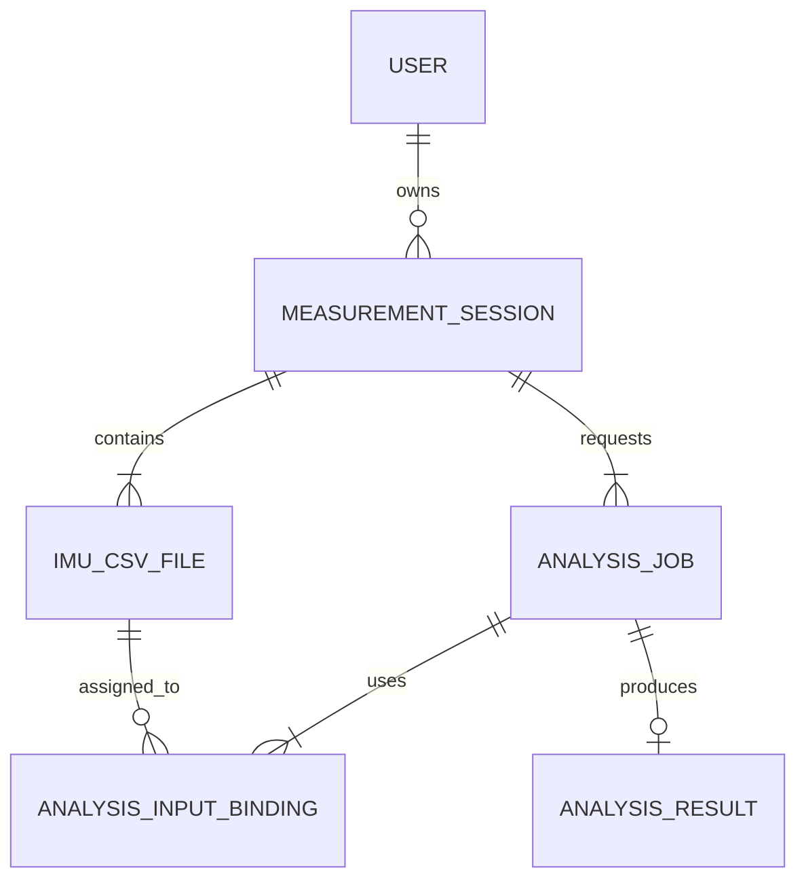
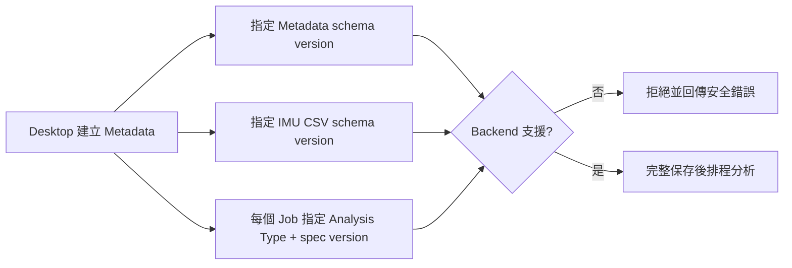

# 拳擊分析 Session 與資料契約

## 名詞定義

| 名詞 | 定義 |
|---|---|
| Session | user 從開始到結束的一次測量；可包含多份 IMU CSV 與多個 Analysis Job。第一版 UI 每次只建立一個 Job。 |
| Analysis Specification | 前後端共同遵守的分析規格，定義 Analysis Type、版本、Input Roles 及 Result 欄位。 |
| Analysis Job | Session 內的一項 Backend 分析要求。 |
| Input Role | 一顆 IMU 在某個分析中的用途，例如 `left_wrist`。 |
| Input Binding | 將 Input Role 指向本 Session 某份 CSV 的對應關係。 |
| Executor | 真正執行某個 Analysis Type 與版本的 Backend 程式。 |
| Common IMU CSV | 所有拳擊分析共用的原始 IMU 資料格式。 |
| Reference Executor | 只在 automated tests 注入的測試分析器；Production 不會載入。 |

## 資料關係



每顆 IMU 產生一份 CSV；同一份 CSV 可以提供給同一 Session 的不同 Analysis Jobs，但同一個 Job 預設不能把一份 CSV 同時當成左右手。

## Common IMU CSV version 1

version 1 固定有 23 欄：

```text
sample_index, packet_index, elapsed_us, device_time_ms, frame_type,
acc_x_g, acc_y_g, acc_z_g,
gyro_x_dps, gyro_y_dps, gyro_z_dps,
mag_x_ut, mag_y_ut, mag_z_ut,
roll_deg, pitch_deg, yaw_deg,
quat_w, quat_x, quat_y, quat_z,
temperature_c, pressure_pa
```

- 一列只代表一顆 IMU 的一幀資料。
- `sample_index` 從 0 逐列增加。
- 同一 Session 的所有 CSV 共用 `elapsed_us` 起點。
- Gateway 同一 packet 的不同 Nodes 使用相同 `packet_index`、`device_time_ms` 與 `elapsed_us`。
- 裝置沒有提供的值留空，不填入猜測值。
- Backend 會驗證 UTF-8、header、row count、檔案大小及 SHA-256。

## 版本規則



新增或改變欄位意義時必須建立新版本，不能偷偷改寫既有版本。Backend 版本仍以 Git SHA 識別。

## Production 邊界

Production App factory 只有 Analysis Specifications，預設沒有任何真正的拳擊 Executor。因此 Backend capability 會回報 `executable: false`，Desktop 會顯示待開發且不開始正式錄製。未來完成真實演算法後，才可明確註冊對應 Executor。
