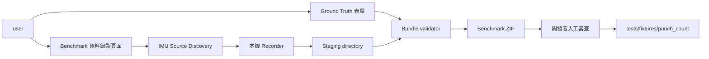
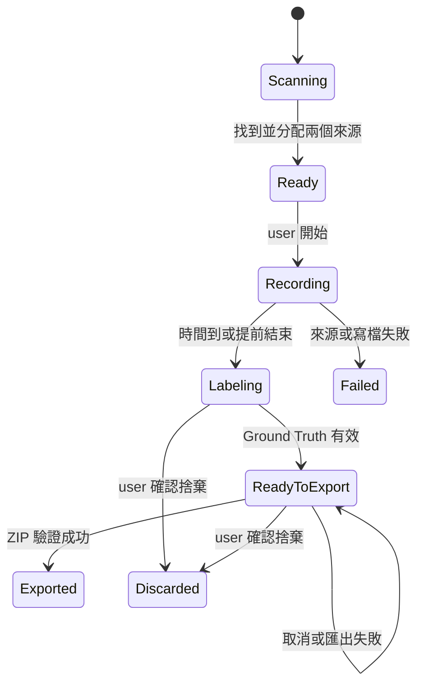

## 名詞定義

| 名詞 | 定義 |
|---|---|
| Recorder state | Benchmark 頁面當下的 scanning、ready、recording、labeling、ready-to-export 或 failed 狀態。 |
| Staging directory | App 在完成匯出前暫存本次 Metadata 與 CSV 的本機資料夾。 |
| Atomic export | 先建立並驗證暫存 ZIP，成功後才改成 user 指定檔名的寫入方式。 |
| Bundle validator | 在匯出前後檢查 ZIP 內容、Metadata、CSV schema 與 checksums 的共同驗證元件。 |

## 背景

動機與範圍請參閱 `proposal.md`，可驗證行為請參閱本 Change 的 capability specs。

Desktop 已有 IMU source discovery、左右手 Input Role selector、每顆 IMU 各自寫入 Common IMU CSV 的 recording service，以及本機 Session staging directory。正式分析頁面錄製後會建立 Analysis Session 並上傳 Backend；Benchmark Recorder 必須重用可信的擷取能力，但停止在本機匯出，不得誤用正式 API 或 Database。

第一版只建立 `punch_count` Shadow boxing labeled data。這個工具會改動 Desktop UI，實作時必須同步提升 `bap_desktop/VERSION`。

## 目標／非目標

**目標：**

- 讓 user 從既有 IMU 探索結果可靠地分配左右手腕。
- 以明確狀態引導限時錄製、人工標記、檢查與匯出。
- 產生 self-contained、versioned、可用 checksum 驗證的 ZIP。
- 讓匯出格式能直接轉入 punch-count Benchmark loader。
- 保護尚未匯出的資料，並避免把帳號或 Secret 寫進 bundle。

**非目標：**

- 自動把錄製資料上傳 Backend、GitHub 或 repository。
- 在 Recorder 頁面執行或顯示正式出拳次數分析。
- 第一版支援其他拳擊分析項目、任意 Input Roles 或影片標記。
- 自動判斷 Ground Truth。
- 取代正式拳擊 Session page。

## user 與元件關係



## 決策

### 1. 將 Recorder 放在獨立「開發工具」區域

App shell 新增「開發工具」標題與「Benchmark 資料錄製」入口，不把它列成第六個拳擊分析項目。頁面會固定顯示：

```text
用途：出拳次數 Benchmark
動作：Shadow boxing
輸入：左手腕、右手腕
輸出：本機 ZIP，不會上傳 Backend
```

這可降低一般 user 把人工 Ground Truth 當作 Backend 分析結果的風險。第一版仍要求登入，沿用現有 App shell 與導覽生命週期，不另外建立第二套未登入 shell。

### 2. 重用 discovery 與 recording primitives，不重用正式 upload coordinator

頁面進入後呼叫既有全 Port 自動探索，以 921600 baud rate 找出 wired IMU 或 wireless receiver Nodes。來源選擇器沿用正式拳擊頁面的 `ImuSource` 身分規則：

- wired：Port；
- wireless：Port、Group ID、Node ID。

錄製核心從現有 `LiveAnalysisRecording` 抽出可重用的「多來源 Common IMU CSV capture」邊界。正式 Session coordinator 在 capture 後建立可上傳 Metadata；Benchmark coordinator 則建立 Benchmark Metadata。兩者共用 serial、parser、clock、writer 與 source assignment validation，但 Benchmark 路徑不建立 Analysis upload request，也不呼叫 Backend。

不直接呼叫正式 Session upload 後再下載，因為這會把開發資料放進 Production Database、需要網路，也違反本機與隱私邊界。

### 3. 使用明確 Recorder state machine



Page controller 只允許目前 state 對應的主要操作。自動 stop 與提前 stop 共用 single-finalization guard。離開頁面或關閉 App 時，`Labeling` 與 `ReadyToExport` 必須先提示匯出或捨棄。

### 4. Benchmark Metadata 使用獨立 version 1 schema

Benchmark bundle 不是可直接上傳的 Analysis Session package，因此使用獨立 schema，避免正式 Backend 誤收 Ground Truth 或開發備註。建議模型放在共用、無 Qt dependency 的模組，供 Desktop exporter 與 pytest loader 使用。

主要結構：

```json
{
  "benchmark_schema_version": 1,
  "imu_csv_schema_version": 1,
  "session_id": "uuid",
  "analysis_type": "punch_count",
  "activity_type": "shadow_boxing",
  "requested_duration_seconds": 60,
  "actual_duration_seconds": 47.3,
  "stop_reason": "ended_by_user",
  "desktop_version": "x.y.z",
  "inputs": [
    {
      "input_role": "left_wrist",
      "csv_id": "uuid",
      "filename": "imu_<uuid>.csv",
      "source": {
        "connection_type": "wireless_receiver",
        "port": "COM3",
        "baud_rate": 921600,
        "group_id": 1,
        "node_id": 2
      },
      "row_count": 18920,
      "size_bytes": 2150000,
      "sha256": "..."
    }
  ],
  "ground_truth": {
    "left_punch_count": 12,
    "right_punch_count": 15,
    "total_punch_count": 27
  },
  "notes": "選填"
}
```

正式欄位名稱與型別只由此 schema 定義一次；UI 與 pytest 不各自拼 JSON。Ground Truth 沿用 Analysis Result 的三個欄位名稱，降低轉入 Benchmark manifest 時的轉換錯誤。

Metadata 不包含登入身分、host name 或絕對本機路徑。Session ID 與 CSV IDs 使用隨機 UUID，只識別技術資料。

### 5. 每個 bundle 固定一份 Metadata 與兩份 CSV

ZIP 內容採 flat layout：

```text
bap-punch-count-benchmark-<UTC timestamp>-<short session id>.zip
  metadata.json
  imu_<left csv id>.csv
  imu_<right csv id>.csv
```

Flat layout 方便人工打開、跨平台解壓與 pytest 載入。Metadata filename 固定為 `metadata.json`；CSV filename 由不可變 CSV ID 產生，不把 COM Port、Group ID 或 Node ID 放入檔名，避免重新接線後以檔名誤判身分。

### 6. 先驗證 staging，再以 atomic export 寫入目的位置

錄製資料先位於 User Data Root 的：

```text
<BAP user data>/temp/benchmark-recordings/<session-id>/
```

Export service 依序：

1. finalize 兩份 CSV；
2. 以共同 validator 檢查 header、row count、size、SHA-256、角色與 Ground Truth；
3. 在 user 選擇的目的資料夾建立唯一 `.partial` ZIP；
4. 重新打開 ZIP，檢查 entry names、Metadata 與每份 CSV checksum；
5. 驗證通過後，以 replace／rename 切換為最後檔名；
6. 保留成功畫面與檔案位置，之後才清除 staging。

取消檔案對話框或寫入失敗時不清除 staging。partial file 會在同次錯誤處理中刪除；若無法刪除，使用不會被誤認為正式 ZIP 的 `.partial` 副檔名並在 UI 顯示位置。

不把整個 ZIP 先放在 User Data Root 再跨磁碟 rename，因為跨 volume 不能保證 atomic rename。

### 7. Source-level tests 使用 Fake IMU，真實硬體另做人工驗證

Automated tests 分三層：

- schema tests：有效／無效 Metadata、Ground Truth、role duplication、隱私欄位；
- service tests：Fake wired／wireless sources、時間到、提前結束、single finalization、I/O failure；
- Qt tests：state、按鈕、倒數、離開未匯出提示與儲存對話框取消。

Exporter contract test 會解壓 ZIP 並重新計算 CSV checksums。這些測試不需要實體 IMU，也不呼叫 Production Backend。

人工硬體驗證至少包含：

1. 同一 Gateway 的兩個 Nodes；
2. 兩個有線 Ports；
3. 一個來源中途斷線；
4. 成功匯出後由 Benchmark loader 讀取。

### 8. 與 Punch Count Change 保持單向相容

這個 Change 的 bundle schema 會輸出 `punch_count` Benchmark 需要的角色與 Ground Truth，但不 import Production Executor。本 Change 先把 duration／capture primitive 抽成共用服務並實作 Recorder，不複製 serial read loop。後續 `implement-punch-count-analysis` 只重用這個邊界，並以 Recorder 產生且經人工審查的資料驗證演算法。

## 風險／取捨

- **[user 輸入錯誤 Ground Truth]** → 匯出前顯示左右手、總數與來源摘要供確認；加入 repository 前仍需人工 review。
- **[開發工具讓一般 user 困惑]** → 放在獨立導覽區，清楚顯示「不會產生分析結果」與「不會上傳」。
- **[App 關閉造成未匯出資料遺失]** → 對 unsaved recording 提示匯出或確認捨棄，匯出失敗保留 staging。
- **[ZIP 在寫到一半時被誤認為完成]** → 使用目的資料夾內的 `.partial` 與 export 後重新驗證。
- **[長時間 CSV 讓 repository 與 CI 膨脹]** → Recorder 不自動 commit；開發者只挑選具代表性的 cases，較大研究資料另行保存。
- **[兩個 active Changes 同時修改 recording code]** → 先完成共用 capture／duration 邊界，再套用 Recorder；保持兩個 Change 的 commits 可追溯。

## 遷移計畫

1. 先在本 Change 抽出共用 capture 與 duration 邊界，讓後續 Punch Count Change 重用。
2. 新增 Benchmark Metadata model、validator、staging 與 atomic ZIP exporter。
3. 新增 Recorder state coordinator 與 Fake IMU service tests。
4. 新增 App shell 導覽與自適應、可鍵盤操作的 Recorder UI。
5. 提升 Desktop version，執行完整 source-level 與 Windows Installer tests。
6. 使用真實 wireless 與 wired IMUs 完成人工錄製、Ground Truth 與匯出驗證。
7. 人工審查輸出的 bundle，再選擇性加入 punch-count Benchmark fixtures。

Rollback 只需移除或停用 Desktop 導覽入口；Recorder 不修改 Backend 或 Production Database。已匯出的 ZIP 保持可攜，不依賴 App 繼續存在。