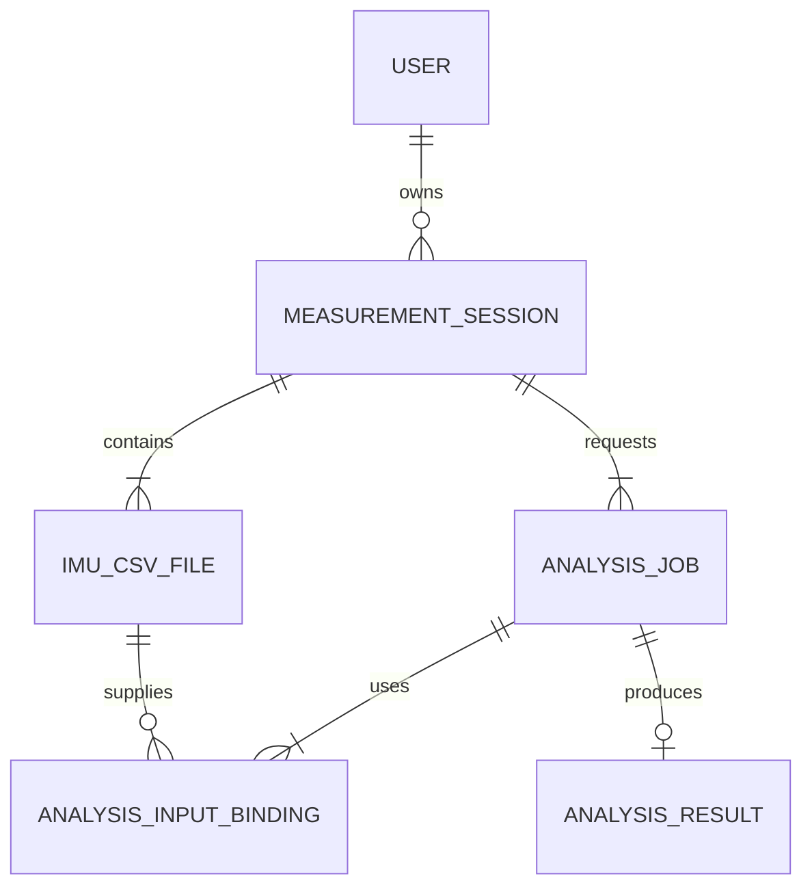
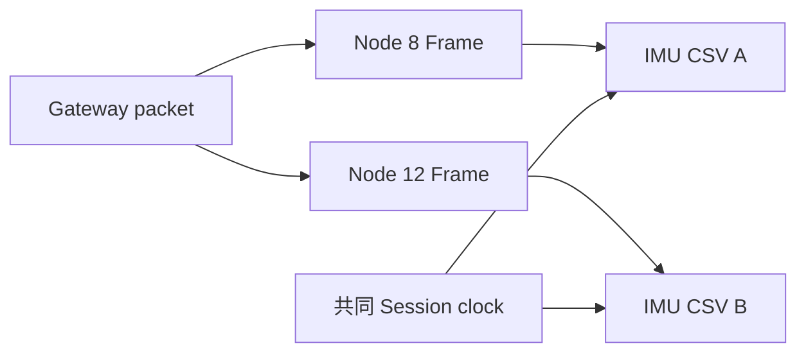
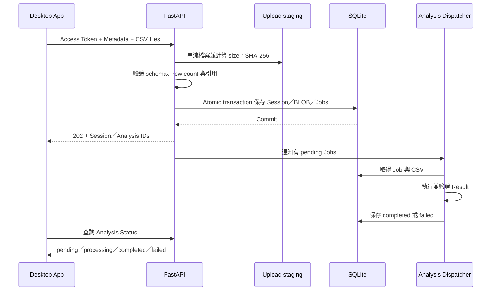
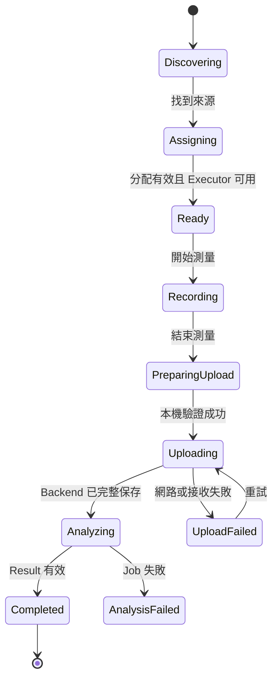

## 名詞定義

| 名詞 | 定義 |
|---|---|
| Contract | Desktop App 與 Backend 都必須遵守、可以自動驗證的資料格式與規則。 |
| Analysis Registry | Backend 用 Analysis Type 與 Specification version 找到對應 Executor 的登錄表。 |
| Analysis Dispatcher | 從 Database 取得待處理 Analysis Job，呼叫 Executor 並更新狀態的背景元件。 |
| Reference Executor | 只在自動測試使用、用來證明完整流程可以產生 Result 的替代 Executor。 |
| Upload staging | Backend 驗證上傳內容前使用的暫存位置，不是正式 Database。 |
| Atomic transaction | 所有相關資料全部成功才提交，任何一步失敗就全部回復的 Database 操作。 |

## Context

目前 `PunchItemPage` 會執行三秒 IMU 探索、依 `PunchItemDefinition` 顯示位置選擇，完成後只顯示「待開發」。IMU diagnostics 已能將有線與無線 Frames 寫成 CSV，但其用途是逐 Port 診斷，無線格式是一列包含最多 16 個 Nodes，不適合直接作為跨分析共用格式。

Backend 目前只有帳號、Refresh Session 與 Desktop Release 資料，使用 FastAPI、SQLAlchemy、Alembic 與 SQLite。正式 Backend 以單一 Uvicorn process 在 Windows Server 前景 Terminal 執行，Caddy 已負責外部 HTTPS 與 Reverse Proxy。

本 Change 橫跨 Desktop、共用契約、Backend API、Database 與背景工作，因此需要先固定模組邊界、資料生命週期及失敗復原方式。需求動機請見 `proposal.md`，可觀察行為請見本 Change 的 capability specs。

## Goals / Non-Goals

**Goals:**

- 讓一顆 IMU 對應一份版本化 Common IMU CSV，而且同一 Session 的檔案可以互相對齊。
- 讓前後端使用同一份 Analysis Specification 與 Session Metadata models。
- 將 Session package 安全、可重試且完整地保存到 SQLite。
- 用可替換 Executor 與非同步 Job lifecycle 將資料收集和演算法分開。
- 讓自動測試以 Reference Executor 走完 Desktop 錄製、HTTP 上傳、Backend 保存、分析及 Result 顯示。
- 保留目前一次只選擇一個分析項目的 UI，但讓 Backend schema 原生支援多個 Analysis Jobs。

**Non-Goals:**

- 不定義出拳次數、速度、力量、軌跡或拳種辨識的運算方法。
- 不向 user 顯示 Reference Executor 的測試結果。
- 不新增同一 Session 同時勾選多個分析項目的 UI。
- 不把 IMU CSV 上傳到 GitHub、外部 Object Storage 或第三方分析服務。
- 不改變 IMU 連線狀態頁面的診斷 CSV。
- 不建立分散式 Queue、獨立 Worker service 或多機分析架構。

## Decisions

### 1. 以「Session → CSV files／Analysis Jobs → Input Bindings → Result」作為核心模型



Desktop 第一版建立的 `analyses` 陣列只有一筆，但 API 與 Database 不加入「只能一筆」的限制。同一份 CSV 只保存一次，不同 Analysis Jobs 以 Bindings 重複引用。

替代方案是讓每種分析建立自己的 Session 與 CSV 副本；雖然較容易開始，但日後同場多分析會重複錄製或複製大量資料，因此不採用。

### 2. 共用契約放在 `bap_common`，實際 I/O 留在 Desktop 與 Backend

建議結構：

```text
bap_common/
├─ analysis_contracts.py       # Analysis Specification、Input Role、Result 驗證
├─ analysis_session.py         # Session Metadata、CSV descriptor、Input Binding models
└─ imu_csv.py                  # version 1 header、欄位與逐列驗證規則

bap_desktop/
├─ services/
│  ├─ common_imu_recorder.py   # AnrotFrame → 每顆 IMU 一份 CSV
│  ├─ analysis_session.py      # Session lifecycle 與本機暫存資料
│  └─ analysis_api.py          # capabilities、multipart upload、status query
└─ ui/punch_items/
   ├─ page.py                  # 探索與 IMU 分配
   └─ session_page.py          # 錄製、上傳、分析狀態與 Result 容器

bap_backend/app/
├─ api/v1/
│  ├─ analysis_capabilities.py
│  └─ measurement_sessions.py
├─ analyses/
│  ├─ base.py                  # Executor protocol
│  ├─ registry.py
│  └─ dispatcher.py
├─ models/analysis.py
├─ repositories/analysis_sessions.py
├─ schemas/analysis_sessions.py
└─ services/analysis_sessions.py
```

`bap_common` 不讀取 serial port、不呼叫 HTTP，也不存取 Database。這讓相同資料可以在兩端用同一套純資料驗證，避免複製 header 或 enum。

替代方案是在 Desktop 與 Backend 各寫一份 Pydantic schema；這容易在改版後產生版本漂移，因此不採用。

### 3. 每顆 IMU 一份 long-form CSV，靜態來源資料放 Metadata

Common IMU CSV version 1 使用 specs 指定的 23 欄。CSV row 只保存會隨 Frame 改變的時間與感測資料；Port、連線方式、baud rate、Group ID、Node ID、CSV ID、row count、大小與 SHA-256 放在 Metadata descriptor。



無線同一 packet 的 Nodes 使用相同 `packet_index`、`device_time_ms` 與 `elapsed_us`。有線 Frames 的 `packet_index` 留白，但仍使用相同 Session clock 產生 `elapsed_us`。

替代方案是沿用 diagnostics 的 16-Node 寬表；這會讓有線與無線格式不同，也會把未使用 Nodes 變成大量空欄位，因此不採用。

### 4. Session 本機暫存目錄在 Backend 確認前保留

Desktop 建議使用：

```text
%LOCALAPPDATA%\BAP\measurement-sessions\<session-id>\
├─ metadata.json
├─ imu_<csv-id-a>.csv
└─ imu_<csv-id-b>.csv
```

Recorder 先以 `.part` 寫入，結束並 flush／close 後再改成 `.csv`，接著計算 row count、size 與 SHA-256。Backend 回傳完整保存確認後，Desktop 才刪除目錄。若 App 異常關閉，下次啟動可以辨認未完成或等待重試的 Session，而不把它當成新錄製。

替代方案是在記憶體累積全部 Frames；長時間測量會占用大量 RAM，且 App crash 後沒有可重試資料，因此不採用。

### 5. Analysis Specification 與 Executor 分開

Analysis Specification 描述：

```text
analysis_type
spec_version
display_name
input_roles
parameters_schema
result_schema
```

Executor protocol 接收已驗證的 Specification、Parameters 及 `role → CSV reader`，回傳待驗證 JSON。Registry 以 `(analysis_type, spec_version)` 查找 Executor。

已知名稱與 IMU 位置、但演算法尚未定案的項目可以顯示在 UI；只有 Result schema 與 Executor 都已註冊的版本才回報 `executable=true`。因此本 Change 不需要用假數字啟用出拳次數。

自動測試透過 App factory 注入 Reference Executor，Production registry 不載入它。後續每個演算法 Change 只需加入自己的正式 Specification、Executor、Result presenter 與測試，不必重寫 Session flow。

### 6. 上傳使用單一 multipart request，但先串流到 staging 再寫 Database

建議 API：

```text
GET  /api/v1/analysis-capabilities
POST /api/v1/measurement-sessions
GET  /api/v1/measurement-sessions/{session_id}
GET  /api/v1/measurement-sessions/{session_id}/analyses/{analysis_id}
POST /api/v1/measurement-sessions/{session_id}/analyses/{analysis_id}/retry
```

`POST /measurement-sessions` 使用 `multipart/form-data`：一個 `metadata` JSON part，加上 Metadata 宣告的所有 CSV file parts。



FastAPI `UploadFile` 先串流到 Server temp directory，驗證完成後才進 SQLAlchemy transaction。單檔與單次 Session 都有 Backend 設定的大小上限；Desktop 可從 capabilities response 取得限制並提早提示。實際預設大小可在效能測試後調整，不改變 API contract。

替代方案是先把全部 multipart bytes 讀進 RAM；容易因大型 Session 造成 Backend 記憶體尖峰，因此不採用。

### 7. SQLite 保存原始 CSV BLOB，不在第一版拆成逐 Frame 資料表

建議資料表：

```text
measurement_sessions
├─ id, user_id, status
├─ metadata_schema_version, imu_csv_schema_version
├─ started_at, ended_at, desktop_version
└─ created_at, updated_at

imu_csv_files
├─ id, session_id, filename
├─ source_id, port, connection_type, baud_rate, group_id, node_id
├─ row_count, size_bytes, sha256
└─ csv_blob

analysis_jobs
├─ id, session_id, analysis_type, spec_version
├─ parameters_json, status
├─ error_code, safe_error_message
└─ created_at, started_at, completed_at

analysis_input_bindings
└─ analysis_id, input_role, csv_id

analysis_results
└─ analysis_id, result_json, created_at
```

保存 BLOB 符合目前「CSV 放在 Backend Database」的需求，也能保留完全相同的原始輸入。演算法執行時再以 stream 或暫存檔載入 DataFrame。若未來資料量超過 SQLite 適用範圍，可以保留相同 API，將 blob storage 抽換成 Object Storage；本 Change 不先增加該複雜度。

### 8. Idempotency 以 Session ID 與完整 package fingerprint 判定

Desktop 先建立 UUID Session ID。Backend 對完成驗證的 Metadata canonical JSON 及依 CSV ID 排序的 checksums 計算 package fingerprint。

- 同 owner、同 Session ID、同 fingerprint：回傳既有 Session 與 Jobs。
- 同 owner、同 Session ID、不同 fingerprint：回覆 conflict，不覆寫。
- 不同 owner 使用相同 Session ID：不透露既有資料，視為不可用 ID。

這能處理「Backend 已 commit，但 Desktop 尚未收到 response 就斷線」的情況。

### 9. Prototype 使用 Database-backed in-process Dispatcher

Backend 啟動時建立單一背景 Dispatcher，從 Database claim `pending` Job，先以條件更新切成 `processing`，再呼叫 Executor。啟動恢復時，先前因 process 中斷而停在 `processing` 的 Job 會回到可重試狀態；重試次數與最後安全錯誤保存在 Database。

這符合目前單一 Uvicorn process 的 Prototype。若未來使用多個 Backend instances 或高成本模型，再換成獨立 Queue／Worker；Repository 與 Executor 邊界讓這項替換不影響 Desktop API。

直接使用一次性 FastAPI `BackgroundTasks` 的替代方案無法在 process restart 後找回工作，因此不採用。

### 10. Desktop 以狀態機控制 UI 與背景工作



Serial recording、HTTP upload 與 status polling 都在 Qt worker 執行，Signal 只傳不可變的狀態資料回 UI thread。離開頁面或關閉 App 時，Session controller 先停止 serial readers、完成目前檔案並取消 polling；已完成的本機資料不會因 UI widget 被刪除而消失。

## Risks / Trade-offs

- **[SQLite BLOB 讓 Database 快速變大]** → 每份 CSV 保存 size 與 checksum、限制 request 大小、備份前先確認容量；未來可抽換 blob storage。
- **[多 Port 的 host receive time 不是硬體同步時間]** → 保留共同 `elapsed_us` 與各裝置 `device_time_ms`，演算法自行選擇同步策略，不宣稱微秒級硬體同步。
- **[Backend restart 中斷分析]** → Job 狀態持久保存，啟動時回復未完成 Job；Executor 必須避免對原始 CSV 做原地修改。
- **[同一 Request 寫入多個大型 BLOB 交易時間較長]** → staging 先完成昂貴驗證，Database transaction 只做必要 insert；設定大小限制並量測。
- **[前後端契約版本漂移]** → 契約放在 `bap_common`，CI 同時測試 Desktop build、Backend API 與已安裝 App E2E。
- **[沒有正式演算法時無法讓 user 看到拳擊 Result]** → Production 明確回報不可執行並停在錄製前；Reference Executor 僅證明基礎流程，不顯示給 user。
- **[App crash 留下暫存 Session]** → 使用 Session 目錄與 `.part` 標記，下次啟動只提供清理或重試已完成 package，不混入新 Session。

## Migration Plan

1. 先加入 `bap_common` contracts、Common CSV writer／validator 與 unit tests，不改變現有 UI 行為。
2. 加入新的 Alembic migration 與 Backend repositories，確認既有 `users`、`refresh_sessions`、`app_releases` 資料不受影響。
3. 加入 capabilities、Session upload、status 與 retry API，再以 Reference Executor 完成 Backend integration tests。
4. 加入 Desktop Session controller 與隱藏的 E2E test entry，使 CI 能驗證完整流程，但 Production 未註冊的拳擊項目仍顯示待開發。
5. 後續分析 Change 註冊正式 Specification、Executor 與 Result presenter 後，對應項目才自動開放正式測量。

Rollback 時可以部署前一個 Backend Release 並回復 migration；在尚未有正式分析資料前，新資料表可以安全移除。正式開始保存 user Session 後，Rollback MUST 先備份 Database，且不得直接刪除新表中的量測資料。

## Open Questions

- 每個正式分析項目的 Result 欄位、演算法版本命名與參數，由各分析 Change 決定。
- 正式 Session 的最長錄製時間與預設 upload size limits，需以實際 400 Hz CSV 大小量測後調整。
- Result view 的各項視覺呈現由對應分析 Change 決定；本 Change 只提供共同狀態與容器。
