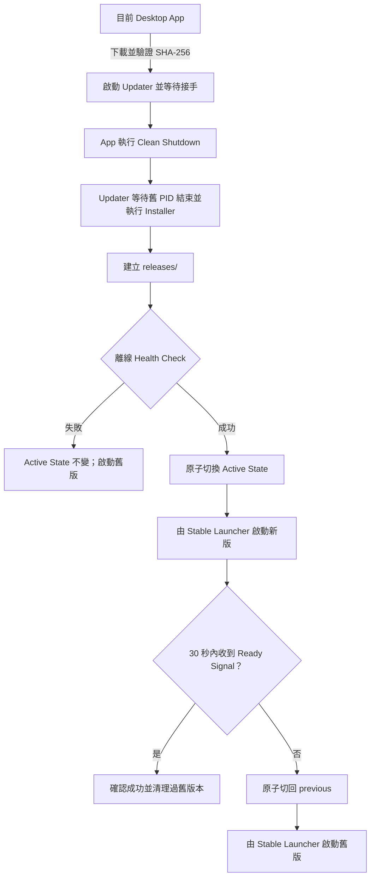
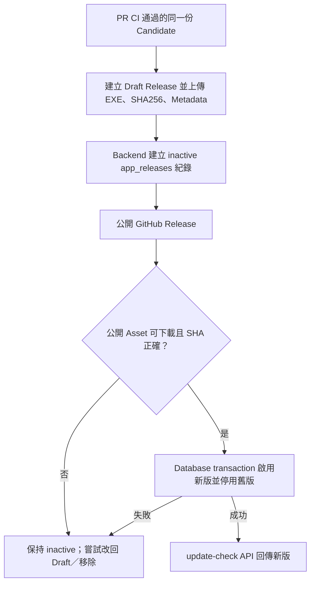

## 名詞定義

| 名詞 | 定義 |
|---|---|
| Program Root | `%LOCALAPPDATA%\Programs\BAP`，只放可重新安裝的程式檔與版本狀態。 |
| User Data Root | `%LOCALAPPDATA%\BAP`，保存設定、Credential reference、logs、量測資料與更新工作檔。 |
| Bootstrap | 放在 Program Root 的 Stable Launcher 與 Updater，不屬於任何特定 App 版本。 |
| Release Manifest | 每個 Versioned Release 內的機器可讀檔，記錄版本、Source Tree SHA 與檔案資訊。 |
| Active State | `active-release.json`，記錄 active、previous 與最近一次更新工作。 |
| Update Operation | 一次從下載檔驗證到啟動確認或 Rollback 的完整更新工作。 |
| Ready Signal | 新版建立主要 UI 並進入 Qt event loop 後寫出的啟動成功訊號。 |
| Legacy Install | 本 Change 上線前，所有 Desktop 程式檔直接放在 Program Root 的既有安裝方式。 |

## Context

目前 Windows Installer 會把新版直接寫入 `%LOCALAPPDATA%\Programs\BAP`，捷徑也直接指向 `BAP.exe`。Desktop App 能下載 Installer、驗證 SHA-256、啟動靜默安裝並關閉自己，但沒有獨立版本目錄、切換前 Health Check、啟動確認或自動 Rollback。

User Data 已放在 `%LOCALAPPDATA%\BAP`，登入用的 Refresh Token 則由 Windows Credential Manager 管理，因此不需要搬移資料。CI 也已能建立同一份 Backend ZIP 與 Desktop Installer，從 Artifact 安裝後執行 HTTP E2E；本 Change 在這個基礎上增加跨版本升級驗證。

## Goals / Non-Goals

**Goals：**

- 新版完整安裝並驗證成功前，舊版持續可用。
- user 永遠透過同一個捷徑啟動目前有效版本。
- 新版切換後若無法啟動，系統自動回到上一版。
- 更新、Rollback 與清理都不碰 User Data。
- PR CI 在 Merge 前驗證真實的舊版升級、新版啟動與故障 Rollback。
- GitHub Release 與 Backend 更新資訊只在公開下載檔可用後才對 user 生效。

**Non-Goals：**

- 本 Change 不改變 Backend 以 Git SHA 識別版本的方式。
- 本 Change 不實作 macOS／Linux 的安裝與更新格式，但資料模型與狀態名稱避免綁死 Windows Junction。
- 本 Change 不讓 Desktop App 在沒有 user 操作時自動下載或安裝。
- 本 Change 不把遠端 Backend 健康狀態當成本機更新成功條件；更新後即使離線仍必須能開啟登入畫面與本機功能。
- 本 Change 不導入增量更新，仍下載完整 Windows Installer。
- Code signing 仍沿用現有 Build 的選用能力；強制簽章與憑證管理可另立 Change。

## Decisions

### 1. Program 與 User Data 完全分開

Program Root 使用以下結構：

```text
%LOCALAPPDATA%\Programs\BAP\
├─ BAPLauncher.exe
├─ BAPUpdater.exe
├─ active-release.json
├─ releases\
│  ├─ 0.1.6\
│  │  ├─ BAP.exe
│  │  ├─ release-manifest.json
│  │  └─ ...
│  └─ 0.1.7\
│     ├─ BAP.exe
│     ├─ release-manifest.json
│     └─ ...
└─ staging\
   └─ <operation-id>\
```

User Data 維持：

```text
%LOCALAPPDATA%\BAP\
├─ settings.json
├─ logs\
├─ measurement-sessions\
├─ temp\imu-diagnostics\
└─ updates\
   └─ <operation-id>\
```

理由：程式檔可以刪除後重建，User Data 不可以。版本切換只改 Program Root 的狀態，不需要搬動設定、登入狀態或量測資料。

替代方案是繼續覆蓋同一目錄；它比較簡單，但無法保證安裝中斷後仍有完整舊版，因此不採用。

### 2. 使用 JSON 狀態檔，不使用 Windows Junction

`active-release.json` 範例：

```json
{
  "schema_version": 1,
  "active_version": "0.1.7",
  "previous_version": "0.1.6",
  "operation_id": "7b1716aa-...",
  "updated_at": "2026-09-06T10:00:00Z"
}
```

Updater 先在同一目錄寫入暫存檔、flush 後再以原子 replace 取代正式檔。Stable Launcher 只讀取完整狀態檔，因此不會看到寫到一半的 JSON。

理由：一般 user 建立 Junction 的權限與行為容易受 Windows 設定影響；JSON 配合原子 replace 比較容易測試，未來也能沿用到 macOS／Linux。

替代方案是建立 `current\` Junction。它讓路徑較直觀，但增加平台與權限差異，因此不採用。

### 3. Stable Launcher 是唯一的 user 啟動入口

Installer 將桌面捷徑與開始功能表捷徑指向 `BAPLauncher.exe`。Launcher：

1. 讀取並驗證 Active State。
2. 確認對應 Release Manifest 與 `BAP.exe` 存在。
3. 啟動 Active Release 並轉交原本的 command-line arguments。
4. 若 active 無效，嘗試 previous。
5. 兩者都無效時顯示白話修復訊息並寫 log。

Launcher 啟動 App 後立即結束，不長時間占用檔案，讓 Installer 可以安全更新 Bootstrap。

### 4. Updater 以暫存副本執行，避免更新自己時被鎖住

Desktop App 將 Installer path、版本、SHA-256、目前 PID 與 operation ID 交給 Program Root 的 `BAPUpdater.exe`。Bootstrap Updater 會把自己複製到 User Data Root 的更新工作目錄，再從該處啟動 helper；helper 寫出「已接手」訊號後，原本 Updater 結束。

Desktop App 只有看到接手訊號才執行 Clean Shutdown。Helper 等待舊 App 結束後才呼叫 Installer，所以 Candidate 可以更新 Program Root 的 Launcher／Updater，而不會覆蓋正在執行的檔案。

替代方案是讓 Desktop App 直接啟動 Installer。這無法可靠協調清理、Health Check、切換與 Rollback，因此不採用。

### 5. Installer 只放置 Candidate，Updater 負責是否啟用

Inno Setup 繼續產生單一 `BAP-Setup-<version>.exe`，但 payload 會放到 `releases\<version>\`。Installer 同時放置最新版 Bootstrap，卻不直接把 Candidate 設成 active。

更新責任分工：



全新安裝沒有 previous。Installer 完成放置後呼叫 Updater 的初始化模式；Candidate 必須通過相同 Health Check 才建立第一份 Active State。

### 6. Health Check 與 Ready Signal 分成兩層

切換前執行：

```text
BAP.exe --post-update-health-check --result-file <path> --isolated-check
```

輸出的 JSON 至少包含 version、source tree、各檢查結果、完成時間與安全錯誤碼。檢查內容：

- Runtime 回報版本等於 Candidate version。
- PySide6 與 Qt platform plugin 可以載入。
- 必要 icon、style 與 UI resource 可以讀取。
- 登入視窗／主要視窗所需元件可以建立但不顯示。
- User Data Root 可讀，並只在 operation 目錄做一次可刪除的寫入測試。
- 不要求正式 Backend 可連線，不讀寫正式帳號或量測資料。

切換後，Updater 透過：

```text
BAPLauncher.exe --update-operation <operation-id>
```

啟動新版。新版在主要 UI 建立且 Qt event loop 開始處理事件後，以原子檔案寫出 Ready Signal。Updater 最多等待 30 秒；程序提早結束或逾時都視為失敗並 Rollback。

理由：只做 import test 無法證明新版真正能開 UI；只在切換後測試又會讓 user 暫時落在壞版本。兩層檢查同時降低兩種風險。

### 7. App 關閉使用單一 Shutdown Coordinator

正常關閉與更新關閉必須走同一條清理路徑。Qt 的 `closeEvent` 與 `aboutToQuit` 都呼叫同一個可重入的 Shutdown Coordinator，確保：

- 停止 IMU 讀取與錄製。
- 等待背景 worker 結束。
- flush／關閉 CSV 與 log。
- 只執行一次，不因兩個 Qt event 重複清理。
- 清理完成後才讓程序結束。

這會取代「啟動 Installer 後延遲很短時間直接 `QApplication.quit()`」的做法。

### 8. Active State 同時保存 active 與 previous

切換 Candidate 前，Updater 先確認目前 active 的 Release Manifest 可用，再把它記為 previous。Candidate 送出 Ready Signal 後，狀態維持：

```text
active   = 新版
previous = 上一個成功版本
```

Rollback 以原子 replace 將 previous 變回 active，再由 Stable Launcher 啟動。若 Rollback 失敗，Updater不刪除任何 Release，並在 operation log 與 UI 訊息中給出可直接啟動的版本路徑。

### 9. 只在更新確認成功後清理版本

清理器保留：

- active；
- previous；
- 正在執行的版本；
- 任何進行中 operation 引用的版本。

其他版本可按版本完成時間由舊到新移除。刪除失敗只記錄並留待下次啟動或更新重試，不使已成功的更新變成失敗。

### 10. 第一個 Versioned Installer 自動接管 Legacy Install

第一次從現行覆蓋式安裝升級時，Updater 先執行 `BAP.exe --write-version` 取得舊版本，並把既有 runtime 檔案複製到 `releases\<old-version>\`，建立 Legacy Release Manifest，再安裝 Candidate。

只有 Legacy Release 能成功啟動時，才把它當成 previous。無法建立可回復副本時，Updater 停止自動升級並保留原安裝，不能先破壞原目錄。

理由：要求現有 user 先解除安裝會違反低摩擦更新目標。

### 11. PR CI 使用同一份 Candidate 執行跨版本測試

當 scope 表示需要發布 Desktop：

1. 先檢查 `desktop-v<version>` 尚未被使用。
2. Build Candidate Installer 與 metadata。
3. 下載 Previous Public Version 的 Installer。
4. 在隔離的 `LOCALAPPDATA` 安裝舊版。
5. 建立 Sentinel Data。
6. 透過正式 Updater 流程升級到 Candidate。
7. 驗證 Launcher 啟動 Candidate、版本一致、HTTP E2E 正常且 Sentinel Data 未變。
8. 在另一個隔離環境破壞 Candidate 的必要檔案，製造 Health Check／Ready Signal 失敗。
9. 驗證自動 Rollback、舊版啟動與 Sentinel Data 保留。
10. 上傳 operation logs 與 test summary；所有測試通過後才上傳 Candidate 供 CD 使用。

若沒有 Previous Public Version，就執行全新安裝路徑並在 summary 清楚註記。Backend-only 變更仍可測試同一份 Desktop source，但不因既有 Desktop tag 而要求提升版本。

### 12. Desktop Release 使用兩階段啟用



Release Metadata 至少包含：

```json
{
  "schema_version": 1,
  "version": "0.1.7",
  "platform": "windows",
  "architecture": "x86_64",
  "installer_filename": "BAP-Setup-0.1.7.exe",
  "installer_sha256": "<sha256>",
  "installer_size_bytes": 123456,
  "source_tree_sha": "<git-sha>",
  "candidate_run_id": "123456789",
  "created_at": "2026-09-06T10:00:00Z"
}
```

Database 的 active 切換必須在同一個 transaction 完成，避免 update-check 同時看到兩個最新版本。任何補償失敗都必須讓 Workflow 失敗並指出 GitHub Release URL、version 與人工修復命令。

## Risks / Trade-offs

- **[Bootstrap 更新時仍可能被防毒軟體鎖定]** → Updater 從 User Data Root 的暫存副本執行；Bootstrap replace 失敗時不切換 active。
- **[第一次從 Legacy Install 搬移檔案較複雜]** → 搬移前先複製與驗證，不先刪原檔；無法建立 previous 就停止升級。
- **[保留兩個版本增加磁碟使用量]** → 只保留 active 與 previous，其他版本延後安全清理。
- **[30 秒 Ready timeout 在非常慢的電腦可能不足]** → timeout 定義為可測試常數並記錄每階段時間；實作測試後可調整，但不得無限等待。
- **[Health Check 無法涵蓋所有真實操作]** → 切換後再要求 Ready Signal，PR CI 另跑安裝版 HTTP E2E。
- **[GitHub Release 已短暫公開但 Database 啟用失敗]** → 新紀錄保持 inactive，CD 嘗試把 Release 改回 Draft／移除，且不得回報成功。
- **[舊公開 Installer 不支援新版 Update 協定]** → 第一個 Versioned Installer 必須由現有 App 能啟動，並由新版 Updater 主動遷移 Legacy Install。

## Migration Plan

1. 先補齊 Launcher、Updater、Active State、Health Check、Ready Signal 與 Shutdown Coordinator 的單元／整合測試。
2. 調整 Inno Setup，讓 payload 進入版本目錄，捷徑改指向 Stable Launcher。
3. 加入 Legacy Install 遷移，使用現行公開版本執行一次本機升級與 Rollback 測試。
4. 更新 PR CI，在隔離 Runner 執行舊版升級、Sentinel Data 保存與故障 Rollback。
5. 更新 CD，發布 Release Metadata 並使用 inactive → publish → verify → activate 的順序。
6. 以新的 Desktop version 發布第一個 Versioned Installer；舊版 update-check 仍下載同一個 `.exe`，不需要 user 手動解除安裝。
7. 觀察第一版更新 logs；確認穩定後才允許清理 Legacy runtime 備份。

若新流程在正式發布前失敗，停止發布 Candidate，既有 Desktop Release 與 `app_releases` 不變。若已公開但尚未啟用，執行 Release 補償；若 user 電腦上的 Candidate 失敗，由本機 Updater 自動恢復 Previous Release。
