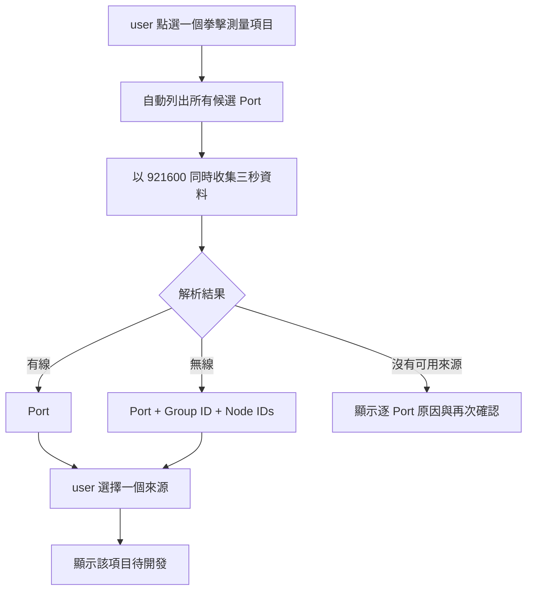

## 名詞定義

| 名詞 | 定義 |
|---|---|
| IMU 來源探索 | 進入拳擊測量項目後，自動從所有 Port 收集三秒資料並找出可用 IMU 來源的流程。 |
| 有線來源 | 直接由某個 Port 輸出可解析 IMU 資料的來源，以 Port 識別。 |
| 無線來源 | 經由無線接收器 Port 輸出的 IMU 來源，以 Port、Group ID 與 Node ID 一起識別。 |
| 候選 Port | 作業系統在探索開始時列出的所有序列埠。 |
| 可用來源 | 在本次三秒探索中至少成功解析一筆相符資料的有線來源或無線 Node。 |
| 拳擊測量項目 | 目前只提供入口及來源選擇，完成後顯示「待開發」的單一拳擊功能。 |

## Purpose

讓系統在每次進入單一拳擊測量項目時自行取得當下可用的 Port、Group ID 與 Node ID，不把判斷是否需要重新掃描的責任交給 user。

## 自動探索與選擇流程

## ADDED Requirements

### Requirement: 每次進入拳擊項目都自動重新探索
Desktop App MUST 在 user 每次點選一個拳擊測量項目後，自動重新列出所有候選 Port，並以固定 `921600` baud rate 同時收集三秒資料；不得要求 user 先進入「IMU 連線狀態」或自行判斷是否需要重新掃描。

#### Scenario: 先前已查看 IMU 連線狀態
- **WHEN** user 已在本次 App 執行期間查看過「IMU 連線狀態」，之後點選拳擊測量項目
- **THEN** Desktop App 仍執行新的三秒 IMU 來源探索
- **AND** 不直接沿用先前五秒 Report 的來源清單

#### Scenario: 先前沒有執行 IMU 測試
- **WHEN** user 啟動 App 後直接點選拳擊測量項目
- **THEN** Desktop App 自動執行三秒 IMU 來源探索
- **AND** user 不需要先前往「IMU 連線狀態」

### Requirement: 探索期間顯示進度且介面保持可用
Desktop App MUST 在三秒探索期間顯示「正在確認 IMU，請稍後。」及進度，且不得讓 App 介面失去回應。

#### Scenario: 正在探索多個 Port
- **WHEN** Desktop App 同時從多個候選 Port 收集三秒資料
- **THEN** 畫面顯示探索中的提示與三秒進度
- **AND** App 視窗仍可正常重繪及回應關閉操作

### Requirement: 系統只提供本次成功觀察到的來源
探索完成後，Desktop App MUST 只把本次三秒內成功解析的有線 Port 或無線 Group ID／Node ID 列為可用來源；不得只因 Port 存在就把它列為 IMU。

#### Scenario: 發現有線 IMU
- **WHEN** 某個 Port 在三秒內成功解析有線 IMU 資料
- **THEN** Desktop App 將該 Port 顯示為一個可選擇的「有線連接」來源
- **AND** 不要求 user 選擇 Group ID 或 Node ID

#### Scenario: 發現無線接收器與多個 Node
- **WHEN** 某個 Port 在三秒內成功解析一個 Group ID 及多個 Node ID
- **THEN** Desktop App 以該 Port 和 Group ID 分組顯示所有觀察到的 Node ID
- **AND** 每個 Node ID 都能作為獨立來源供 user 選擇

#### Scenario: 相同 ID 出現在不同 Port
- **WHEN** 兩個 Port 都觀察到相同 Group ID 與 Node ID
- **THEN** Desktop App 將它們顯示為兩個不同來源
- **AND** 每個來源都保留自己的 Port

### Requirement: user 一次只能選擇一個 IMU 來源
Desktop App MUST 讓 user 為目前的單一拳擊測量項目選擇一個有線 Port，或一組 Port、Group ID 與 Node ID；選擇其他來源時 MUST 取消原本的選擇。

#### Scenario: 選擇無線 Node
- **WHEN** user 選擇一個無線來源的 Node ID
- **THEN** Desktop App 同時保留該來源的 Port、Group ID 與 Node ID
- **AND** 其他來源不再保持選取

#### Scenario: 改選有線 Port
- **WHEN** user 已選擇一個無線 Node，之後改選有線 Port
- **THEN** Desktop App 取消原本的無線來源選擇
- **AND** 目前選擇只包含該有線 Port

### Requirement: 無法找到來源時提供逐 Port 說明
若三秒探索沒有找到可用來源，Desktop App MUST 顯示「找不到可用的 IMU」、每個候選 Port 能合理判斷的簡化原因，以及「再次確認」操作。

#### Scenario: 所有 Port 都沒有可解析資料
- **WHEN** 三秒探索完成且所有候選 Port 都沒有成功解析 IMU 資料
- **THEN** Desktop App 不顯示空白的來源選擇畫面
- **AND** Desktop App 顯示每個 Port 的簡化原因及「再次確認」

#### Scenario: user 按下再次確認
- **WHEN** user 在找不到來源的畫面按下「再次確認」
- **THEN** Desktop App 重新列出所有候選 Port 並執行新的三秒探索

### Requirement: 完成選擇後只顯示待開發
Desktop App MUST 在 user 選好一個 IMU 來源後顯示目前拳擊測量項目「待開發」，不得繼續錄製拳擊資料或呼叫遠端後端上傳 IMU 資料。

#### Scenario: 選好來源並繼續
- **WHEN** user 選好一個可用來源並繼續
- **THEN** Desktop App 顯示目前拳擊測量項目「待開發」
- **AND** 三秒探索資料在不再需要後從本機暫存中清除
- **AND** 遠端後端沒有收到探索資料
