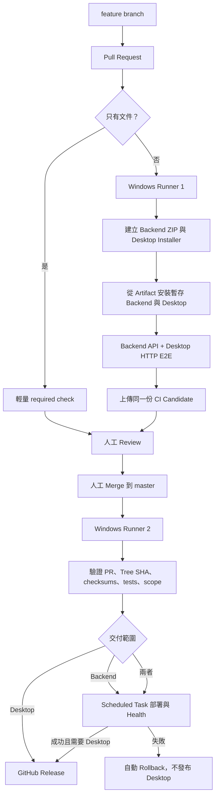

## 名詞定義

| 名詞 | 定義 |
|---|---|
| Windows Runner 1 | PR 使用的 GitHub-hosted Windows VM，負責 Build、安裝、Production-like 測試與 Candidate 上傳。 |
| Windows Runner 2 | 人工 Merge 後使用的 GitHub-hosted Windows VM，只負責驗證 Candidate 與 Promotion，不重新 Build。 |
| CI Candidate | Backend ZIP、Desktop Installer、checksums、delivery manifest 與 test summary 的集合。 |
| 統一 Backend 交付包 | 同時包含 Backend source、Migration、locked dependencies metadata 與該版本遠端部署程式的 ZIP。 |
| Bootstrap | 第一次在遠端 Server 建立資料夾、權限、Scheduled Task 與最小部署入口的操作。 |
| Promotion record | 記錄 master commit、PR、CI run、Source Tree SHA、Artifact checksum、scope 與正式結果的資料。 |
| Workspace 產生物 | `dist\`、`build\`、`*.egg-info\`、`.pytest_cache\`、`__pycache__\` 等可重新產生的本機檔案。 |

## Context

目前已有 Backend ZIP builder、Windows Installer builder、SCP／SSH 部署 Script、`C:\BAP\releases`／`current`、SQLite backup 與 Health Check。不過正式發布仍混合開發者本機操作、獨立 Deployment Scripts Artifact、人工前景 Backend 與一個 Desktop-only PR Workflow。詳見 `proposal.md`。

Repository 是 public；`production-backend` Environment 已設定 `BAP_BACKEND_SSH_PRIVATE_KEY`、`BAP_BACKEND_HOST=140.114.75.84`、`BAP_BACKEND_USER=user` 與 `BAP_BACKEND_SSH_PORT=22`。本 Change 依已確認的決策信任該 IP，不增加 Server Host Key 驗證。

## Goals / Non-Goals

**Goals：**

- CI 只 Build 一次，CD Promotion 同一份通過測試的 Candidate。
- 開發者 workspace 不再是正式 Artifact 或部署狀態的來源。
- 用一個統一 Backend 交付包取代 Backend ZIP 加 Deployment Scripts ZIP 的雙軌流程。
- 遠端 Backend 由 Scheduled Task 持續運行，部署流程能自動停止、啟動、檢查與 Rollback。
- 新流程驗證完成後，從 repository 與 Server 移除舊入口和殘留結構。

**Non-Goals：**

- 不自動 Merge Pull Request。
- 不允許 PR 讀取 Production Secret 或連線正式 Backend。
- 不在本 Change 管理 Caddy、DNS、TLS certificate 或 Reverse Proxy。
- 不為驗證 Scheduled Task 主動重新啟動遠端 Windows Server；只檢查開機 Trigger 設定，等待日後正常維護重開機再觀察。
- 不加入 Server Host Key。
- 不測試實體 IMU hardware。
- 不建立 macOS 或 Linux Installer。
- 不將開發者的 `.venv` 當成可清理產生物。

## High-level I/O

| 階段 | Input | Output | 執行位置 |
|---|---|---|---|
| PR 分類 | PR base、test merge tree | docs-only 與 component scope | 輕量 GitHub Job |
| CI Build | PR test merge tree、locked dependencies | Backend ZIP、Desktop Installer、checksums | Windows Runner 1 的暫存目錄 |
| Production-like Test | 實際 ZIP 與 Installer | API／Desktop E2E、test summary | Windows Runner 1 |
| Candidate Upload | Artifact、manifest、reports | 有期限的 GitHub Actions Artifact | Windows Runner 1 + GitHub |
| 人工 Merge | CI success、review | 新的 `master` commit | GitHub UI |
| Candidate Resolution | master commit、merged PR | 對應的 CI Candidate | Windows Runner 2 |
| Backend Promotion | 已驗證 Backend ZIP | 遠端 Release、Health、LKG | Windows Runner 2 + SSH + Server |
| Desktop Promotion | 已驗證 Installer | GitHub Release、`app_releases` | Windows Runner 2 + GitHub + Backend |

## 整體流程



## Decisions

### 1. CI Build 一次，CD 不重新 Build

PR CI 使用 test merge tree 建立正式 Candidate。Candidate manifest 記錄 PR head/base/test commit、Source Tree SHA、workflow run、scope、版本、檔名、SHA256 與測試結果。

Merge commit SHA 可能與 PR test commit 不同，所以 CD 比對 `HEAD^{tree}` 與 Candidate 的 Source Tree SHA。內容一致才 Promotion；不一致就 fail closed。

**未採用方案：** Merge 後重新 Build。它無法證明 Production 使用的檔案就是 CI 測過的檔案。

### 2. 使用統一 Backend 交付包

Backend ZIP 會包含：

```text
bap-backend-tree-<source-tree-sha>.zip
├─ bap_backend/
├─ bap_common/
├─ migrations/
├─ deployment/runtime/
│  ├─ Common-BapDeployment.ps1
│  ├─ Deploy-BapBackendRelease.ps1
│  ├─ Rollback-BapBackendRelease.ps1
│  ├─ Get-BapBackendStatus.ps1
│  └─ Test-BapBackendHealth.ps1
├─ alembic.ini
├─ pyproject.toml
├─ uv.lock
├─ .python-version
└─ deployment-manifest.json
```

第一次 Bootstrap 只安裝穩定且最小的 Candidate 驗證／展開入口。每次 CD 上傳統一 ZIP 後，由 Bootstrap 驗證並執行包內該版本的 runtime deployment code。

因此不再需要第二份 `bap-deployment-scripts-<commit-sha>.zip`、`Publish-BapDeploymentScripts.ps1` 或 `Update-BapDeploymentScripts.ps1`。

### 3. 正式 Build 不寫入開發者 workspace

Runner 使用 `RUNNER_TEMP` 進行 snapshot、Build、安裝與測試，只將 Candidate 上傳 GitHub。開發者的 `dist\` 或 `build\` 只可作為本機除錯輸出，不能被 CD 讀取。

禁止用 `git clean -fdX` 當日常清理，因為可能刪除 `.venv`。需要清理時，只移除明確列出的產生物。

### 4. Scheduled Task 是唯一正式 Backend Process 管理方式

`Initialize-BapBackendHost.ps1` 建立 `BAPBackend` Scheduled Task，設定開機啟動並透過 `C:\BAP\current` 執行 Backend。

部署順序：

```mermaid
flowchart LR
    ZIP["incoming 統一 ZIP"] --> VERIFY["checksum + manifest"]
    VERIFY --> PREPARE["releases/master-commit"]
    PREPARE --> STOP["Stop BAPBackend"]
    STOP --> BACKUP["備份 SQLite"]
    BACKUP --> MIGRATE["Alembic migration"]
    MIGRATE --> SWITCH["切換 current"]
    SWITCH --> START["Start BAPBackend"]
    START --> LOCAL["localhost health"]
    LOCAL --> PUBLIC["public HTTPS health"]
    PUBLIC --> LKG["更新 Last Known Good"]
```



`Deploy-BapBackendRelease.ps1` 和 `Rollback-BapBackendRelease.ps1` 直接控制 Scheduled Task，不再提示管理者開啟前景 Terminal。`Start-BapBackend.ps1`、`Stop-BapBackend.ps1` 與 PID 檔流程因此退出。

### 5. Scope 判斷只決定 Promotion，不決定 CI 是否整合測試

非 docs-only PR 都建立前後端 Artifact並完成 E2E，確保同一 Source Tree 的整合相容性。Manifest 另記錄：

| 變更 | Backend Promotion | Desktop Promotion |
|---|---:|---:|
| `bap_backend/**`、`migrations/**`、Backend deployment code | 是 | 否 |
| `bap_desktop/**`、`packaging/windows/**` | 否 | 是 |
| `bap_common/**`、`anrot_imu_driver/**`、`pyproject.toml`、`uv.lock` | 是 | 是 |
| 只有文件 | 否 | 否 |
| Workflow 或 scope 規則 | 保守設為是 | 保守設為是 |

CD 必須重新計算 scope 並與 manifest 比對；不一致就停止。

### 6. Backend-first Gate

同時需要 Backend 與 Desktop Promotion 時，先部署 Backend並完成 local／public Health Check，再發布 Desktop。Backend 失敗就 Rollback，且不讓新 Desktop 出現在 GitHub Release。

### 7. docs-only 與 concurrency

PR 入口永遠回報固定 required check。docs-only 只執行輕量分類與結果 Job，不配置 Windows Runner。

相同 PR 的 concurrency group 使用 `pr-ci-<PR number>` 並啟用 cancel-in-progress。Production 使用單一 concurrency group，禁止兩次 Migration 或 `current` 切換同時發生。

### 8. Production Secret 邊界

PR Workflow 只有讀取 repository 和上傳 Artifact 的權限，不引用 `production-backend`。只有 Merge 後 CD 的 Promotion Job 可以讀取 Environment Secret。

依既有決策，SSH 使用 Private Key 並相信 `140.114.75.84`；本 Change 不建立 `known_hosts` 或要求 `BAP_BACKEND_HOST_KEY`。Log、Summary 與 diagnostics 必須遮蔽 Secret。

### 9. 舊流程移除清單

新流程完成端到端驗證後，repository 移除：

| 類型 | 移除項目 | 替代 |
|---|---|---|
| 舊 Workflow | `.github/workflows/build-desktop.yml` | `pull-request-ci.yml` |
| 本機 Backend Publisher | `Publish-BapBackend.ps1` | `continuous-delivery.yml` |
| Deployment Scripts Publisher | `Publish-BapDeploymentScripts.ps1` | 統一 Backend 交付包 |
| Remote Script Updater | `Update-BapDeploymentScripts.ps1` | 最小 Bootstrap + 包內 runtime scripts |
| 前景 Process | `Start-BapBackend.ps1`、`Stop-BapBackend.ps1` | `BAPBackend` Scheduled Task |
| 舊說明 | 人工 Release／前景 Terminal 文件 | 根目錄開發流程與 Workflow Summary |
| 舊測試 | 要求「不得由 GitHub 部署」或「必須前景 Terminal」的 assertions | CI/CD、Scheduled Task 與唯一入口 contract tests |

### 10. 目標 repository 結構

```text
BAP/
├─ .github/workflows/
│  ├─ pull-request-ci.yml
│  └─ continuous-delivery.yml
├─ deployment/windows/backend/
│  ├─ Common-BapDeployment.ps1
│  ├─ Build-BapBackendArtifact.ps1
│  ├─ Initialize-BapBackendHost.ps1
│  ├─ Deploy-BapBackendRelease.ps1
│  ├─ Rollback-BapBackendRelease.ps1
│  ├─ Get-BapBackendStatus.ps1
│  └─ Test-BapBackendHealth.ps1
├─ packaging/windows/
│  ├─ Build-BapDesktop.ps1
│  ├─ Smoke-Test-BapInstaller.ps1
│  ├─ bap-desktop.spec
│  └─ bap-installer.iss
├─ bap_backend/
├─ bap_desktop/
├─ tests/
├─ open_BAP.cmd
└─ README.md
```

### 11. 遠端保留與淘汰範圍

保留：

```text
C:\BAP\
├─ config\
├─ data\
├─ logs\
├─ backups\
├─ releases\
├─ current
└─ incoming\
```

完成切換後淘汰 `scripts-releases\`、`scripts\` Junction、`bootstrap\Update-BapDeploymentScripts.ps1`、舊 Deployment Scripts ZIP 與舊 PID 檔。若部署鎖仍需要暫存目錄，可保留 `run\`，但不得延續 PID process 管理。

### 12. 狀態與通知

每次 CI／CD 都寫 GitHub Job Summary；失敗時上傳不含 Secret 的 diagnostics。GitHub 使用 repository／帳號的 Actions notification 設定寄送失敗 Email，不在 repository 保存 SMTP 密碼。

Promotion record 與 Last Known Good 必須能追溯 master commit、PR、CI run、Source Tree SHA、checksums、scope、Backend Release 與 Desktop Release。

## Risks / Trade-offs

- **[Candidate 與 master Tree 不同]** → CD fail closed，不重新 Build 或尋找相似 Artifact。
- **[統一 ZIP 內的 deployment code 有錯]** → Bootstrap 先驗證 checksum、manifest 與 PowerShell 語法，再執行新版本。
- **[過早刪除舊流程]** → 必須先完成一次 CI Candidate E2E、一次 Backend CD、一次 Desktop Release 與一次 Rollback 演練。
- **[Scheduled Task 啟動後立即失敗]** → 同時檢查 Task state、port 12345、local health 與 public health。
- **[Artifact 到期]** → Candidate retention 至少 14 天；超過期限不得由 CD 重新 Build，必須重新走 PR。
- **[Workspace 清理誤刪 .venv]** → 不提供廣泛的 `git clean -fdX` 流程，只清理明確產生物。
- **[未驗證 Server Host Key]** → 這是已接受的 Prototype 風險；Private Key 仍不得出現在 log。

## Migration Plan

1. 建立 Candidate metadata、Source Tree SHA、scope 與 checksum helpers。
2. 將 Backend runtime deployment code納入統一 Backend ZIP。
3. 建立 `pull-request-ci.yml`，用實際 ZIP／Installer 完成 Production-like E2E。
4. 設定 `master` Branch Protection 與固定 required check；維持人工 Merge。
5. 改寫 Initialize，在遠端建立 `BAPBackend` Scheduled Task 與最小 Bootstrap。
6. 建立 `continuous-delivery.yml`，驗證並 Promotion 同一 Candidate。
7. 在 Production 完成 Backend-only、Desktop-only、shared 與 docs-only 路由測試。
8. 演練 Health failure 自動 Rollback。
9. 確認新流程可用後，移除舊 Workflow、Publish／Update／Start／Stop Scripts 及相反的測試 assertions。
10. 清理開發者本機可重新產生的 `dist\`、`build\`、`*.egg-info\`、cache，以及遠端舊 script releases；保留 `.venv`、正式資料與備份。
11. 若新流程切換失敗，在移除舊入口前回復 Workflow commit；在移除後則以 Git revert 恢復最後一版已驗證 Workflow 與 Scripts。
