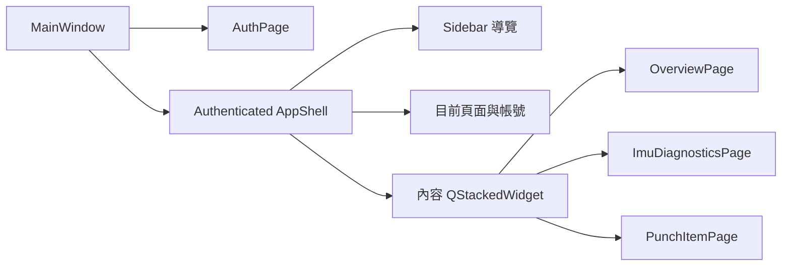
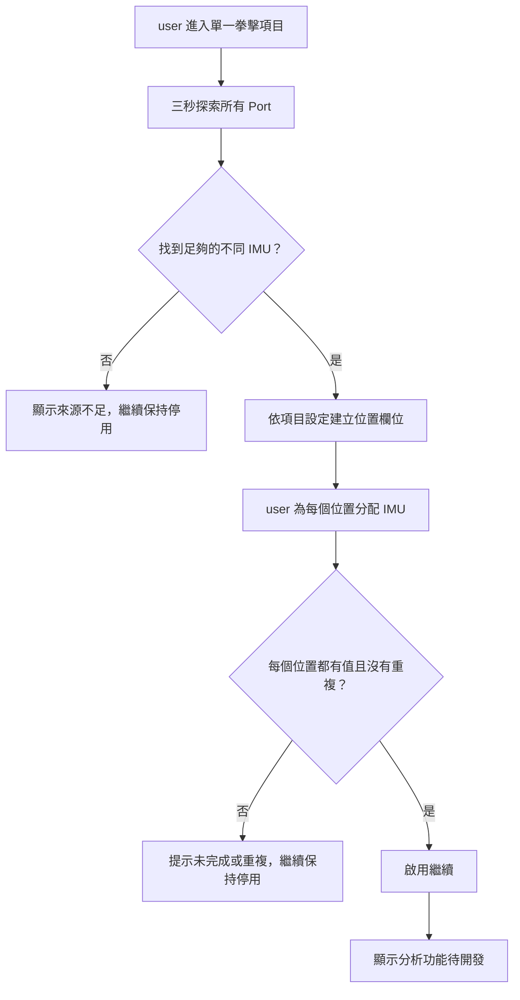
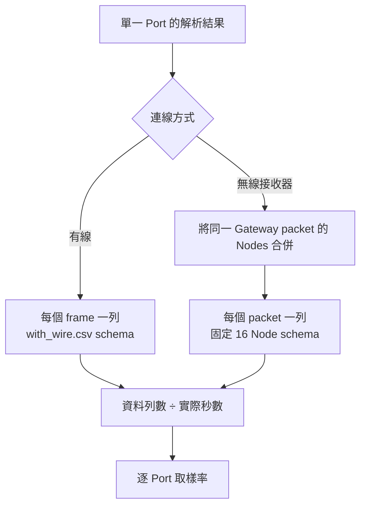

## 名詞定義

| 名詞 | 定義 |
|---|---|
| App shell | 登入後共用的外框，包含側邊導覽、上方頁面列與內容區。 |
| Auth 畫面 | 登入與註冊頁面；user 尚未登入時不顯示 App shell。 |
| QSS | Qt Style Sheet，用來集中定義 PySide6 元件的顏色、留白、邊框與互動狀態。 |
| 項目設定 | 描述一個拳擊項目需要哪些 IMU 位置的資料，不包含量測演算法。 |
| IMU 分配表 | 以「位置 → ImuSource」保存 user 在目前項目所做選擇的資料。 |
| ImuSource | 既有的可用 IMU 來源物件，包含 Port、連線方式，以及無線來源的 Group ID 與 Node ID。 |

## 背景

請參考 `proposal.md` 的「原因」。目前 `MainWindow` 使用單一 `QStackedWidget` 切換 Auth、主畫面與臨時功能頁，`HomePage`、`ImuDiagnosticsPage` 及 `PunchItemPage` 主要由基本垂直排列組成。既有 Session、更新檢查、五秒 IMU 診斷及三秒來源探索都已可使用，這次只調整畫面結構與拳擊項目的 IMU 分配方式。

目前 `PunchItemPage` 使用互斥的 `QRadioButton`，只能保存一個 `selected_source`。新的需求必須根據項目產生兩個位置欄位，並保存位置與來源的對應關係；出拳力量則要保持配置未決定狀態。

## 目標與非目標

**目標：**

- 將已確認的 UI Prototype 落實成 PySide6 Desktop App。
- 讓 Auth、總覽、IMU Report 與拳擊項目共用一致的 BAP 視覺語言。
- 將登入後導覽改成固定 App shell，讓 user 隨時知道目前所在頁面。
- 讓拳擊項目以資料設定決定需要哪些 IMU 位置，不在 UI 程式中散落項目名稱判斷。
- 保留既有非同步 IMU 測試與探索服務，不讓 UI 改版影響裝置通訊。
- 讓每個 Scenario 都能對應到 automated Qt test，硬體讀取則沿用既有 service test 或 hardware-in-the-loop test。

**非目標：**

- 不實作出拳次數、速度、力量、軌跡或拳種辨識演算法。
- 不錄製正式拳擊測量資料，也不將 IMU 資料送到遠端 Backend。
- 不改變登入、Token、更新檢查、五秒診斷或三秒探索的 API 與時間規則。
- 不新增 user 可切換的 Theme；第一版只提供已確認的 BAP 預設風格。
- 不在本 Change 決定出拳力量的 IMU 數量與位置。

## 設計決策

### 1. Auth 畫面與登入後 App shell 分開

`MainWindow` 保留最外層狀態切換，但登入後只顯示一個共用 `AppShell`。`AppShell` 內包含側邊導覽、上方頁面列與內容 `QStackedWidget`。Auth 畫面不顯示側邊導覽，避免尚未登入時出現不可使用的功能入口。



選擇這個方式，而不是讓每個頁面自己建立返回按鈕，原因是導覽、目前頁面、帳號與登出可以只實作一次，也能避免各頁面外觀不一致。

### 2. 使用一份集中 QSS 與少量共用元件

新增一份 BAP QSS，預設使用深色中性側邊欄、明亮內容區與拳擊紅作為主要操作色。頁面不直接寫大量 `setStyleSheet()`；需要不同狀態時使用 `objectName` 或 dynamic property，更新 property 後重新 polish 元件。

共用元件只處理重複的外觀與結構，例如頁面標題列、狀態標籤、功能卡片及主要／次要按鈕。業務規則仍留在各頁面或既有 service，避免建立只為包裝單一 QLabel 的過度抽象。

未採用額外 Theme 套件，因為 Prototype 不需要可切換 Theme，而且新增依賴會增加 Windows installer 大小與打包風險。圖示優先使用 Qt 內建圖示或隨 App 打包的少量本機 SVG，不在執行時下載資源。

### 3. 拳擊項目需求使用資料設定表示

建立不可變的項目設定，至少包含顯示名稱、說明、狀態及必要 IMU 位置。UI 根據設定產生位置欄位，不使用五份幾乎相同的頁面。

```text
出拳次數  -> 左手腕、右手腕
出拳速度  -> 左手腕、右手腕
出拳軌跡  -> 左手腕、右手腕
拳種辨識  -> 持把人左手把背面、持把人右手把背面
出拳力量  -> 配置未決定
```

未採用「讓 user 自由新增位置」的設計，因為每個分析項目未來要知道每一筆資料的用途；位置必須由項目定義，user 只負責把實際 IMU 分配到這些位置。

### 4. 每個位置使用一個來源下拉欄位

三秒探索完成後，`PunchItemPage` 以每個必要位置一列顯示下拉欄位。所有欄位共用本次探索的 `ImuSource` 清單，並以完整來源資訊顯示有線 Port，或無線 Port／Group ID／Node ID。

頁面以 `dict[position_id, ImuSource]` 保存 IMU 分配。只有所有必要位置都已選擇，且各值代表不同的 `ImuSource`，「繼續」才會啟用。`ImuSource` 已是 frozen dataclass，可以直接使用完整物件比較，不另創容易碰撞的顯示字串 ID。



未採用多選清單，因為單純勾選兩顆 IMU 無法表達哪一顆屬於左手、右手或哪一側手把。

### 5. 出拳力量使用明確的未決定狀態

出拳力量仍執行既有三秒來源探索，讓進入每個項目的前置流程一致；探索完成後不產生位置下拉欄位，而是顯示「IMU 配置待決定」，並保持「繼續」停用。未來決定配置時只需補上項目設定與對應 spec，不需要重寫整個頁面。

### 6. IMU Report 只顯示逐 Port 取樣率

`ImuDiagnosticsPage` 可以顯示找到的 Port 數量與成功連線數量，但不建立跨 Port 平均取樣率。取樣率只出現在 Report 的個別 Port 資料列。這項改動只影響呈現，不修改 `DiagnosticReport` 的逐 Port 計算。

### 7. 以結構與行為測試取代像素快照

Qt tests 驗證可見文字、導覽選取、控制項狀態、分配內容、Tab focus 順序及支援視窗尺寸下的必要元件可達性。視覺風格測試只檢查 QSS 已載入及必要 property，不使用對作業系統字型和渲染差異敏感的逐像素 screenshot 比對。

### 8. IMU 診斷 CSV 依 Port 與連線方式分開

一個無線 Gateway packet 可能同時帶有多顆 Node 的資料。CSV 會把同一個 packet 的所有 Node 放在同一列，因此 Report 的無線取樣率使用「Gateway packet 列數 ÷ 實際收集秒數」，不能直接使用 parser 產生的 Node frame 數量。這樣兩顆 Node 各為 `400 Hz` 時，Report 仍顯示 `400 Hz`，而不是錯誤的 `800 Hz`。

有線與無線 schema 不同，而且 schema 本身沒有 Port 欄位，所以每個成功連線的 Port 會建立自己的暫存 CSV。檔名使用 `imu_YYYYMMDD_HHMMSS_序號_Port_連線類型.csv`，例如 `imu_20260904_213007_01_COM7_wireless.csv`。只有一份檔案時，user 可以直接指定匯出檔名；多份檔案時，user 選擇資料夾，系統將全部 CSV 複製進去。



## 建議檔案結構

```text
bap_desktop/
├─ resources/
│  ├─ text.py                       # 白話繁體中文文字與「拳種辨識」名稱
│  └─ icons/                        # App 隨附的少量 SVG（若 Qt 內建圖示不足）
└─ ui/
   ├─ main_window.py                # Auth 與登入後 App shell 的切換
   ├─ styles.py                     # 載入 BAP QSS
   ├─ app_shell.py                  # 側邊導覽、上方頁面列、內容區
   ├─ components.py                 # 少量共用標題、狀態與功能卡片
   ├─ auth/
   │  └─ page.py                    # 登入與註冊雙欄畫面
   ├─ home/
   │  └─ page.py                    # 總覽與功能入口
   ├─ imu_diagnostics/
   │  └─ page.py                    # 進度、摘要與逐 Port Report
   └─ punch_items/
      ├─ definitions.py             # 每個項目需要的 IMU 位置
      └─ page.py                    # 探索、分配、驗證與待開發狀態

tests/desktop/
├─ test_app_shell.py
├─ test_auth_session_ui.py
├─ test_imu_diagnostics.py
├─ test_imu_discovery.py
└─ test_desktop_ui_design.py
```

實作時可以依現有模組大小合併 `components.py`，但項目設定與來源分配規則不得只存在於 QSS 或顯示文字中。

## 風險與取捨

- **風險：QSS 在不同作業系統的原生元件上有細微差異** → 使用標準 PySide6 元件、避免依賴固定像素高度，並在 Windows installer smoke test 及 Qt offscreen tests 驗證。
- **風險：重構 MainWindow 可能破壞 Session restore、UpdateBanner 或登出流程** → 保留既有 service 與 signal 邊界，先建立 App shell tests，再搬移頁面。
- **風險：非同步探索完成時 user 已切換頁面** → 沿用 `shutdown()`、cancel event 與 `ShutdownCoordinator`，頁面離開後不得更新已銷毀元件。
- **風險：以完整 ImuSource 比較重複來源可能受未來欄位影響** → 目前 frozen dataclass 的 Port、connection type、Group ID、Node ID 正是來源身分；若未來加入非身分欄位，再提供明確 identity property。
- **取捨：第一版不提供可切換 Theme** → 降低設計與測試範圍，先確保已確認的 BAP 預設風格一致可用。

## 移轉方式

1. 先加入集中 QSS、共用元件及項目設定，不改變既有頁面流程。
2. 建立登入後 App shell，將 Home、Diagnostics 與 PunchItemPage 逐一接入內容區。
3. 將 PunchItemPage 從單一 `QRadioButton` 改成位置式分配，並保留三秒探索與清除暫存的既有行為。
4. 更新文字、IMU Report 摘要與 automated tests。
5. 執行 Desktop tests、完整 test suite、`open_BAP.cmd` 人工 UI smoke test，以及 Windows installer smoke test。

若新介面造成阻斷性問題，可回復這個 Change 的 UI commit；Backend、資料庫及 IMU 通訊格式沒有變更，因此不需要資料 migration 或遠端 rollback。
