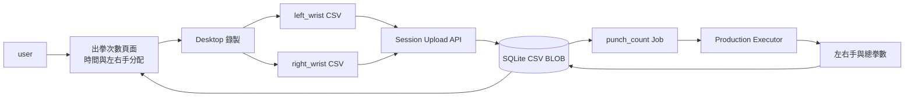
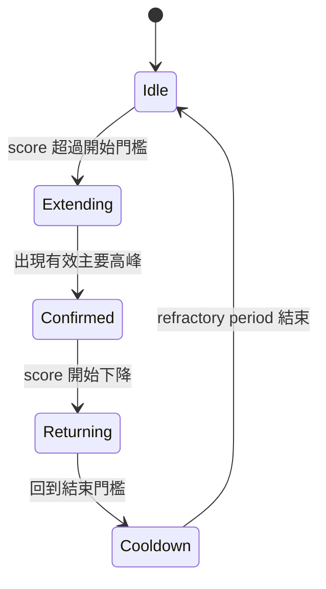

## 名詞定義

| 名詞 | 定義 |
|---|---|
| Motion score | 將加速度與角速度的動作強度正規化後合成的判斷數值。 |
| Hysteresis | 開始與結束使用不同門檻，避免訊號在單一門檻附近反覆切換狀態。 |
| Refractory period | 確認一拳後的短暫保護時間，用來避免收拳或同一動作的其他 peaks 被重複計數。 |
| Production Executor | Backend 正式註冊並處理 user Session 的分析元件，不是只供 CI 使用的替代實作。 |
| Benchmark case | 一次具有左右手 CSV、完整性資訊與人工 Ground Truth 的固定測試資料。 |
| Benchmark ZIP | Benchmark Recorder 匯出的自包含壓縮檔，內含 `metadata.json` 與兩份 Common IMU CSV。 |
| source_interrupted | 錄製期間必要的無線 IMU Node 連續一秒沒有有效 Frame，系統因此提早停止 Session。 |

## 背景

動機與範圍請參閱 `proposal.md`，可驗證行為請參閱本 Change 的 capability specs。

目前前後端已共同註冊 `punch_count` version 1 規格，Input Roles 是 `left_wrist` 與 `right_wrist`，Result 已固定為三個整數拳數欄位；Production Backend 尚未註冊真正 Executor。Desktop 已能自動探索 IMU、錄製每顆 IMU 各一份 Common IMU CSV、上傳 Session 並等待 Result，但頁面目前沒有預定錄製時間。

前一個 Change 已完成 Benchmark Recorder、`BenchmarkMetadata`、ZIP 載入與驗證邏輯，Repository 也已有五份經人工核對的無線 IMU Benchmark ZIP。本 Change 會重用這些資料與契約，不再建立第二套 Manifest 格式。

`elapsed_us` 由 Desktop 的 `time.perf_counter()` 相對 Session 起點計算。同一次 serial read 解析出的多個 Frames 可能共用相同 `elapsed_us`；無線 Gateway Frames 另有 `device_time_ms`。演算法不能假設每一列都有唯一 host timestamp。

## 目標／非目標

**目標：**

- 以可解釋且決定性的 Rule-based pipeline 計算左右手 Shadow boxing 出拳次數。
- 重用既有 Analysis Specification、Session upload、SQLite BLOB 與 Job dispatcher。
- 讓時間到、user 提前結束與必要 IMU Node 中斷共用同一個安全的錄製完成流程。
- 將既有五份真實 labeled Benchmark ZIP 固定成 source-level pytest regression suite。
- 對無效資料回報安全錯誤，不以零拳掩蓋資料問題。

**非目標：**

- 計算擊中沙包、手靶或其他物體的 impact punches。
- 辨識 jab、cross、hook 或 uppercut。
- 使用 Machine Learning、即時串流分析或在 Desktop 執行正式演算法。
- 修改 Common IMU CSV version 1 的 23 欄 schema。
- 在 Result 中加入拳速、拳力或逐拳時間清單。

## 系統資料流



## 決策

### 1. 正式 Executor 與純演算法核心分開

Backend registry 會為 `punch_count` version 1 註冊 Production Executor。Executor 負責驗證兩個 Input Roles、將 CSV bytes 轉成演算法輸入、把可預期資料錯誤轉為穩定的 `ContractError`，再回傳既有三欄 Result。

實際單手分析放在不依賴 FastAPI、SQLAlchemy 或 Qt 的純 Python 模組。左右手分別呼叫相同單手分析，再將結果相加。這讓 Benchmark pytest 可以直接測演算法與 Production Executor，而不需要啟動 Server。

不把演算法放在 Desktop，因為正式資料流已決定由 Backend 分析，且集中部署能讓演算法更新後重跑既有 CSV，不要求 user 更新 App 或重新錄製。

### 2. 以 sample 順序為主，時間欄位用來換算動作區段

CSV 先經既有 Common IMU CSV schema validation，再依 `sample_index` 檢查順序。時間軸採以下策略：

1. `device_time_ms` 足夠完整、沒有倒退且有足夠唯一值時，優先作為單手 sample timing。
2. 否則使用 `elapsed_us`。
3. 相鄰列時間相同時仍保留所有 samples，並以 sample 順序與整段觀察到的有效時間跨度估計時間窗，不將重複 timestamp 當成重複資料刪除。
4. 缺少足夠 sensor samples、時間完全沒有前進，或實際 sample rate 明顯無法支持分析時，回報資料無效。

不直接以每列 `elapsed_us` 差值當作瞬時取樣率，因為 serial buffering 會產生零間隔與批次間較大間隔。

### 3. 使用方向不敏感的 Rule-based motion episode

每隻手先計算：

```text
acc_magnitude  = sqrt(acc_x_g² + acc_y_g² + acc_z_g²)
dynamic_acc    = abs(acc_magnitude - baseline_gravity)
gyro_magnitude = sqrt(gyro_x_dps² + gyro_y_dps² + gyro_z_dps²)
```

短時間 smoothing 降低單點雜訊，再以靜止 baseline、最低有效門檻與加速度／角速度組合建立 Motion score。初始版本不依賴固定的 sensor 軸向，因此左右手腕安裝方向的細微差異不會直接改變正負號判斷。

單手狀態機包含：



一拳在主要動作已確認後只計數一次；後續收拳與同一 episode 的其他 peaks 不再增加。開始／結束門檻使用 Hysteresis，並為 episode duration、quiet gap 與 refractory period 設定 versioned constants。

不只計算 acceleration peaks，因為 Shadow boxing 的伸拳、末端減速與收拳可能在同一拳內產生多個 peaks。

### 4. 門檻由既有 labeled Sessions 校正並隨演算法版本保存

第一版參數會集中在單一不可由一般 user 任意修改的 `rule_v1` configuration，包含 smoothing window、baseline window、start／confirm／end thresholds、episode duration 與 refractory period。

第一版 Prototype 先使用目前五份 labeled Benchmark ZIP 校正參數，也用同一批資料做固定回歸測試。修改規則或門檻必須讓所有已核准 fixtures 重跑；若未來需要破壞既有語意，新增 Analysis Specification version，而不是偷偷改變 Result 契約。

因為校正與回歸使用同一批資料，測試通過只能證明「演算法能正確處理這五個已知案例」，不能宣稱對未知 user 或未知動作具有獨立、無偏的準確率。未來取得更多資料後，才把未參與調參的 Sessions 分成獨立驗證集。

第一版避免新增 NumPy／SciPy dependency，使用標準 Python 的串流 CSV、數學與有限大小 rolling buffers，降低 Backend Artifact 大小與部署風險。若資料顯示需要較進階 filter，再另行評估 dependency。

### 5. 直接重用自包含 Benchmark ZIP

Repository 結構規劃為：

```text
tests/
  fixtures/
    punch_count/
      README.md
      bap-punch-count-benchmark-*.zip
  backend/
    test_punch_count_benchmark.py
```

每份 ZIP 已經透過 `metadata.json` 記錄固定 ID、兩份檔案、SHA-256、左右手與總拳數，不需要額外建立跨檔案的 `manifest.json`。既有純 ZIP Loader 與 `BenchmarkMetadata` 會移到或整理到 `bap_common`，讓 Desktop 匯出功能、Backend 演算法測試與 CI 共用同一份契約。

Loader 會先驗證 ZIP 安全性、schema、checksum 與 Ground Truth，再呼叫 Production Executor。每個 case 的左、右與總拳數都必須完全相符；失敗訊息包含 case ID、expected 與 actual。測試不得修改 ZIP、CSV 或 Ground Truth。

提供的資料只含 Session-level counts 時，只能驗證 count error，不能計算 event Precision／Recall。若未來加入每拳 timestamp labels，可以新增 event-level metrics，但不影響本次三欄 Result。

### 6. 所有停止原因共用 monotonic clock 與集中 finalization

出拳次數頁面新增整數秒輸入與倒數顯示。開始錄製時同時保存 planned duration、wall-clock start 與 monotonic start；UI timer 每次更新都從 monotonic elapsed 重新計算，不用累加 timer ticks，避免 UI 忙碌造成倒數漂移。

自動時間到、「提前結束測量」與必要無線 IMU Node 中斷都呼叫同一個 guarded stop operation。第一個呼叫將狀態從 `recording` 切到 `finalizing`，後續競爭呼叫直接返回，確保 CSV 只關閉及上傳一次。

必要無線 Node 連續一秒沒有有效 Frame 時，Desktop 停止整個 Session 並使用 `source_interrupted`。若左右手在中斷前都已有至少一筆有效資料，系統保留並上傳部分 Session，讓 Backend 照常分析；若任一 Input Role 完全沒有有效資料，Session 顯示失敗且不送出空資料。

Metadata schema 升為 version 2，新增：

```json
{
  "requested_duration_seconds": 60,
  "actual_duration_seconds": 47.3,
  "stop_reason": "source_interrupted"
}
```

`actual_duration_seconds` 由 monotonic clock 計算；`started_at` 與 `ended_at` 繼續保存 UTC wall-clock。Backend 以新的 nullable columns 保存欄位，既有 version 1 rows 保持 null，查詢時不捏造歷史值。

### 7. Result view 沿用既有契約

Result view 顯示：

```text
總出拳次數  27
左手         12
右手         15
```

Desktop 仍先驗證 Backend capability 為 executable，並只在 Job status 為 `completed` 且三欄 Result 通過共同契約時顯示。分析失敗時保留 Backend 原始 CSV，讓後續可重跑演算法。

## 風險／取捨

- **[只用合成強度可能把劇烈防守或調整拳套視為出拳]** → 以完整 episode、雙特徵與負例 Benchmark 校正，不只使用單點門檻。
- **[伸拳與收拳可能被算成兩拳]** → 使用狀態機、Hysteresis 與 refractory period，並加入快速連拳及單次完整動作 cases。
- **[過長 refractory period 會漏掉快速 double jab]** → 用真實快速連拳 Session 校正並保留版本化設定。
- **[不同 user、安裝方向與力度造成訊號差異]** → 使用方向不敏感特徵，Benchmark 納入不同速度與左右手資料；不宣稱超出已驗證資料範圍的準確度。
- **[同一批五個案例同時用來調參與回歸，可能過度貼合已知資料]** → 明確把第一版結論限制為「五個已知案例通過」；有更多資料後建立不參與調參的獨立驗證集。
- **[只有每個 Session 的總拳數可能掩蓋一個 false positive 與一個 false negative]** → 第一版明確限制驗證結論；後續增加逐拳 timestamp Ground Truth。
- **[Metadata migration 影響既有正式 Database]** → 新欄位允許 null、先備份、執行 Alembic migration，再以舊版 rows 與新版 upload 做相容測試。

## 遷移計畫

1. 新增 Metadata version 2 model 與向後相容 Database migration，保留 version 1 讀取。
2. 新增 Session duration UI、monotonic countdown、必要 Node 中斷偵測與單次 finalization guard。
3. 新增純演算法核心與 Production Executor，先以人工小型 fixtures 驗證資料錯誤處理。
4. 將既有 Benchmark ZIP Loader 整理到 `bap_common`，並直接使用 Repository 內五份已核對的 ZIP，不建立第二套 Manifest。
5. 以五份既有案例校正 `rule_v1` 並建立固定回歸；記錄這不是獨立準確率驗證。
6. 在 source-level、API integration 與 Artifact E2E 中驗證完整 Session 到 Result 流程。
7. 依現有 CI/CD 先部署 Backend；Production Health 通過後再發布包含新 UI 的 Desktop 版本。

Rollback 時可將 Backend `current` 切回上一個 Release。新增的 nullable Database columns 保留但不妨礙舊程式執行；Desktop 仍會依 Backend capability 判斷是否開放正式出拳次數。

## 已知限制

- 第一版只有五份既有 labeled Benchmark ZIP，而且同時用於調參與回歸，因此只能保證這五個案例，不代表對其他 user 或動作的準確率。
- 目前 Ground Truth 只有 Session-level 左右手拳數，不能驗證每一拳發生時間或計算 event-level Precision／Recall。
