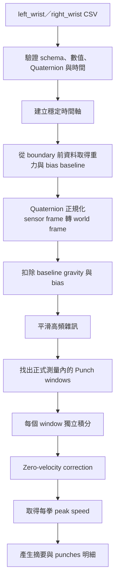

## 名詞定義

| 名詞 | 定義 |
|---|---|
| Capture timeline | 從 Desktop App 開始保存校正 samples 到正式測量結束的完整時間軸。 |
| Measurement boundary | Capture timeline 中正式 Session duration 開始的 `elapsed_us`。 |
| World frame | 不跟著手腕轉動的參考座標，用來扣除重力並積分線性加速度。 |
| Linear acceleration | 將原始 acceleration 轉到 World frame 並扣除重力與校正偏差後的加速度。 |
| Zero-velocity correction | 假設一次完整出拳的開始與結束速度接近零，用來降低積分漂移的修正。 |
| Punch window | 一次出拳事件從開始、主要高峰到結束所涵蓋的 samples。 |
| Synthetic data | 以程式產生且預期答案已知的 IMU data，用於自動驗證數學與資料流。 |

## 背景

目前 `punch_speed` version 1 只有 `summary` placeholder，Backend 沒有 Executor，因此 Desktop App 會把它視為不可使用。既有 `punch_count` 已能讀取左右手 Common IMU CSV，並以 acceleration 與 gyroscope 的動作分數找出主要 peaks；Session flow 也已能錄製、上傳、保存及取得 Result。

Common IMU CSV version 1 已包含本 Change 需要的 `elapsed_us`、三軸 acceleration、三軸 gyroscope 與 Quaternion，不需要改 CSV schema。限制是目前沒有外部速度 Ground Truth，因此自動測試只能證明數學、契約和整合正確，實際 IMU 測試只能驗證相對快慢與使用體驗。

## 目標與非目標

**目標：**

- 讓新版 Desktop App 能完成「拳頭速度」的 IMU 準備、校正、正式錄製、上傳、Backend 分析與 Result 顯示。
- 讓每一拳的速度能追查到手別及 CSV 時間範圍。
- 沿用既有 Session 與 CSV 保存方式，不建立第二套上傳流程。
- 以決定性的 pure-Python 演算法完成 Prototype，避免為第一版增加大型數值運算 dependency。
- 保持現有出拳次數 Benchmark 的結果不變。

**非目標：**

- 不宣稱已驗證拳頭絕對速度的誤差範圍。
- 不支援擊中沙包、手靶或其他物體的出拳。
- 不把手腕 IMU 到拳頭中心的距離或手掌旋轉半徑納入人體模型。
- 不在 Benchmark 資料錄製頁面加入沒有 Ground Truth 的拳頭速度選項。
- 不修改 Common IMU CSV version 1 或把 IMU frames 拆成 Database rows。

## 設計決策

### 1. 第一個可執行契約使用 punch_speed version 2

現有 version 1 已隨 Desktop 程式發布，但只有未定義內容的 `summary` placeholder。直接改寫 version 1 會讓舊 Desktop App 誤以為自己與新 Backend 使用同一份契約。

因此新版前後端改用：

```text
analysis_type = punch_speed
spec_version  = 2
display_name  = 拳頭速度
```

Backend 只為 version 2 註冊 Executor。舊 Desktop App 如果仍要求 version 1，會繼續看到功能不可執行，而不會收到自己無法解讀的新 Result。

替代方案是直接修改 version 1；此方式較省程式碼，但破壞版本契約，因此不採用。

### 2. 校正與正式測量共用 CSV，但以 Parameter 分界

Desktop App 會先用白話告訴 user 校正姿勢與接下來的操作。校正設定畫面先隱藏正式錄製時間，避免 user 誤以為時間包含校正。user 按下「開始校正」後立刻建立左右手 CSV writer；兩秒校正完成時才顯示正式錄製時間欄位，讓 user 輸入時間並按下「開始正式錄製」。流程如下：

```mermaid
flowchart LR
    GUIDE["顯示校正姿勢與下一步"] --> START["按下開始校正"]
    START --> CAL["錄製兩秒校正資料<br/>顯示請保持預備姿勢"]
    CAL --> DURATION["顯示錄製時間欄位<br/>user 輸入正式錄製秒數"]
    DURATION --> WAIT["顯示開始正式錄製按鈕<br/>等待 user"]
    WAIT -->|"時間有效且 user 按下按鈕"| BOUNDARY["保存 measurement_start_elapsed_us"]
    BOUNDARY --> RECORD["開始正式 Session duration"]
    RECORD --> STOP["時間到或 user 提前結束"]
    STOP --> PACKAGE["完成 CSV 與 Session package"]
```



`punch_speed` version 2 增加一個必要 Analysis Parameter：

```json
{
  "measurement_start_elapsed_us": 2000000
}
```

實際值由 monotonic capture clock 產生，不假設一定剛好等於 `2,000,000`。Backend 使用 boundary 以前的 samples 估算校正狀態，只在 boundary 以後偵測出拳。`requested_duration_seconds` 與 `actual_duration_seconds` 仍只描述正式測量，不包含校正時間。

替代方案是把校正資料另存 CSV；這會增加 CSV、Input Role 與上傳狀態，卻沒有提供額外 user 價值，因此不採用。

### 3. 使用同一批 CSV 完成事件偵測與速度計算

Backend 的資料流如下：



左右手各自執行相同流程，最後才合併 Result。任一必要輸入無法通過資料品質檢查，整個 Analysis Job 失敗。

### 4. 從既有 punch_count peak 邏輯抽出共用事件偵測

目前 `count_single_wrist_punches()` 只回傳數量。實作時將不改變 peak 選擇規則，僅把相同計算抽成可回傳 peak index 的內部函式，再由：

- `punch_count` 取事件數量；
- `punch_speed` 由每個 peak 向前、向後尋找低於動作 threshold 的位置，建立 Punch window。

相鄰 windows 重疊時，以兩個 peaks 的時間中點分割。window 不得早於 `measurement_start_elapsed_us`，也不得超出 CSV。既有五份 punch-count regression data 必須保持原本的左右手拳數。

替代方案是為拳頭速度另寫一套無關的事件偵測；這可能讓同一份 Session 的出拳次數與拳頭速度得到不同拳數，因此不採用。

### 5. Quaternion、重力移除與積分採明確且可測試的數學步驟

每筆 acceleration 先由 `g` 轉成 `m/s²`：

```text
a_mps2 = a_g × 9.80665
```

Quaternion 必須由四個有限數值組成且能正規化。實作依 ANROT frame 的 W、X、Y、Z 順序，把 sensor-frame acceleration 旋轉到固定 World frame。校正區段 World-frame acceleration 的 robust median 作為靜止 baseline；正式資料扣除這個向量後得到 Linear acceleration。

在每個 Punch window 內，以 trapezoidal integration 分別計算 `vx`、`vy`、`vz`：

```text
v[i] = v[i-1] + (a[i-1] + a[i]) / 2 × dt
speed[i] = sqrt(vx² + vy² + vz²)
```

每個 window 開始速度設為零。為降低短時間積分漂移，將 window 結束時的殘餘速度按經過時間線性扣回，使修正後的開始與結束速度都為零，再取 window 內最大的 speed。

第一版以 `rule_v1` 識別演算法參數；Result 對外回傳 `algorithm_version = "rule_v1"`。數值在輸出時四捨五入至小數三位，內部計算保留完整精度。

### 6. 時間軸保留 sample 順序並處理重複 timestamp

速度積分不能把重複 `elapsed_us` 的不同 samples 當成同一筆。時間處理依序使用：

1. 驗證 `sample_index` 連續且順序正確。
2. 優先使用能前進的 device time 判斷相鄰間隔。
3. device time 不完整時，使用 `elapsed_us` 的正向差值估算 median sample interval。
4. 同一批 serial read 造成 timestamp 重複時，依 sample 順序與 median interval 在批次內插值。

若仍無法得到正值 `dt`、資料低於最低可接受取樣率，或 measurement boundary 不在兩份 CSV 的有效範圍內，回報資料錯誤，不執行猜測。

### 7. Result 使用 flat summary 加上 punches array

Version 2 Result 範例如下：

```json
{
  "algorithm_version": "rule_v1",
  "left_punch_count": 2,
  "right_punch_count": 1,
  "total_punch_count": 3,
  "left_average_speed_mps": 4.85,
  "left_max_speed_mps": 5.2,
  "right_average_speed_mps": 4.1,
  "right_max_speed_mps": 4.1,
  "punches": [
    {
      "hand": "left",
      "punch_index": 1,
      "start_elapsed_us": 3100000,
      "peak_elapsed_us": 3290000,
      "end_elapsed_us": 3510000,
      "peak_speed_mps": 4.5
    }
  ]
}
```

`punches` 依 `peak_elapsed_us` 排序；`punch_index` 則在每隻手內從 1 連續增加。共用契約除了檢查 top-level 型別，也要驗證 nested object、非負有限速度、時間順序、拳數與摘要的一致性。

### 8. Desktop Result view 先摘要、後明細

頁面與導覽中的分析名稱由「出拳速度」改成「拳頭速度」。完成畫面先顯示左右手摘要卡片，再顯示可捲動的每拳明細表格：

```text
拳頭速度分析完成

左手：2 拳｜平均 4.85 m/s｜最高 5.20 m/s
右手：1 拳｜平均 4.10 m/s｜最高 4.10 m/s

手別｜第幾拳｜拳頭速度｜發生時間
```

畫面只在 Backend Result 通過 version 2 contract 後顯示完成，並沿用既有「重新測量」行為。UI 不顯示「估算手腕速度」，但技術規格保留資料來源與未具 Ground Truth 的事實。

### 9. 自動驗證與人工驗證分開

Automated tests 使用答案已知的 Synthetic data，至少涵蓋：

- `g` 到 `m/s²` 及 microseconds 到 seconds 的單位換算。
- Quaternion identity 與已知旋轉。
- 固定 acceleration pulse 的 trapezoidal integration。
- 開始／結束零速度修正。
- 重複 timestamp 的時間重建。
- 缺少 Quaternion、校正不足、無效時間及低取樣率錯誤。
- 左右手多拳的 Result 關係與 API round trip。
- Desktop 校正、錄製、等待、Result 與重新測量狀態。
- 現有 punch-count regression 不受共用事件函式調整影響。

人工驗證由 user 使用實際無線 IMU 完成靜止、慢速、一般速度與快速 Shadow boxing。驗證結果只記錄「是否符合相對快慢與操作預期」，不填寫不存在的真實速度或誤差百分比。

## 風險與取捨

- **Quaternion 方向定義或 sensor 安裝方向理解錯誤** → 以 identity、90 度旋轉的 synthetic tests，加上實際靜止轉腕不應產生持續速度的人工測試驗證。
- **手腕 IMU 不等於拳頭最前端** → UI 依產品需求顯示「拳頭速度」，技術文件明確記錄這是由手腕 IMU 推算且未使用人體幾何模型。
- **Zero-velocity assumption 不適用於尚未收完的拳** → 只接受可辨認的完整 Punch window；Session 在動作中被切斷時，不把不完整 window 當作有效速度。
- **積分對 bias 很敏感** → 強制兩秒校正、每拳獨立積分、短 window 與結束速度修正，避免跨整個 Session 累積。
- **共用事件偵測可能改變既有拳數** → 保留 peak 判斷次序與常數，並在實作期間先跑現有五份 regression data。
- **沒有 Ground Truth 無法判斷絕對準確度** → 第一版只承諾計算與相對行為可驗證，未來取得 Ground Truth 後再建立新演算法版本。

## 上線與回復方式

1. 先發布支援 version 2 contract 與 UI 的 Desktop source、Backend Executor 和 automated tests。
2. CI 以同一 commit 的 Artifact 完成前後端 E2E。
3. 合併後依既有 component delivery routing 部署 Backend，並產生新版 Desktop Release。
4. 新 Desktop 只有在 Backend 回報 `punch_speed` version 2 Executor 可用時才開放測量。
5. 若 Production smoke test 失敗，依既有 Backend release rollback；Desktop 保留上一個可用 Release。舊 Desktop 仍只要求 version 1，因此不會誤讀 version 2 Result。
