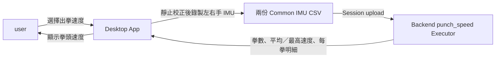

## 名詞定義

| 名詞 | 定義 |
|---|---|
| 拳頭速度 | Desktop App 顯示給 user 的分析名稱；數值由配戴在手腕的 IMU 資料推算，單位為 `m/s`。 |
| 出拳事件 | 一隻手完成一次 Shadow boxing 出拳的動作區段。 |
| 最高拳頭速度 | 一個出拳事件中，系統計算出的最高速度。 |
| 靜止校正 | 正式測量前，user 保持預備姿勢，讓系統估算 IMU 的初始狀態與感測偏差。 |
| 積分漂移 | 加速度的微小誤差經過時間累積後，使計算出的速度逐漸偏離合理值。 |
| Ground Truth | 由外部測速設備取得、可用來比較演算法準確度的參考速度；本 Change 尚未具備。 |

## 原因

目前 Desktop App 已有「出拳速度」入口與左右手腕 IMU 分配方式，但 Backend 尚未提供可執行的速度分析，因此 user 無法完成測量並取得結果。本 Change 先完成可操作的 Shadow boxing 拳頭速度 Prototype，透過自動測試確認計算與資料流，再由 user 使用實際 IMU 人工判斷速度快慢、左右手結果與穩定性是否合理。

## 變更內容

- 將 `punch_speed` 從只有 version 1 名稱與 `summary` placeholder 的待開發項目，升級為 Desktop App 與 Backend 都能執行的 version 2 分析。
- 每次分析各使用一份 `left_wrist` 與 `right_wrist` Common IMU CSV。
- 在正式錄製前加入簡短且有文字提示的靜止校正階段；校正前與校正期間不顯示錄製時間，校正完成後才請 user 輸入正式錄製時間並按下按鈕開始錄製，因此正式 Session duration 不包含校正或等待時間。
- Backend 依 IMU 的時間、加速度、角速度與 Quaternion，辨認每次出拳、扣除重力、修正積分漂移並計算每一拳的最高速度。
- Backend 回傳左右手拳數、平均速度、最高速度與每一拳的速度明細；所有速度統一使用 `m/s`。
- Desktop App 的 user-facing 名稱統一顯示「拳頭速度」，不顯示「估算手腕速度」。
- 沒有有效 Quaternion、時間軸、校正資料或必要 sensor data 時，分析失敗並顯示白話錯誤，不以猜測值假裝成功。
- 以已知答案的合成資料測試座標轉換、單位換算、積分與漂移修正，並以實際 IMU 進行人工驗證。
- 本 Change 不宣稱第一版數值已由外部 Ground Truth 證明絕對準確，也不在 Benchmark 資料錄製頁面重新加入「出拳速度」選項。

## 能力

### 新增能力

- `punch-speed-analysis`：定義 Shadow boxing 拳頭速度的輸入、校正、計算、結果、錯誤處理與人工驗證方式。

### 修改能力

- `analysis-specification-contract`：保留未曾實作的 version 1 作為舊 placeholder，新增前後端共同遵守且可驗證的 `punch_speed` version 2 Result schema。

## 影響

- `bap_common/`：更新 `punch_speed` Analysis Specification 與 Result 驗證。
- `bap_backend/`：新增拳頭速度 Executor，並註冊到既有 Session analysis flow。
- `bap_desktop/`：開放出拳速度測量、加入靜止校正狀態，並顯示左右手摘要與每拳明細。
- `tests/`：新增合成 IMU 計算測試、Analysis contract/API 測試、Desktop UI 測試與人工實機驗證項目。
- 既有 Common IMU CSV version 1、Session upload API 與 SQLite 原始 CSV 保存方式維持不變。

