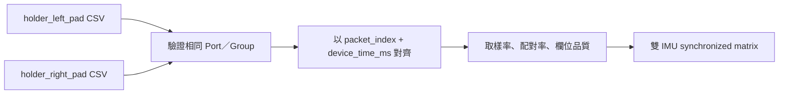
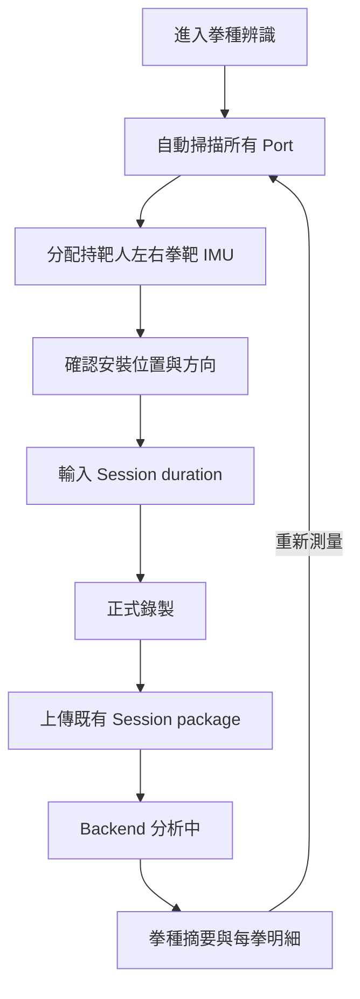

## 名詞定義

| 名詞 | 定義 |
|---|---|
| Research checkpoint | 「許明騏交接」中供研究程式載入的 PyTorch `.pt` 模型檔。 |
| Production Model Bundle | Backend Artifact 內實際部署的 ONNX 模型、正規化資料與 manifest。 |
| Model parity | 相同固定輸入經 Research checkpoint 與 Production Model Bundle 執行後，輸出落在指定誤差內且最終事件與拳種相同。 |
| Role adapter | 把 BAP 的 `holder_left_pad`、`holder_right_pad` Common IMU CSV 轉成研究模型原本 `Node1`、`Node2` 輸入順序的 Backend 元件。 |
| Synchronized matrix | 將左右兩顆 IMU 的同步 Frames 合併後形成的模型輸入矩陣。 |
| Model manifest | 記錄演算法版本、輸入順序、欄位、標籤、取樣率、模型參數與檔案 checksum 的 JSON。 |
| Regression fixture | 可放進公開 repository、輸入與預期結果固定的最小測試資料。 |

## 背景

目前 BAP 已有共用 Session、Common IMU CSV、Analysis Specification、非同步 Backend Job、原始 CSV BLOB 保存與 Desktop Result 查詢流程。`punch_classification` version 1 只有 `summary` placeholder，Backend 沒有 Executor，Desktop 因此將「拳種辨識」顯示為不可使用。

「許明騏交接」的最終流程使用兩顆安裝於持靶人左右拳靶背面的 IMU，取樣率為 400 Hz。原研究 CSV 在同一列保存 `Node1` 與 `Node2`，而 BAP 為每顆 IMU 保存一份 Common IMU CSV；同一個 Gateway packet 的不同 Node Frames 已保留相同 `packet_index`、`device_time_ms` 與 `elapsed_us`，因此可以在 Backend 重建原模型所需的同步資料。

交接內容同時存在論文描述與較新的最終程式。實作以 `許明騏交接/Code/README_HANDOVER_REPRODUCE.md`、`許明騏交接/Code/essay/README_REPRODUCE.md` 與最終 checkpoint 行為為準。論文提到的額外 gap merge，以及只使用 12 個 Segmentation channels 的描述，不得覆蓋最終程式與 checkpoint 的實際設定。

## 目標與非目標

**目標：**

- 沿用既有 BAP Session flow，完成雙拳靶 IMU 錄製、上傳、分析及 Result 顯示。
- 將研究模型轉成不需要 PyTorch Runtime 的可部署 Model Bundle。
- 完整重現最終交接程式的前處理、Segmentation、後處理與 Classification 行為。
- 讓每次分析能追查 Model Bundle、原始 CSV、同步資料範圍及拳種結果。
- 讓 CI 自動驗證模型、契約、Backend API、Desktop UI 與 Candidate Artifact。

**非目標：**

- 不重新訓練、調參或改善交接模型。
- 不新增 `unknown`、防守動作或假動作類別。
- 不支援有線 IMU、不同 Gateway 或不同 Group ID 的兩顆 IMU 組合。
- 不把整份「許明騏交接」、論文、簡報或未確認授權的原始資料加入 repository 或部署 Artifact。
- 不新增逐 Frame Database tables，也不修改 Common IMU CSV version 1。
- 不宣稱模型已對所有 user、IMU 型號、安裝方向及實際場域證明準確率。

## 設計決策

### 1. 使用 punch_classification version 2

既有 version 1 已存在於已發布的 Desktop 程式，但只有未定義內容的 `summary` placeholder。直接改寫 version 1 會讓新舊 Client 誤以為使用同一份契約。

因此第一個可執行版本使用：

```text
analysis_type = punch_classification
spec_version  = 2
display_name  = 拳種辨識
input_roles   = holder_left_pad, holder_right_pad
```

Backend 只為 version 2 註冊 Executor。舊 Desktop App 要求 version 1 時，仍會得到不可執行狀態，不會誤讀 version 2 Result。

替代方案是修改 version 1；此方式較省程式碼，但破壞已發布的版本契約，因此不採用。

### 2. 研究模型只在可信任的離線轉換流程載入

Production 不直接載入研究用 `.pt` 或執行整份交接專案。開發者在可信任環境透過 `tools/ml/convert_punch_classification_models.py` 載入兩個已知 checkpoint，輸出：

```text
bap_backend/app/analysis_models/punch_classification/v1/
├─ segmentation.onnx
├─ classifier.onnx
├─ normalization.npz
└─ manifest.json
```

Backend Runtime 只使用 `numpy` 與 CPU 版 `onnxruntime`。PyTorch 僅屬模型轉換工具的開發 dependency，不進入 Backend Production dependency，也不進入 Desktop Installer。

`manifest.json` 至少保存：

- `algorithm_version = mitt_tcn_bilstm_lstm_v1`
- Analysis Type 與 Specification version
- Research checkpoint SHA-256
- 每個 Bundle 檔案的 SHA-256
- Role 到模型 Node slot 的明確對應
- 32 欄 Segmentation feature 順序
- 12 欄 Classification feature 順序
- 400 Hz、window `384`、stride `128`、minimum segment `20`
- Classification resample length `96`
- 六種 label 的固定 index 順序
- 正規化資料名稱與 shape

替代方案是讓 Backend 安裝 PyTorch 並直接讀取 `.pt`；這會顯著增加 Artifact、安裝時間與不受限制反序列化的風險，因此不採用。

### 3. Node1／Node2 對應必須成為建立 Bundle 的阻擋條件

交接文件沒有足夠證據直接證明研究資料的 `Node1`、`Node2` 各自代表持靶人哪一隻手。轉換工具不得在沒有明確設定時自行猜測，而 MUST 要求開發者指定 Role mapping，並將它寫入 manifest。

建立第一個正式 Bundle 前必須使用其中一種方式確認：

1. 由原演算法開發者提供明確紀錄；或
2. 使用左右拳種已知的固定資料，分別測試兩種排列，確認哪一種能重現交接結果。

如果仍無法確認，Task 不得把 Executor 標示為可用。Backend Role adapter 永遠依 manifest 轉換，不依 Port 名稱、Node ID 大小或掃描順序猜測左右手。

### 4. 兩份 Common IMU CSV 依 Gateway packet 精確對齊

Backend 分別讀取 `holder_left_pad` 與 `holder_right_pad` CSV，先驗證兩份 descriptor 具有相同 Port、Group ID 與 connection type，並且 Node ID 不同。接著以 `(packet_index, device_time_ms)` 的共同值建立 inner join；同一 key 在單一 CSV 重複、兩邊 device time 矛盾或時間倒退時視為資料錯誤。

初始資料品質設定放在 manifest 或演算法設定中：

```text
expected_sample_rate_hz      = 400
sample_rate_tolerance        = ±10%
minimum_synchronized_frames  = 384
minimum_pair_ratio           = 0.95
```

對齊後保留共同的 `elapsed_us`，供 Result 轉回 Session 時間。必要欄位空白、非有限或缺少時直接失敗，不沿用前值或補零。

替代方案是依 CSV row number 配對；掉包時會把不同時間的 Frames 錯誤合併，因此不採用。以 `elapsed_us` 插值可作為未來支援不同資料來源的策略，但第一版只支援同一 Gateway packet，不需要引入插值誤差。



### 5. Role adapter 完整重現 32 欄 Segmentation 輸入

每一顆 IMU 依 manifest 提供 16 欄：

```text
acc_x, acc_y, acc_z,
gyro_x, gyro_y, gyro_z,
mag_x, mag_y, mag_z,
roll, pitch, yaw,
quat_w, quat_x, quat_y, quat_z
```

Role adapter 先依 manifest 決定哪個 Role 放入研究模型的 Node1 與 Node2 slot，再建立 `frames × 32` matrix。單位沿用 Common IMU CSV header，正規化只使用 Bundle 中保存的研究參數。

雖然論文文字描述 Segmentation 使用 12 channels，但最終 `model_best.pt` checkpoint 需要 32 channels；Production 必須遵守 checkpoint 與最終程式，並以 parity fixture 防止未來誤改為 12 channels。

### 6. Segmentation 後處理遵守最終交接程式

Backend 將正規化後的 32 欄資料切成 window `384`、stride `128` 的重疊視窗，以 batch 方式執行 ONNX Segmentation。重疊位置的 class probabilities 取平均後產生原始 Frame timeline 的 binary prediction。

後處理只做：

1. 將連續 positive Frames 形成出拳區段。
2. 移除長度少於 20 Frames 的區段。

不額外執行論文舊版的 gap merge 或 `Gmax`。這項差異寫入 model card 及 regression tests，避免日後只看論文而改變 Production 行為。

### 7. Classification 重現 Quaternion 重力修正與 96 × 12 輸入

每個出拳區段依交接的 `gravity_quat_add` 流程處理 acceleration，再選取兩顆 IMU 的 acceleration 與 gyroscope 共 12 欄。區段沿時間軸重採樣為 `96 × 12`，套用 Bundle 的正規化資料後送入雙向 LSTM ONNX Classifier。

Classifier 必定輸出六個 labels 的 probabilities；Backend 取最高值作為 `punch_type`，該值作為 `confidence`。第一版不自行增加 unknown threshold，因為這會改變交接模型的行為。若未來需要拒絕低信心動作，必須建立新的演算法版本與規格。

### 8. Result 保存摘要、時間明細與模型版本

Version 2 Result 範例如下：

```json
{
  "algorithm_version": "mitt_tcn_bilstm_lstm_v1",
  "total_punch_count": 3,
  "counts_by_type": {
    "left_jab": 1,
    "right_jab": 1,
    "left_hook": 0,
    "right_hook": 1,
    "left_upper": 0,
    "right_upper": 0
  },
  "punches": [
    {
      "punch_index": 1,
      "punch_type": "left_jab",
      "start_elapsed_us": 1240000,
      "end_elapsed_us": 1530000,
      "confidence": 0.94
    }
  ]
}
```

`punches` 依 `start_elapsed_us` 排序，`punch_index` 從 1 連續增加。Backend 在保存前驗證六種 counts、total 與明細一致。既有 `analysis_results.result_json` 足以保存此結構，因此不新增 Database migration。

### 9. Desktop 沿用通用頁面狀態並增加拳靶專用限制

Desktop 繼續使用既有自動 Port 掃描、Session duration、錄製、上傳、polling、錯誤與重新測量狀態。拳種辨識頁增加：

- 持靶人左手拳靶與右手拳靶兩個 selector。
- 只顯示可形成同 Port、同 Group、不同 Node 組合的無線來源。
- 模型版本對應的安裝圖示／文字與確認操作。
- 明確說明 Input Role 是持靶人手別，Result 是拳擊手手別。
- 總拳數、六種拳種統計卡片與可捲動的每拳明細。



### 10. Model parity 與公開 Regression fixture 分層驗證

驗證分成三層：

1. **Conversion parity**：可信任開發環境同時載入原 PyTorch checkpoint 與 ONNX，保存固定 tensors 的 logits、probabilities、segments 與 labels 比對結果。
2. **Repository regression**：只提交經授權且去識別化的小型 Common IMU CSV fixtures、預期結果及原模型 reference outputs；CI 不需要保存研究 checkpoint 也能驗證 ONNX Runtime。
3. **Artifact E2E**：Candidate Backend Artifact 啟動後，Desktop 測試透過真實 HTTP 上傳雙 IMU Session，等待分析並驗證 version 2 Result。

Regression fixtures 至少涵蓋六種拳種、連續出拳、無出拳、左右對調、不同 Gateway、缺少必要欄位與配對率不足。沒有授權以前，只能在本機使用交接資料，不得把它加入 Git history。

## 風險與取捨

- **Node1／Node2 左右關係判斷錯誤** → Bundle 建立前必須以原作者紀錄或已知左右資料確認，mapping 寫入 manifest 並加入防對調測試。
- **IMU 安裝方向與訓練資料不同** → Desktop 顯示固定安裝指引並要求確認；Hardware test 驗證同方向、旋轉與左右互換。
- **ONNX 與 PyTorch 數值差異改變邊界或分類** → 比對中間輸出與最終事件；超出容許差異時阻止 Bundle 與 Candidate 發布。
- **長 Session 造成記憶體與推論延遲** → Segmentation 使用 batch windows，Classification 逐事件或小 batch 執行；測試至少涵蓋預設 60 秒 Session，必要時再以新規格加入項目專屬上限。
- **模型強制把每個事件分到六類之一** → UI 把 confidence 稱為模型信心，不宣稱準確率；第一版不任意新增 unknown threshold。
- **研究資料可能含個人資訊或未取得公開授權** → 交接資料維持 untracked；只提交經確認可公開且去識別化的最小 fixtures。
- **研究結果不是 subject-independent accuracy** → model card 分別記錄資料集、實驗方式與限制，不把交接數字寫成產品保證。
- **模型資產增加 Backend Artifact 大小** → 只部署兩個 ONNX、正規化及 manifest，不包含 PyTorch、訓練資料或論文檔案。

## 上線與回復方式

1. 在可信任開發環境確認 Node role mapping，轉換兩個 checkpoint，產生 Model Bundle、reference outputs 與 model card。
2. 將 Bundle 放入 `bap_backend` package，確保 Backend Artifact 明確包含並驗證所有 checksums。
3. CI 完成 unit、contract、model regression、API E2E、Desktop UI 與 Candidate Artifact E2E。
4. 先部署含 version 2 Executor 的 Backend；此時舊 Desktop 仍將 version 1 視為不可使用。
5. Backend health 與拳種辨識 smoke test 通過後，再發布要求 version 2 的 Desktop。
6. Backend 部署失敗時沿用既有 Release rollback；Desktop 發布失敗時保留上一個可用版本。
7. 回復舊 Backend 後，新 Desktop 會由 capability check 得知 version 2 不可用，停止新測量並顯示白話訊息，不會偽造結果。
