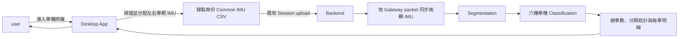

## 名詞定義

| 名詞 | 定義 |
|---|---|
| 拳種辨識 | 根據持靶人左右手拳靶背面的 IMU 資料，辨識拳擊手打出的拳種。 |
| 持靶人 | 手持左右拳靶、讓拳擊手擊打的人。 |
| 拳擊手手別 | 拳擊手實際出拳的左手或右手，與持靶人的左右手分開定義。 |
| Segmentation | 從連續 IMU 資料中找出每次出拳的開始與結束區段。 |
| Classification | 將一個已找出的出拳區段辨識為六種支援拳種之一。 |
| Model Bundle | Backend 執行辨識時需要的模型檔、正規化參數、版本與完整性資訊。 |

## 原因

Desktop App 已預留「拳種辨識」入口，但目前 Backend 沒有可執行的分析，因此 user 無法完成錄製並取得拳種結果。「許明騏交接」已提供兩顆拳靶 IMU 的 Segmentation 與 Classification 模型，本 Change 要把可信任的模型與必要前處理整理成 BAP 可部署、可驗證且能由既有 Session flow 執行的功能。

## 變更內容

- 將 `punch_classification` 從只有名稱與 `summary` placeholder 的待開發項目，升級成 Desktop App 與 Backend 都能執行的新版本規格。
- 每次分析使用同一個無線接收器下的兩顆不同 IMU，分別綁定為持靶人左手拳靶與右手拳靶。
- Desktop App 自動掃描 Port，讓 user 分配兩顆 IMU，並在正式錄製前顯示安裝位置、方向及左右手不可互換的提示。
- Desktop App 沿用既有 Session 錄製、上傳、分析狀態查詢與重新測量流程。
- Backend 依 Common IMU CSV 的 `packet_index` 與 `device_time_ms` 同步兩顆 IMU，建立交接模型需要的雙 IMU 輸入。
- Backend 先找出每次出拳區段，再辨識為左／右刺拳、左／右鉤拳或左／右上鉤拳。
- Backend 回傳總拳數、各拳種數量及依時間排列的每拳明細；每拳的分類分數 MUST 清楚標示為模型信心，不得稱為準確率。
- 將可信任的研究用 PyTorch checkpoints 轉成較適合部署的 ONNX Model Bundle，並以 parity tests 確認轉換前後結果一致；正式 Backend 不直接執行整份交接專案。
- 以少量、經確認可放入公開 repository 的固定資料建立模型回歸測試，不把整個「許明騏交接」資料夾或未確認授權的資料加入 Artifact。
- 本 Change 不新增 `unknown` 拳種，也不宣稱交接實驗數據代表所有 user、IMU 型號、安裝方向或實際環境的準確率。

## 能力

### 新增能力

- `punch-classification-analysis`：定義雙拳靶 IMU 的選擇限制、同步、資料品質檢查、六種拳種辨識、Result 與 Desktop 顯示行為。

### 修改能力

- `analysis-specification-contract`：保留既有 placeholder 版本，新增前後端共同遵守且可執行的 `punch_classification` 新版本 Input Roles、Parameters 與 Result schema。

## 影響

- `bap_common/`：新增可執行的 `punch_classification` Analysis Specification 與 Result 驗證。
- `bap_backend/`：新增雙 IMU 對齊、模型輸入轉換、ONNX 推論 Executor 與安全錯誤處理。
- `bap_desktop/`：開放拳種辨識流程、限制兩顆 IMU 必須來自同一個無線接收器，並新增安裝指引與拳種結果頁面。
- `tools/ml/`：新增一次性的可信任模型轉換與 Model Bundle 驗證工具。
- `tests/`：新增模型 parity、固定資料 regression、Analysis contract、API E2E、Desktop UI 與實際 IMU 人工驗證。
- Backend Artifact 會加入 ONNX 模型及推論 dependency；Desktop Installer 不需要包含 PyTorch 或 ONNX Runtime。
- 既有 Common IMU CSV version 1、Session upload API 與 SQLite 資料表原則上維持不變。

