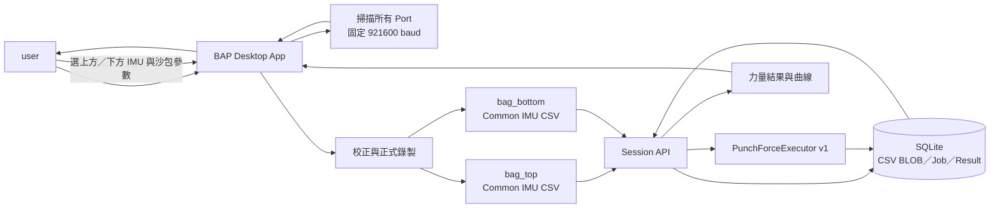
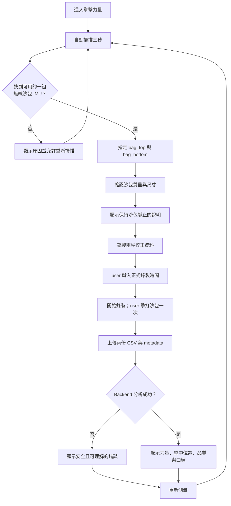

## 名詞定義

| 名詞 | 定義 |
|---|---|
| `punch_force` | 本 Change 新增的拳擊力量 Analysis Type。 |
| `bag_top` | 固定在沙包上方的 IMU，供力量模型計算沙包上方的加速度。 |
| `bag_bottom` | 固定在沙包下方的 IMU，供力量模型計算沙包下方的加速度。 |
| Common IMU CSV | BAP 共用的 23 欄 IMU CSV 格式；每顆 IMU 各自產生一份 CSV。 |
| 配對封包 | 兩顆 IMU 具有相同 `packet_index` 的資料列，代表它們來自同一個 Gateway packet。 |
| 校正基準 | 正式測量前，系統用靜止資料估計感測器基線與雜訊的結果。 |
| 力量模型 | 根據沙包上下兩顆 IMU 的加速度，以及沙包質量、尺寸與感測器距離，估算拳頭施加在沙包上的力量。 |
| Executor | Backend 中實際讀取 CSV、執行演算法並產生 Result 的程式元件。 |
| Quality Warning | 結果仍可顯示，但資料品質或模型假設有需要 user 注意的地方。 |
| Display Point | Backend 為 UI 繪圖保留的曲線點；它是原始計算結果的精簡版，不會改寫原始 CSV。 |

## Context

目前 BAP 已經有共用的拳擊 Analysis Session flow，可由 Desktop App 掃描 IMU、錄製 Common IMU CSV、上傳 Backend、執行 Analysis Job，最後把 Result 顯示給 user。不過「出拳力量」仍然是尚未實作的入口。

Repository 內的 `punch_force/` 已有研究版演算法。它使用固定在沙包上方與下方的兩顆 IMU，根據兩端加速度估算沙包質心加速度、旋轉加速度、拳擊力量與擊中位置。研究版程式的輸入是單一 Gateway 寬表 CSV，而且包含命令列、批次處理與繪圖行為，不能直接當成 BAP Backend Executor 使用。

BAP 的正式資料格式則是「一顆 IMU 一份 Common IMU CSV」。同一個無線接收器封包中的各個 Node 會共用相同的 `packet_index`，因此 Backend 可以用 `packet_index` 對齊沙包上下兩顆 IMU，而不需要修改現有 CSV schema 或 Session database tables。

本 Change 要把研究版的核心物理計算整理成可以測試、可以版本化、沒有 UI side effect 的 Backend service，並接上現有 Desktop App flow。`punch_force/` 保留作為研究參考，不直接放進正式 Artifact。

## Goals / Non-Goals

### Goals

- 讓 user 可以在 Desktop App 完成 IMU 掃描、沙包 IMU 指派、校正、正式錄製、Backend 分析與結果查看。
- 使用同一個無線接收器、同一個 Group ID 下的兩個不同 Node，分別代表 `bag_top` 與 `bag_bottom`。
- 沿用 Common IMU CSV、Session API、SQLite CSV BLOB 與 Analysis Job，不另外建立力量專用資料表。
- 將演算法輸入、參數、錯誤與 Result 定義成 `punch_force` version 1 contract。
- 結果同時顯示 kgf 與 N、擊中位置、取樣率、品質提示及可讀的曲線圖。
- 以 source-level、API integration、Desktop scenario 與 Windows Artifact smoke test 保護完整 flow。

### Non-Goals

- 不把 Force Plate 當成本次測量必需的裝置，也不宣稱 IMU 估算值等同 Force Plate 的直接量測值。
- 第一版不支援有線 IMU、不同 Port、不同 Group ID，或超過兩顆沙包 IMU 的配置。
- 第一版 UI 只引導 user 進行一次有效擊打，不另外計算或分離連續多拳；若資料中有多個峰值，結果只代表 global maximum。
- 不在本 Change 建立 Ground Truth dataset，也不承諾絕對力量準確度。
- 不把研究版 CLI、批次輸出目錄、pandas DataFrame 或 Backend Matplotlib 視窗帶入正式執行流程。
- 不修改 DNS、Caddy、TLS、部署流程或 Backend process 管理方式。

## System and Data Flow



Desktop App 對 user 顯示的主要階段如下：



## Decisions

### 1. 重用研究版的數學方法，但重新實作成 BAP service

Backend 會把研究版的純計算部分拆成小型、可測試的函式，例如資料驗證、封包對齊、取樣率估算、姿態轉換、濾波、擊打偵測、力量計算及 Result 組裝。Executor 只負責把 BAP 的 Analysis Job 接到這些函式。

這樣做的原因：

- 研究版程式讀取的是單一寬表 CSV，BAP 則是一顆 IMU 一份 Common IMU CSV。
- 研究版包含 CLI、批次寫檔及 Matplotlib 視窗，Backend API 不應在 request 中開視窗或任意寫研究輸出目錄。
- 小函式比較容易用合成訊號及固定 fixture 做 deterministic regression test。

沒有採用的替代方案是「直接 import 並呼叫 `punch_force.py`」。這會把檔案格式、命令列副作用與研究依賴一起帶進 production code，之後也難以維護 contract version。

### 2. 第一版只接受明確且可對齊的兩顆無線 IMU

Input Roles 固定為：

| Input Role | 來源 |
|---|---|
| `bag_top` | 沙包上方 IMU |
| `bag_bottom` | 沙包下方 IMU |

兩者必須位於相同 Port、相同 Group ID，且 Node ID 不同。Desktop App 先阻擋不合法選擇；Backend 仍會再次驗證，避免舊版或非官方 client 繞過 UI。

正式計算以 `packet_index` 配對，不以 CSV row number 或收到資料的電腦時間硬湊。只存在其中一份 CSV 的封包視為缺口，不會把不同時間的資料誤認為同一筆量測。

Windows 可能在一次 Serial read 收到多個 Gateway Packets，使不同 `packet_index` 共用相同的 host `elapsed_us`。只要時間沒有倒退且首尾具有有效時間跨度，Backend 會用 `packet_index`、首筆時間與末筆時間建立 deterministic、嚴格遞增的分析時間軸；原始 CSV 保持不變。若時間倒退、完全沒有跨度或無法建立可靠時間軸，Backend 仍拒絕分析。

### 3. 對少量內部缺口插值，但不改寫原始 CSV

對齊後如果只有少量、位於資料中間的封包缺口，Backend 可以在計算用的記憶體資料中做線性插值，並加入 Quality Warning。以下情況直接讓 Analysis Job 失敗：

- 開頭或結尾缺資料，沒有足夠資訊可以內插。
- 任一段連續缺少超過 5 個封包。
- 總缺口超過正式測量封包數的 5%。

原始 CSV BLOB 保持不變，讓之後仍可重跑不同版本的演算法。插值規則屬於 `algorithm_version` 的一部分；規則變更時必須更新演算法版本及 regression tests。

### 4. 沙包參數由 user 確認，轉動慣量由 Backend 統一計算

第一版參數如下：

| 參數 | 預設值 | 規則 |
|---|---:|---|
| 沙包質量 | 36 kg | 必須是有限的正數 |
| 沙包長度 | 1.24 m | 必須是有限的正數 |
| 沙包直徑 | 0.335 m | 必須是有限的正數 |
| 兩顆 IMU 的距離 | 1.24 m | 必須是有限的正數，且不得大於沙包長度 |

Backend 把沙包視為均勻實心圓柱，使用以下公式計算橫向轉動慣量，不另外要求 user 輸入難以理解的慣量數字：

```text
R = diameter / 2
J = mass × (3 × R² + length²) / 12
```

Analysis Job 已保存 `parameters_json`，因此同一份資料之後仍可知道當時採用哪些沙包參數。

### 5. 校正與正式錄製是兩個清楚分開的階段

校正前，UI 明確告訴 user：讓沙包靜止、不要碰撞、確認兩顆 IMU 已固定。系統錄製兩秒校正資料，取得重力方向、靜止偏差與基線雜訊。

校正成功後，才顯示正式錄製時間欄位與「開始測量」按鈕。正式錄製時間為 5 至 3600 秒，user 可以提前結束。Metadata 分別保存：

- `calibration_end_elapsed_us`：校正資料到此結束。
- `measurement_start_elapsed_us`：正式錄製從此開始。

兩個時間不能被視為同一個欄位，因為 user 在校正後閱讀說明、輸入時間及按下開始之間可能有停頓。Backend 只在正式錄製區間尋找擊打事件。

### 6. 力量計算沿用研究模型，所有單位在程式邊界寫清楚

計算順序如下：

1. 解析兩份 CSV，確認必要欄位、數值範圍、四元數可正規化。
2. 依 `packet_index` 對齊，估算實際取樣率並處理允許的內部缺口。
3. 使用校正區間估計兩顆 IMU 的靜止基準。
4. 對 body-frame 加速度做低通濾波，再透過四元數轉到共同的 world frame，扣除校正基準。
5. 取水平面加速度向量 `a_top` 與 `a_bottom`。
6. 計算沙包質心加速度 `a_com = (a_top + a_bottom) / 2`。
7. 計算力量 `F = mass × |a_com|`，內部單位為 N；顯示 kgf 時使用 `kgf = N / 9.80665`。
8. 使用上下感測器差值與距離估計角加速度，再由 `J × angular_acceleration / F` 估算擊中高度與相對沙包中心的偏移。

Backend 加入 SciPy，使用 Butterworth 低通濾波。Backend 不引入 pandas 與 Matplotlib；CSV 使用現有 parser／標準資料結構處理，繪圖由 Desktop 已有的 Matplotlib 完成。

### 7. 正式測量區間直接使用力量曲線的 global maximum

本 Change 遵循 `punch_force/README.md` 與原始 `punch_force.py` 的做法：正式測量區間只找一次 `argmax`，並用該點同時計算最大力量與擊中位置。

第一版 UI 仍會明確要求 user 一次只擊打一拳。不過演算法不使用 `find_peaks` 計算局部峰值數量，因為沙袋被擊中後的振動也可能產生其他局部峰值，不能直接把它們視為多次出拳。如果 user 實際打了多拳，結果會代表其中力量曲線最大的那一點；本分析不負責計算出拳次數。

結果中的 `algorithm_version` 使用 `bag_rigid_body_global_max_v1`，讓 Desktop 與 Backend 能明確確認彼此使用相同契約。

### 8. 資料可算不代表資料完美；可用警告與不可用錯誤分開處理

可完成分析但需要提醒 user 的情況，以 `quality_status = warning` 和 `warnings` 回傳，例如：

- 使用了允許範圍內的缺口插值。
- 實際取樣率低於建議取樣率。
- 兩顆 IMU 的旋轉訊號差異過大，可能沒有固定牢靠。
- 估算擊中位置超出沙包實體長度。

CSV 無資料、來源不符、必要欄位無效、取樣率不足以計算、缺口過多，或正式測量區間沒有可用的正力量資料，則讓 Job 失敗。對 user 顯示安全的白話訊息；詳細 stack trace 只留在 Backend log。

### 9. Result 同時服務數值閱讀與內嵌曲線圖

Backend 回傳已在 delta spec 定義的 versioned JSON，包括峰值力量、峰值時間、質心加速度、擊中位置、取樣率、品質與 `curve_points`。

完整 CSV 仍由 Backend 保存；給 UI 的曲線最多 300 點。降採樣必須保留第一點、最後一點與峰值點，避免圖表看不到真正的峰值。Desktop 結果頁用內嵌 Matplotlib 呈現：

- 上方與下方 IMU 的水平加速度。
- X/Y 方向角加速度。
- 力量曲線及峰值標記。
- 圖表內可見的座標軸名稱、圖例與峰值標記全部使用英文，避免目標電腦沒有中文字型時出現方框或亂碼；圖表外的 BAP 操作介面仍使用繁體中文。

頁面同時顯示「這是依 IMU 與沙包模型得到的估算值，不是 Force Plate 直接量測」，並提供「重新測量」回到 IMU 掃描階段。

### 10. 共用 input descriptor，避免每個分析複製分類專用型別

目前 Dispatcher 的來源描述型別名稱偏向拳種辨識。這次會把它一般化成 Analysis Input Descriptor，至少包含 CSV ID、Input Role、Port、連線方式、Group ID 與 Node ID。拳種辨識、拳擊力量與後續多輸入分析共用同一種 descriptor。

這是內部重構，不改變公開 API payload。既有 Executor 的行為與 tests 必須保持通過。

### 11. 沿用現有 Session database，不新增 migration

現有 tables 已能表達：

```text
measurement_sessions
├─ imu_csv_files (bag_top CSV、bag_bottom CSV)
└─ analysis_jobs (punch_force v1)
   ├─ analysis_input_bindings (bag_top、bag_bottom)
   └─ analysis_results (versioned JSON)
```

因此本 Change 不建立逐 Frame table，也不新增力量專用 table。這可保持 schema 簡單，並允許未來以新 `algorithm_version` 重跑同一份原始資料。

## Recommended Code Structure

```text
BAP/
├─ bap_common/
│  └─ analysis_contracts.py              # punch_force v1 contract
├─ bap_backend/
│  └─ app/services/
│     ├─ analysis_dispatcher.py           # 共用 input descriptor
│     └─ punch_force/
│        ├─ executor.py                   # Session／Job 接線
│        ├─ models.py                     # typed input／result／設定
│        ├─ alignment.py                  # packet_index 對齊與插值
│        ├─ signal_processing.py          # 校正、姿態轉換與濾波
│        └─ algorithm.py                  # 力量、擊中位置與事件偵測
├─ bap_desktop/
│  └─ ui/punch_items/
│     ├─ definitions.py                  # IMU roles、沙包參數、說明
│     └─ ...                              # 力量設定與 Result view
├─ tests/
│  ├─ unit/                              # 數學／對齊／contract
│  ├─ integration/                       # Session API + SQLite
│  └─ desktop/                           # user flow
└─ punch_force/                           # 研究參考，不進 Artifact
```

實際檔名可依現有 package 慣例微調，但 production 演算法不能依賴 Repository 根目錄的研究資料夾。

## Testing Strategy

### Source-level tests

- Contract 接受正確的兩個 Input Roles 與沙包參數，拒絕遺漏、重複或非法參數。
- 用已知的合成上下加速度，驗證 N、kgf、質心加速度、角加速度與擊中位置公式。
- 驗證 `packet_index` 完整對齊、少量插值、開頭／結尾缺口、連續缺口過大與總缺口過大。
- 驗證四元數正規化、靜止校正、濾波與取樣率估算。
- 驗證無可用正力量、單一峰值與多個局部峰值皆得到 deterministic 結果，且多個局部峰值選擇 global maximum。
- 驗證曲線降採樣不超過 300 點，且保留第一點、最後一點與峰值。
- 驗證既有出拳次數、速度、軌跡與拳種辨識 Executor 不受共用 descriptor 重構影響。

### API integration tests

- 建立包含 `bag_top`／`bag_bottom` 兩份 CSV 的 Session，送出 `punch_force` v1 Job，確認 Result 與 SQLite 保存內容。
- 驗證相同角色、不同 Port／Group、相同 Node、CSV 損壞及 Analysis error 的安全回應。
- 驗證同一份 CSV 與參數重跑同一個演算法版本會得到相同 Result。

### Desktop scenario tests

- 掃描、合法／非法 IMU 指派、沙包參數驗證、校正、正式錄製、提前結束、分析等待、結果與重新測量。
- Backend 不支援、網路錯誤、沒有可用正力量與 Quality Warning 的白話顯示，並確認多個局部峰值可顯示 global maximum 結果。
- 確認結果頁可嵌入曲線，而且 user 不需要開外部視窗。

### Artifact and manual tests

- Windows candidate 安裝後，以 production-like Backend 跑完整 Artifact E2E。
- 使用兩顆固定在實體沙包上下方的無線 IMU 做人工測量；確認流程可完成、曲線合理，且資料含多個峰值時回傳正式測量區間的 global maximum。
- 在沒有 Force Plate Ground Truth 的情況下，只能把人工測試結果記為「流程與數值合理性驗證」，不能宣稱絕對精度已被證明。

## Risks / Trade-offs

- **[沒有 Force Plate Ground Truth，絕對力量可能有系統性誤差]** → UI 明確標示估算值；保存原始 CSV、參數與演算法版本，方便未來取得 Ground Truth 後重新校正。
- **[沙包不是理想的均勻實心圓柱]** → 讓 user 輸入實際質量與尺寸；把模型假設寫入說明與版本，未來可增加不同沙包模型。
- **[兩顆 IMU 沒有固定牢靠或方向不一致]** → 校正前顯示擺放要求，Backend 做旋轉訊號一致性檢查並回傳 Quality Warning 或 error。
- **[無線封包遺失會破壞上下感測器對齊]** → 只用 `packet_index` 配對，限制可插值的缺口並保留原始 CSV。
- **[低通濾波可能壓低真正峰值]** → cutoff 依實際取樣率安全限制，參數納入演算法版本並以 synthetic regression test 固定。
- **[global maximum 可能選到振動或多拳中的最大值]** → UI 明確要求一次只擊打一拳；結果代表正式測量區間力量曲線最大的時間點。
- **[SciPy 增加 Backend Artifact 體積與 build 時間]** → 只在 Backend 加入必要依賴；不加入 pandas 與 Backend Matplotlib，CI 需要驗證乾淨 Windows build。
- **[共用 input descriptor 重構可能影響拳種辨識]** → 保持 API payload 不變，先加相容測試，再逐一切換既有 Executor。

## Migration Plan

1. 先新增 `punch_force` v1 contract、共用 input descriptor 與 unit tests，不在 UI 開放入口。
2. 實作 Backend 純計算 service、Executor 與 registry，完成 API integration tests。
3. 實作 Desktop 的來源指派、沙包參數、校正／錄製狀態與 Result view。
4. 更新完整 scenario matrix、Windows Artifact smoke test 與文件。
5. CI 全部通過後，由 user 使用實體沙包上下兩顆 IMU 做人工驗證。
6. 人工驗證完成後才把 Change 標記完成並同步主規格。

若新功能需要 rollback，可先從 Analysis Registry 移除 `punch_force` 並把 Desktop 入口恢復為尚未開放；既有 Session tables 與原始 CSV 不需回滾，因為本 Change 沒有新增 database migration。

