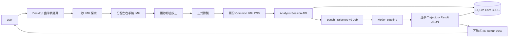
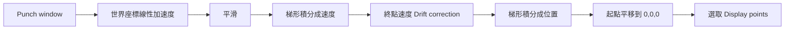
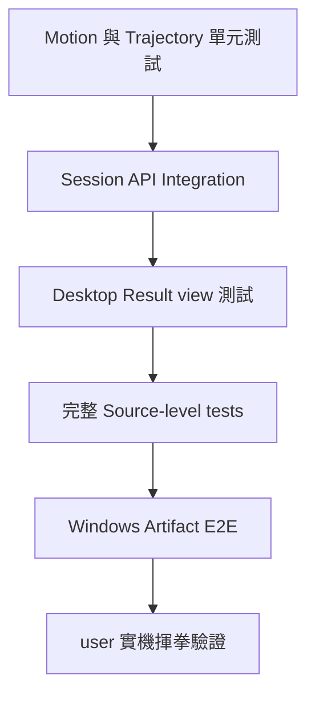

## 名詞定義

| 名詞 | 定義 |
|---|---|
| Research reference | `kaipo_research` 中用來理解原始演算法的交接程式與資料，不直接視為可部署產品程式。 |
| Motion pipeline | 將 Common IMU CSV 轉成世界座標線性加速度、速度及位置的共用運算流程。 |
| Punch window | 一拳在 CSV 時間軸上的開始、動作高峰與結束範圍。 |
| Session heading | 校正時建立的 user 正前方，用來把結果轉成 X 向右、Y 向前、Z 向上的座標。 |
| Display points | Backend 從完整估算路徑選出的有限點數，供 Desktop 3D Widget 顯示。 |
| Production Executor | Backend 正式啟動時註冊並執行真實演算法的分析元件。 |
| 3D adapter | 隔離 Result view 與內嵌 Matplotlib Widget 的薄層，讓資料選擇、Camera presets 與 fallback 可以個別測試。 |

## Context

`kaipo_research` 的實際 Trajectory Reconstruction 程式位於巢狀的 `demo_folder.zip`。原始流程由 C 程式讀取單顆 IMU 的舊 CSV，使用 Fusion AHRS、固定校正參數與固定 `0.0025` 秒取樣週期，把加速度積分成速度與位置，再輸出 `x,y,z` CSV；另一個 Python 程式用 Matplotlib 顯示或產生圖檔。

這份研究內容證明了軌跡重建方向可行，但目前具有固定路徑、固定長度陣列、裝置專屬校正值、來源不明 EXE、整段資料連續積分及第三方 Fusion 授權未確認等限制，不能直接放進 Backend Artifact。

BAP 已有 Common IMU CSV、左右手腕 Session、Quaternion 旋轉、靜止校正、出拳區段及速度積分。出拳軌跡適合在現有 `punch_speed` 基礎上抽出共用 Motion pipeline，再增加逐拳位置積分與 3D Result view。需求細節見本 Change 的 delta specs。

## Goals / Non-Goals

**Goals:**

- 以同一套可測試的 Python 運算支援左右手腕每一拳的相對三維軌跡。
- 保留 `kaipo_research` 的姿態轉換、重力移除與兩次積分核心概念，同時移除裝置專屬硬編碼。
- 讓 `punch_speed` 與 `punch_trajectory` 共用 CSV、時間軸、Quaternion、校正與 Punch window 邏輯，避免兩份實作逐漸不一致。
- 讓 Desktop 以內嵌 Matplotlib 互動式 3D 圖呈現有限大小的 Result，且在繪圖環境不可用時安全降級。
- 不改動現有 Session API 與 Database tables。

**Non-Goals:**

- 不宣稱 IMU 雙重積分能提供實驗室等級的絕對位置。
- 不在本 Change 訓練軌跡分類模型，也不使用研究資料中的軌跡 PNG 做拳種辨識。
- 不直接執行或發布 `imu.exe`、`plot_trajectory.exe`、整包資料集或 1.6 GB 交接壓縮檔。
- 不在同一個 Session UI 同時加入出拳次數、速度與軌跡等多個 Analysis Jobs。
- 不加入軌跡影片匯出、圖片匯出、歷史 Session 瀏覽或兩人軌跡比較。

## 系統資料流



## Decisions

### 1. 將研究演算法改寫成 Backend Python，不呼叫外部 EXE

Backend 新增版本化的 `PunchTrajectoryExecutor`。它直接接收 Session 儲存的 CSV bytes 並回傳 dict，與現有 Dispatcher 介面一致。

採用此方案的原因：

- 不需要在 Windows Server 安裝 GCC 或維護子程序。
- 沒有固定工作目錄、輸入檔名及暫存輸出檔碰撞。
- Python 例外可以轉成既有的安全 Analysis error。
- 同一套 Source-level tests 可在本機與 CI 執行。
- 未來 Backend 移到 Linux 時不必重新編譯 Windows EXE。

未採用的替代方案是把原始 C 程式編成 `imu.exe` 後由 Backend 呼叫。它較接近交接版本，但會保留硬編碼、檔案 I/O、程序管理與授權問題，因此不適合作為正式介面。

### 2. 抽出共用 Motion pipeline，避免複製拳頭速度程式

新增 `bap_backend/app/services/imu_motion.py`，承接以下既有或共用行為：

- 解析與驗證 Common IMU CSV。
- 從 `device_time_ms` 或 `elapsed_us` 建立均勻且向前的時間軸。
- 正規化 Quaternion 並將感測器加速度轉到世界座標。
- 以校正區段估計靜止基準及移除重力偏移。
- 使用現有出拳偵測規則建立 Punch windows。
- 以梯形積分建立速度，並修正終點殘留速度。

`punch_speed.py` 改為呼叫共用元件，但對外 Result 與 `rule_v1` 行為必須保持不變。`punch_trajectory.py` 在修正後速度上再次使用梯形積分得到位置。

未採用完全複製 `punch_speed.py` 的方案，因為兩份時間軸、校正與分拳規則很容易在後續修正時不一致。

### 3. 每拳獨立積分並以起點為原點

整段 Session 直接雙重積分會快速累積 Drift。Executor 因此先找出每隻手的 Punch windows，再對每個 window 個別處理：



速度修正使用與拳頭速度一致的線性終點誤差移除。位置不強迫最後一點回到原點，避免把沒有完整收拳的有效位移抹除；每個新 Punch window 重新以零速度與零位置開始。

### 4. 校正資料同時定義偏移與 Session heading

Desktop 將 `punch_trajectory` version 2 納入和拳頭速度相同的兩階段錄製：先錄兩秒校正，再由 user 決定正式時間及開始正式測量。`calibration_end_elapsed_us` 固定校正資料的結束位置，`measurement_start_elapsed_us` 標示正式測量開始位置；中間等待 user 輸入時間、操作滑鼠或移動到準備姿勢的資料不參與校正穩定性判斷，也不算正式出拳。兩個階段仍保存在同一份 CSV，不另外建立第三份校正檔。

Prototype 假設左右手腕 IMU 依 UI 示意以一致方向安裝。user 校正時面向預計出拳方向並保持準備姿勢；Backend 以校正 Quaternion 的穩定代表值建立 Session heading，將地球座標轉成：

- `+X`：user 右方。
- `+Y`：user 正前方。
- `+Z`：向上。

若校正 Quaternion 變動過大、無法正規化或兩顆 IMU 推得的 heading 明顯不一致，Executor 回報校正失敗，不猜測方向。這個 Prototype 假設必須在 UI 說明，後續若實機證明準備姿勢無法穩定推得 heading，再另開 Change 導入明確的方向校正動作。

### 5. 使用版本化、可重新驗證的 Result JSON

`bap_common/analysis_contracts.py` 新增 `punch_trajectory` version 2 specification 與關聯驗證：

```text
algorithm_version
coordinate_system
distance_unit
left_punch_count
right_punch_count
total_punch_count
trajectories[]
└─ hand, punch_index, start_elapsed_us, end_elapsed_us
   duration_seconds, path_length_m, maximum_displacement_m
   points[]
   └─ elapsed_us, x_m, y_m, z_m
```

Result validator 會從 `trajectories` 重算左右手拳數、總拳數、拳序、時間順序及摘要的基本關係。任何座標或摘要為 `NaN`／`Infinity` 都不能保存成成功 Result。

原始高頻 CSV 已由 `imu_csv_files.csv_blob` 保存，不再把全部 400 Hz 位置點複製進 Result。每拳以固定且可重現的等距索引選點，最多保留 300 點並一定保留首尾點。

### 6. Desktop 使用內嵌 Matplotlib 3D Widget，不產生暫存 PNG

新增專用 Trajectory Result view，以手別與拳次 selector 決定目前軌跡。3D adapter 將 JSON points 交給 Matplotlib `FigureCanvasQTAgg` 與 `mplot3d`，直接在 BAP 結果頁面顯示線段、起點、終點、座標軸與參考格線。畫面同時保留 Matplotlib Navigation Toolbar，讓 user 操作平移、縮放、視角重設及另存圖片。

Camera presets 固定定義為：

- 使用者視角：Camera 在原點後方，朝 `+Y` 看，`+Z` 向上。
- 側面：從 `+X` 或 `-X` 看向原點。
- 上方：從 `+Z` 往下看。
- 重設縮放：保留目前 preset，重新計算能完整看到所選軌跡的距離。

滑鼠可以在 Matplotlib 圖上旋轉，並透過 Navigation Toolbar 縮放及平移；selector 與 presets 都使用標準 Qt 控制項，因此可用鍵盤操作。Result view 不會因 Camera 改變而修改 Backend Result。

不採用 Matplotlib PNG，因為靜態圖不能滿足互動需求；改採 Matplotlib 的 Qt Canvas，所以仍可直接旋轉、縮放與平移。未採用 WebEngine／Plotly 的原因是 Desktop Artifact 會明顯變大且多一層網頁執行環境。未繼續使用 pyqtgraph／PyOpenGL，因為 user 希望結果與原始 `plot_trajectory.py` 的 Matplotlib 3D 視窗一致，且內嵌 Qt Canvas 已能滿足本次互動需求。

### 7. 3D 顯示失敗時使用文字 Fallback

3D adapter 的建構與更新都位於錯誤邊界內。若 Matplotlib、Qt Canvas 或繪圖環境不可用，頁面改顯示：

- 「此電腦目前無法顯示互動式 3D 軌跡」。
- 手別、拳次、持續時間、路徑長度及最大位移。
- 重新測量操作。

Backend Result 仍視為成功且不會被刪除。這使顯示能力問題不會被誤報成分析失敗。

### 8. 沿用現有 Session API 與 Database

現有 `analysis_jobs`、`analysis_input_bindings` 與 `analysis_results.result_json` 已能保存新分析，不需要 Migration。Backend capability endpoint 會在 Trajectory Executor 成功註冊時回報 `punch_trajectory` version 2 可執行；Desktop 仍依 capability 決定是否開放正式錄製。

## 建議程式結構

```text
BAP/
├─ bap_common/
│  └─ analysis_contracts.py            # punch_trajectory v2 契約
├─ bap_backend/app/services/
│  ├─ imu_motion.py                    # 共用運動資料與積分
│  ├─ punch_speed.py                   # 改用共用運算，維持既有結果
│  └─ punch_trajectory.py              # 逐拳位置與 Result
├─ bap_desktop/ui/punch_items/
│  ├─ definitions.py                   # trajectory spec_version=2
│  ├─ page.py                          # 校正、正式錄製與 Result 轉場
│  └─ trajectory_view.py               # selector、3D adapter、fallback
└─ tests/
   ├─ backend/test_punch_trajectory.py
   ├─ backend/test_analysis_sessions_api.py
   ├─ common/test_analysis_contracts.py
   └─ desktop/test_punch_items.py
```

## 驗證方式



自動測試使用合成的靜止、已知 Quaternion、已知加速度與多拳資料，驗證座標有限、起點歸零、拳序、點數上限、契約拒絕條件與 deterministic output。另用最小有效 Session 驗證 upload、Job、Result polling 與 UI 呈現。`punch_speed` 全部既有測試是共用元件重構的必要回歸防線。

因目前沒有光學定位 Ground Truth，`kaipo_research` 範例只能用來確認轉換流程可以執行，不能當作公尺座標準確度的唯一依據。最終需要 user 以 Jab、Hook、Uppercut 與靜止案例人工確認方向、形狀、尺度及 Drift。

## Risks / Trade-offs

- 左右手腕在自然準備姿勢下可能呈鏡像角度，即使兩顆 IMU 都穩定，heading 仍不會完全相同。實體測試觀察到 `64.35°` 的穩定差值，因此 Prototype 接受不超過 `75°` 的差值，並以兩者的圓形平均建立 Session heading；超過此範圍仍視為安裝方向不一致。這只能提供一致的相對顯示方向，不代表精密的絕對方位量測。

- **[雙重積分對雜訊非常敏感]** → 每拳獨立積分、靜止校正、平滑及終點速度修正；UI 明確標示相對估算軌跡。
- **[準備姿勢未必能穩定代表 user 正前方]** → 提供明確安裝與校正說明，檢查兩手 heading 一致性，實機驗證後再決定是否增加方向校正動作。
- **[共用 Motion pipeline 可能改變拳頭速度結果]** → 先以既有速度測試鎖住輸出，再重構；不在本 Change 調整速度參數。
- **[Matplotlib Qt Canvas 在部分 Windows 環境無法載入]** → 提供文字 Fallback，並在 Source 與 Artifact 測試中涵蓋成功與失敗路徑。
- **[Result points 太多會拖慢 API、SQLite 與 UI]** → 每拳上限 300 點，原始資料只保留在既有 CSV BLOB。
- **[研究程式或 Fusion 原始碼授權不明]** → 不複製或發布該程式；只依可描述的運算流程與 BAP 現有 Quaternion 能力重新實作。
- **[Matplotlib 增加 Desktop Artifact 大小]** → 移除不再使用的 pyqtgraph／PyOpenGL，只保留 Matplotlib、Qt backend 與 NumPy，CI 比較 Artifact 大小並執行 installer smoke test。

## Migration Plan

1. 先加入 version 2 契約、Backend Motion pipeline 與 Trajectory Executor；version 1 placeholder 保留但不可執行。
2. Backend 部署後 capability endpoint 會回報 version 2 可執行，但舊 Desktop 只認得 version 1，因此不會誤解新 Result。
3. Desktop 提升版本並加入校正與 3D Result view，通過 PR CI 與 Windows Artifact E2E 後才發布。
4. user 更新 Desktop 後才能提交 version 2 Session。
5. 若 Backend 部署失敗，沿用既有 Backend rollback；若 Desktop 3D 顯示有問題，可回復上一個 Desktop Release，Backend 保留 version 2 不影響其他分析。
