## 名詞定義

| 名詞 | 定義 |
|---|---|
| BAP | 專案與 Desktop App 的正式名稱，全名為 Boxing Analysis Platform。 |
| Desktop App | 以 Qt for Python（PySide6）建立、安裝在 user 電腦上的應用程式。 |
| 本機 IMU 服務 | 不依賴 Qt 的 Python 模組，負責列出 Port、讀取 bytes、解析 frame、產生 CSV 與整理結果。 |
| 遠端後端 | 以 Python 提供帳號、Token 與更新資訊 API 的伺服器程式。 |
| API client | Desktop App 內負責呼叫遠端後端 HTTPS API 的模組。 |
| Port 探索 | 在固定時間內同時讀取所有序列埠，並依解析結果辨識有線 IMU 或無線接收器。 |
| Access Token | 有效期 30 分鐘的 JWT，用於呼叫需要登入的 API。 |
| Refresh Token | 有效期 30 天的隨機字串，用於更新登入狀態；後端只保存其 hash。 |
| Migration | 以可重複執行的版本化步驟建立或調整 Database schema。 |
| Backend Artifact | 從指定 commit 建立、檔名為 `bap-backend-<commit-sha>.zip` 的可部署 Backend 壓縮檔。 |
| Release | 解壓縮到 `C:\BAP\releases\<commit-sha>\` 後不再原地修改的 Backend 版本。 |
| `current\` | `C:\BAP\current\` Directory Junction，指向目前由 Backend Python process 使用的 Release。 |
| 持久資料 | 不隨 Release 切換的 `.env`、Database、Log 與備份。 |
| 部署介面 | Backend 提供給人工部署及後續自動部署流程使用的 Artifact、目錄、設定、啟動、Migration 與 Health Check 約定。 |
| 發布 Script | Developer 在本機執行的 `Publish-BapBackend.ps1`，負責檢查 Git、建立 Artifact、上傳並要求遠端執行部署。 |
| 乾淨 Git 快照 | 沒有 Backend 相關未提交內容，且能以 commit SHA 從 Git 重新取得的完整檔案集合。 |
| Checksum | 與 Backend ZIP 放在一起的 `.sha256` 檔案，用來確認傳輸後的 ZIP 內容沒有改變。 |
| Backend Python process | 使用一般 Python command 啟動的 FastAPI process；Prototype 不註冊 Windows Service。 |
| PID file | `C:\BAP\run\bap-backend.pid`，記錄由部署 Script 管理的 Backend process id。 |
| 部署 Script Artifact | 檔名為 `bap-deployment-scripts-<commit-sha>.zip`，只包含可在遠端執行的部署 Scripts、版本資訊與 manifest。 |

## Context

目前 repository 以 `anrot_imu_driver/` 提供 Click CLI、`pyserial` 序列埠操作及 `AnrotSerialParser`。`read_data.py` 與 `record_data.py` 直接控制迴圈、終端輸出及檔案，會阻塞呼叫端；GUI 不適合直接呼叫這些 Click command。既有 parser 已能解析一般有線 frame 與 `0x63` 無線接收器 frame，後者會提供 `gw_id` 與 `node_id`。

本變更橫跨 Desktop UI、本機硬體存取、遠端帳號服務、Database、更新檢查、Windows 包裝，以及 Backend 可被部署的固定介面。Desktop App 使用 `https://imuapp.lab2312.cs.nthu.edu.tw/api/`；既有 Caddy 負責 TLS termination 與 Reverse Proxy，再將 request 轉送到監聽 `0.0.0.0:12345` 的 FastAPI Backend。DNS、TLS certificate、HTTPS termination 與 Caddy 設定都是已經搭建完成的 Server 外部前置條件，不由本 Change 實作。遠端 Windows Server 使用 `C:\BAP` 保存程式版本與持久資料；第一版由 Developer 本機 Script 透過 SCP 與 SSH 發布。GitHub Actions 無人值守部署不在本變更實作。

專案正式名稱改為 BAP（Boxing Analysis Platform）。Python package 使用 `bap_desktop` 與 `bap_backend`，本機 repository 目標路徑為 `D:\repos\BAP`；GitHub remote 固定為 `git@github.com:conan0220/BAP.git`。project-owned 文件、設定、installer、Backend process 與顯示文字都不得再使用舊專案名稱。

既有 `establish-punch-force-data-foundation` Change 專注於研究資料，不包含應用程式 UI。本設計不得把 Prototype 的 UI 或帳號需求混入該 Change，也不得把研究 trial 行為誤當成目前 App 的拳擊測量功能。

## Goals / Non-Goals

**Goals：**

- 讓 Desktop App、本機 IMU 服務及遠端後端有清楚邊界，三者可以分別測試。
- 重用既有 ANROT parser，但把序列埠讀取從 CLI 拆成 Qt-independent service。
- 讓所有 Port 的五秒診斷與三秒來源探索共用同一個有時間上限的掃描核心。
- 用可撤銷的 Refresh Token 與作業系統安全儲存支援記住登入狀態。
- 讓第一版能在 Windows 安裝，並保留日後建立 macOS、Linux 套件的空間。
- 建立 API、Service、Repository、Database、Security、Settings 與 Migration 邊界清楚的 Backend 架構。
- 提供固定 Artifact、外部設定、持久資料、啟動入口、Migration 與 Health Check 介面，讓人工部署與後續自動部署使用相同約定。
- 讓 `current\` 可以切換到新的 Release，也能在失敗時指回上一個 Release。
- 讓 Backend 與部署 Scripts 都能從已 commit、已 push 且可追蹤的版本建立 Artifact。

**Non-Goals：**

- 不錄製或分析拳擊測量資料。
- 不把 IMU bytes、解析資料或 CSV 上傳遠端後端。
- 不替 Group ID 或 Node ID 建立 user 自訂名稱。
- 不自動安裝 App 更新。
- 不建立 Windows Service，也不保證 Windows Server 重新開機後自動啟動 Backend。
- 不修改既有 Caddy、DNS、TLS certificate、HTTPS termination 或 Reverse Proxy 設定。
- 不在本變更建立 GitHub Actions 到 Windows Server 的無人值守部署流程，包括 Tag 觸發、production environment secrets、部署核准與 concurrency；第一版仍提供由 Developer 人工啟動、之後自動完成 SCP、SSH、`current\` 切換及失敗 rollback 的本機發布流程。
- 不修改 vendor material。

## 系統架構

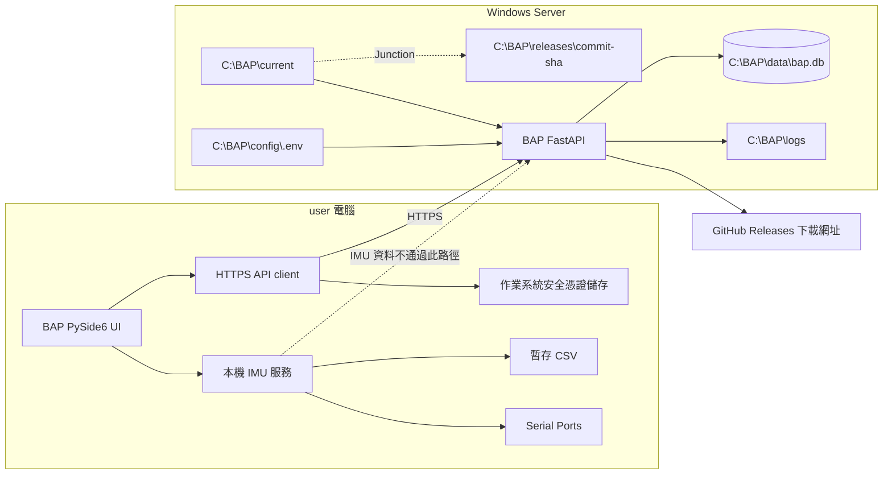

## 三個角色的資料夾與檔案

以下三棵樹分別描述 Developer 寫程式的位置、遠端 Backend 實際運行的位置，以及 user 安裝 Desktop App 後會看到的本機資料。相同名稱出現在不同電腦時，仍是不同的檔案副本。

### Developer 電腦：BAP repository

Developer 電腦保存所有 source code、測試、OpenSpec 與部署 Scripts。正式資料庫、正式 `.env`、user Token 及 IMU 資料不得放在這裡。

```text
D:\repos\BAP\
├─ .github\
│  └─ workflows\
│     ├─ ci.yml
│     └─ build-desktop.yml
├─ .codex\
│  └─ skills\
├─ bap_backend\
│  ├─ VERSION
│  ├─ __init__.py
│  └─ app\
│     ├─ main.py
│     ├─ api\
│     │  ├─ dependencies.py
│     │  └─ v1\
│     │     ├─ auth.py
│     │     ├─ releases.py
│     │     └─ health.py
│     ├─ core\
│     │  ├─ config.py
│     │  ├─ logging.py
│     │  └─ security.py
│     ├─ db\
│     │  ├─ base.py
│     │  └─ session.py
│     ├─ models\
│     ├─ schemas\
│     ├─ repositories\
│     └─ services\
├─ bap_desktop\
│  ├─ app.py
│  ├─ ui\
│  ├─ services\
│  ├─ api_client\
│  └─ resources\
├─ anrot_imu_driver\
│  ├─ commands\
│  └─ parsers\
├─ migrations\
│  ├─ env.py
│  └─ versions\
├─ deployment\
│  └─ windows\
│     └─ backend\
│        ├─ README.md
│        ├─ Initialize-BapBackendHost.ps1
│        ├─ Build-BapBackendArtifact.ps1
│        ├─ Publish-BapBackend.ps1
│        ├─ Publish-BapDeploymentScripts.ps1
│        ├─ Update-BapDeploymentScripts.ps1
│        ├─ Deploy-BapBackendRelease.ps1
│        ├─ Rollback-BapBackendRelease.ps1
│        ├─ Start-BapBackend.ps1
│        ├─ Stop-BapBackend.ps1
│        ├─ Get-BapBackendStatus.ps1
│        └─ Test-BapBackendHealth.ps1
├─ packaging\
│  └─ windows\
│     ├─ bap-desktop.spec
│     └─ bap-installer.iss
├─ tests\
│  ├─ backend\
│  │  ├─ unit\
│  │  ├─ integration\
│  │  └─ contract\
│  ├─ desktop\
│  ├─ imu\
│  └─ scenario\
├─ docs\
├─ openspec\
├─ ANROT-IMU-v1.3.6-windows-x64\
├─ dist\                              # Build 產物，不提交 Git
│  ├─ bap-backend-<commit-sha>.zip
│  ├─ bap-backend-<commit-sha>.zip.sha256
│  ├─ bap-deployment-scripts-<commit-sha>.zip
│  ├─ bap-deployment-scripts-<commit-sha>.zip.sha256
│  └─ BAP-Setup-<version>.exe
├─ .gitignore
├─ .python-version
├─ AGENTS.md
├─ README.md
├─ pyproject.toml
└─ uv.lock
```

`deployment/windows/backend/` 是所有部署 Scripts 的 source of truth。遠端只保留執行所需副本；任何修改都必須先在 repository review、commit 與測試，再由 `Publish-BapDeploymentScripts.ps1` 發布，不直接在 Server 上永久修改。

### 遠端 Backend：Windows Server

遠端 Server 只保存運行 Backend 及部署所需內容，不保存 Desktop App source code、Desktop installer、OpenSpec 或 IMU 資料。

```text
C:\BAP\
├─ current\                          # Junction，指向目前運行版本
├─ releases\
│  └─ <commit-sha>\
│     ├─ bap_backend\
│     ├─ migrations\
│     ├─ pyproject.toml
│     ├─ uv.lock
│     ├─ deployment-manifest.json
│     └─ .venv\
│        └─ Scripts\
│           └─ python.exe
├─ incoming\
│  ├─ bap-backend-<commit-sha>.zip
│  └─ bap-backend-<commit-sha>.zip.sha256
├─ config\
│  └─ .env                           # 正式 Secret，不進 Git 或 Artifact
├─ data\
│  └─ bap.db
├─ logs\
│  └─ bap-backend.log
├─ backups\
│  └─ bap-<timestamp>-<commit-sha>.db
├─ scripts\
│  ├─ Deploy-BapBackendRelease.ps1
│  ├─ Rollback-BapBackendRelease.ps1
│  ├─ Start-BapBackend.ps1
│  ├─ Stop-BapBackend.ps1
│  ├─ Get-BapBackendStatus.ps1
│  └─ Test-BapBackendHealth.ps1
├─ scripts-releases\
│  └─ <commit-sha>\                 # 已驗證的部署 Script 版本
├─ bootstrap\
│  └─ Update-BapDeploymentScripts.ps1 # 固定入口，不由自己覆寫
└─ run\
   └─ bap-backend.pid                # Backend 未執行時可不存在
```

`current\` 本身不保存另一份程式碼，只指向 `releases\<commit-sha>`。`.env`、`bap.db`、Log、PID 與備份都放在 Release 外，因此切換或移除 Release 不會刪除持久資料。Prototype 不建立 Windows Service；Backend 由普通 Python process 執行，部署 Scripts 透過 PID file 管理該 process。

### user 電腦：Desktop App 與本機資料

第一版使用 per-user Windows 安裝，預設不要求系統管理員權限，也不要求 user 安裝 Python。

```text
C:\Users\<user>\AppData\Local\Programs\BAP\
├─ BAP.exe
└─ _internal\                        # PySide6、Python runtime 與 App resources

C:\Users\<user>\AppData\Local\BAP\
├─ settings.json                     # 只放非敏感設定
├─ logs\
│  └─ bap-desktop.log
└─ temp\
   └─ imu-diagnostics\
      └─ <test-id>.csv               # 未匯出檔案在 App 關閉時刪除

Windows Credential Manager
└─ BAP Refresh Token                 # 不寫入 settings.json

user 自己選擇的資料夾
└─ exported-imu-diagnostics.csv      # App 關閉時不刪除
```

Desktop App 只呼叫遠端帳號與更新 API。序列埠、IMU bytes、診斷 CSV 與 Report 都留在 user 電腦；遠端 `C:\BAP` 不會收到這些資料。

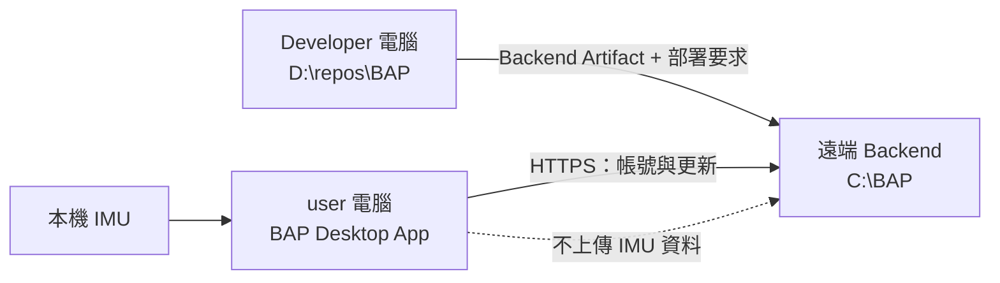

## Decisions

### 1. Desktop App 使用 PySide6，UI 與服務分層

Desktop App 使用官方 Qt for Python binding（PySide6）。UI layer 只負責畫面狀態與 user 操作；serial、CSV、HTTP、Token storage 都透過 service interface 呼叫。耗時工作使用 Qt worker thread 或 thread pool 執行，結果以 signal 回到 UI thread。

建議目錄：

```text
bap_desktop/
├─ app.py
├─ ui/
│  ├─ auth/
│  ├─ home/
│  ├─ imu_diagnostics/
│  └─ punch_items/
├─ services/
│  ├─ imu_scan_service.py
│  ├─ diagnostic_csv_service.py
│  ├─ session_service.py
│  └─ update_service.py
├─ api_client/
└─ resources/
```

**為何不直接呼叫 CLI：** CLI command 會直接印到 terminal、攔截例外並持續阻塞，無法提供 GUI 需要的取消、進度與結構化結果。

**替代方案：** PyQt6 也能提供相同 Qt API，但 PySide6 是 Qt 官方 Python binding，較適合目前希望採用 Qt for Python 的決定。

### 2. 建立 Qt-independent、有時間上限的 Port scan core

新增可重用 scan core，輸入為 Port 清單、固定 baud rate 與 duration，輸出為每個 Port 的結構化結果。每個 Port 使用獨立 parser instance 與 worker，並行執行以避免總時間成為 `Port 數量 × duration`。服務只被動讀取，不傳送任何設定指令。

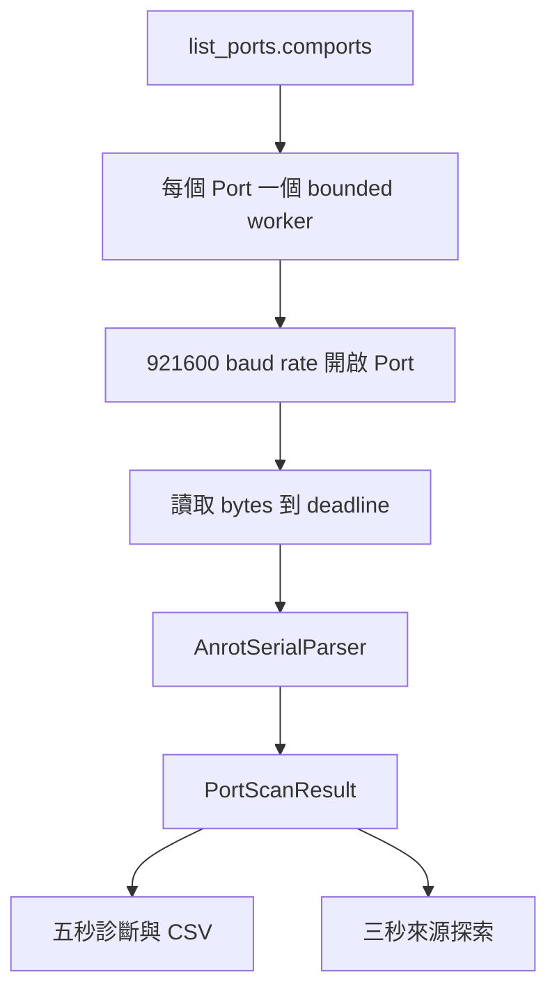

`PortScanResult` 至少包含：Port、Manufacturer、實際開始與結束時間、收到的 byte 數、成功解析的 frame、連線方式、Group ID、Node IDs、分類後的 status 與 reason code。UI 根據 reason code 顯示固定白話文字，不直接把不可控的 Python exception 完整內容暴露給 user。

**替代方案：** 依序掃描較容易實作，但多個 Port 時會讓 user 等待過久，因此不採用。

### 3. 所有受支援 IMU 固定假設為 921600 baud rate

診斷與來源探索都不做 baud rate 猜測，固定使用 `921600`。UI 不提供 baud rate picker。這能讓自動掃描時間固定，也避免每個 Port 反覆嘗試多個速率。

若沒有資料，UI 只能說明「可能不是 IMU、裝置未開啟，或波特率不是 921600」，不得宣稱已知道唯一原因。

**替代方案：** 自動輪流嘗試多種 baud rate 會增加等待時間，且收到偶然 bytes 時可能誤判，因此留到後續 Change。

### 4. 五秒診斷與三秒探索共用核心，但輸出不同

「IMU 連線狀態」使用五秒 scan，保留解析資料到單一暫存 CSV，計算 `資料列數 ÷ 實際秒數`，並顯示所有 Port。CSV 每列包含 Port 與來源欄位，讓多 Port 資料仍可追蹤來源。

拳擊項目進入前使用新的三秒 scan，不使用五秒 Report cache。它只保留建立來源選擇所需的結果，並只把成功解析的有線 Port或無線 Node 列為可選來源；完成選擇後清除探索資料。

**替代方案：** 重用本次 App 執行期間的五秒 Report 會漏掉之後開機、關機或換接的 Node，並把是否要重新掃描的責任交給 user，因此不採用。

### 5. 遠端後端使用 FastAPI、SQLAlchemy 與 Alembic，並採用單向分層

後端採用 FastAPI 提供 JSON API，以 Uvicorn 在 `0.0.0.0:12345` 執行。資料存取透過 SQLAlchemy，schema 變更使用 Alembic。Prototype 先使用單一 SQLite Database file，並保持 repository layer 不依賴 SQLite 特有 SQL，方便後續改用 PostgreSQL。

依賴方向固定為 `API → Service → Repository → Database`。API layer 只處理 HTTP schema、驗證狀態及回應；Service layer 負責註冊、登入、Token 輪替與版本查詢規則；Repository layer 封裝查詢與交易。API route 不得直接寫 SQL，Repository 也不得依賴 FastAPI request object。

建議目錄：

```text
bap_backend/
├─ __init__.py
├─ app/
│  ├─ main.py
│  ├─ api/
│  │  ├─ dependencies.py
│  │  └─ v1/
│  │     ├─ auth.py
│  │     ├─ releases.py
│  │     └─ health.py
│  ├─ core/
│  │  ├─ config.py
│  │  ├─ logging.py
│  │  └─ security.py
│  ├─ db/
│  │  ├─ base.py
│  │  └─ session.py
│  ├─ models/
│  ├─ schemas/
│  ├─ repositories/
│  └─ services/
```

`bap_backend/` 只保存能被 Python import 的 Backend package。Alembic 使用 repository root 的 `migrations/`，Backend tests 使用 `tests/backend/`，而 `deployment-manifest.json` 在 Build Artifact 時產生，不由 Developer 手動維護。

主要 API：

```text
POST /api/v1/auth/register
POST /api/v1/auth/login
POST /api/v1/auth/refresh
POST /api/v1/auth/logout
GET  /api/v1/releases/latest?platform=windows
GET  /health
```

Backend 由 application factory 建立 App，Database session、settings、clock 與 Token generator 都透過明確 dependency 注入，讓測試不需要連到正式 Database 或使用正式 Secret。

**替代方案：** 直接把 SQL 寫在 route 中較快，但會讓測試與未來換 Database 困難；Django 提供完整帳號功能，但對目前少量 API 與既有 Python 模組較重，因此不採用。

### 6. Prototype Database 只保存帳號、Refresh Session 與更新資訊

Database schema：

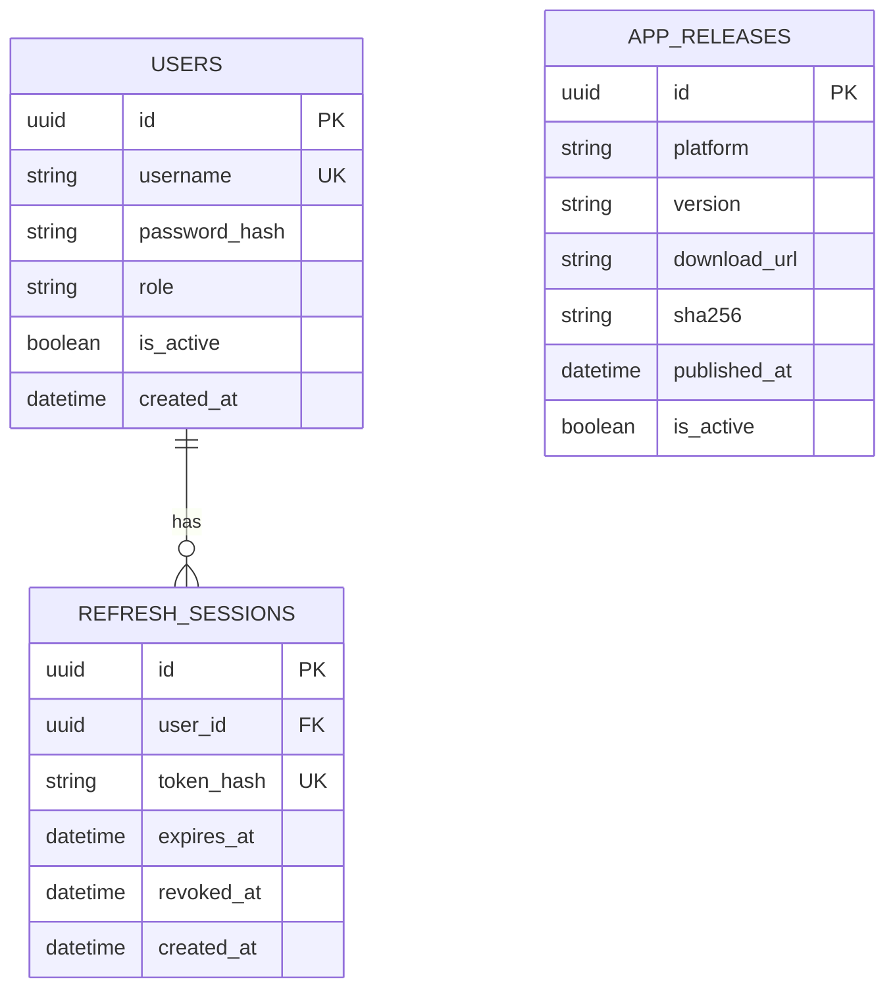

Username 欄位使用 case-sensitive unique comparison，確保 `Boxer01` 與 `boxer01` 是不同帳號。Database 不建立 IMU、CSV、拳擊測量或分析結果 table。

### 7. Access Token 使用短效 JWT，Refresh Token 使用可撤銷隨機字串

Access Token 由後端簽發，內容只放 user id、一般使用者 role、issued time、expiry 與 token id，有效期 30 分鐘。Refresh Token 使用 cryptographically secure random value，有效期 30 天；Database 只保存 hash，不保存可直接使用的原文。每次成功 refresh 時輪替 Refresh Token，舊 Token 立即撤銷。

密碼使用 Argon2id hash，不保存或記錄原始密碼。登入錯誤一律回覆相同訊息，避免透露帳號是否存在。

**替代方案：** 將 Refresh Token 也做成完全無狀態 JWT，無法可靠完成登出撤銷，因此不採用。

### 8. Desktop App 依「記住登入狀態」決定 Token 保存位置

Access Token 只保存在 process memory。user 勾選「記住登入狀態」時，Refresh Token 保存到作業系統 credential store；未勾選時只保存在 memory，App 關閉即消失。登出時先清除本機 Token，再嘗試通知後端撤銷，確保離線登出後 App 不會自行恢復登入。

**替代方案：** 將 Token 明文寫入設定檔較容易，但任何能讀取 user profile 的程式都可取得 Token，因此不採用。

### 9. App 啟動時非阻擋地查詢更新資訊

更新服務在 App 啟動後背景呼叫 `/api/v1/releases/latest`。後端從 `app_releases` 回傳 platform、version、HTTPS download URL 與 SHA-256。Windows 安裝檔由 GitHub Releases 保存；Desktop App 只開啟下載網址，不代替 user 下載或執行安裝程式。

更新檢查失敗不得阻止登入或本機 IMU 功能。版本比較使用標準 semantic version 規則，不以字串大小直接比較。

### 10. Windows 發行使用 PyInstaller one-folder 與 Inno Setup

PyInstaller 將 Python runtime、PySide6 plugin 與 App resources 收進 one-folder distribution，再由 Inno Setup 產生 Windows installer。one-folder 相較 one-file 有較穩定的啟動時間，也較容易檢查 Qt plugin 是否完整。Build workflow 必須在 Windows 執行，不使用 Windows build 產生 macOS 或 Linux 套件。

程式碼保持跨平台路徑、serial port 與 credential store interface，但本 Change 只驗收 Windows installer。

### 11. 本機 IMU 資料與遠端資料完全分流

Desktop App 的 auth/update API client 不接受 IMU payload；本機 IMU service 不持有遠端 API client。這個依賴方向避免未來程式修改時意外把 IMU 資料傳到伺服器。

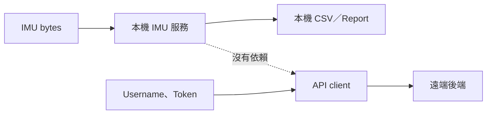

### 12. 專案身份、package 與安裝名稱統一為 BAP

產品對外短名稱固定為 `BAP`，完整名稱固定為 `Boxing Analysis Platform`。Python import package 使用 `bap_desktop` 與 `bap_backend`；Windows installer 顯示名稱使用 `BAP`；Backend Artifact 使用 `bap-backend-<commit-sha>.zip`。

本機 repository 完成其他修改與驗證後，資料夾名稱統一為 `D:\repos\BAP`。GitHub repository 已改名為 `BAP`，目標 `origin` URL 為 `git@github.com:conan0220/BAP.git`。改名檢查涵蓋 project-owned 程式碼、文件、OpenSpec 主規格、Goals、目前與 archived Changes、測試、設定、package metadata、installer 與 deployment files；`.git` 內部歷史物件及第三方 vendor material不做內容改寫。

**替代方案：** 只改 UI 顯示名稱會留下舊 package、路徑與部署名稱，之後容易同時出現兩套命名，因此不採用。

### 13. Backend 設定與 Secret 必須在 Release 外部

Backend 使用 typed settings 從 process environment 及 `C:\BAP\config\.env` 取得設定。至少定義下列設定介面：

```text
BAP_ENV
BAP_BIND_HOST=0.0.0.0
BAP_BIND_PORT=12345
BAP_DATABASE_URL=sqlite:///C:/BAP/data/bap.db
BAP_JWT_SIGNING_KEY
BAP_ACCESS_TOKEN_MINUTES=30
BAP_REFRESH_TOKEN_DAYS=30
BAP_LOG_DIR=C:/BAP/logs
```

正式啟動時若缺少 JWT signing key、Database URL 或其他必要設定，Backend 必須拒絕啟動並留下不包含 Secret 的錯誤訊息。`.env`、原始密碼、Token、Database 與 Log 不得放入 Artifact 或 Release。`C:\BAP\config\.env` 的 Windows ACL 只允許用來執行 Backend 的 `user` 帳號、`SYSTEM` 與被授權管理者讀取。

**替代方案：** 每個 Release 各自帶 `.env` 會造成 Secret 進入 Artifact，並讓 rollback 使用不同設定，因此不採用。

### 14. Backend Artifact 與遠端目錄使用固定介面

Backend Artifact 名稱固定為 `bap-backend-<commit-sha>.zip`，並在旁邊產生 `bap-backend-<commit-sha>.zip.sha256`。ZIP 內容至少包含 `bap_backend/`、`migrations/`、`pyproject.toml`、`uv.lock` 與 Build 時產生的 `deployment-manifest.json`，不得包含 `.venv`、`.env`、Database、Log 或測試產生資料。`pyproject.toml` 必須能只安裝 Backend production dependencies，不得讓遠端 Server 被迫安裝 PySide6、PyInstaller 或其他 Desktop／Build-only dependencies。

`deployment-manifest.json` 至少記錄專案名稱、component、完整 commit SHA、Backend version、建立時間、Python 版本需求、application entry point 與 Alembic revision。部署工具必須先驗證 `.sha256`，再確認檔名 SHA、manifest SHA 與目標 Release 名稱相符，避免把損壞或錯誤版本放到正式路徑。Checksum 放在 ZIP 外，避免 manifest 內容與 ZIP checksum 互相循環。

遠端目錄固定為：

```text
C:\BAP\
├─ current\                         # Junction，指向目前運行的 Release
├─ releases\
│  └─ <commit-sha>\                 # 解壓縮後不可原地覆寫
├─ incoming\                        # 尚未展開的 Artifact
├─ config\
│  └─ .env
├─ data\
│  └─ bap.db
├─ logs\
├─ backups\
├─ scripts\                         # 人工與後續自動部署共用入口
├─ scripts-releases\                # 有版本的部署 Script 內容
├─ bootstrap\                       # 固定的 Script 更新入口
└─ run\                             # PID 等短期執行狀態
```

準備 Release 時在 `releases\<commit-sha>\.venv` 執行鎖定相依套件安裝。`current\`、`config\`、`data\`、`logs\` 與 `backups\` 不得包在彼此裡面，切換 Release 也不得搬移或覆蓋持久資料。

**替代方案：** 直接把 ZIP 解壓縮覆蓋正在執行的目錄較簡單，但可能留下舊檔、鎖住執行中的檔案，也無法可靠 rollback，因此不採用。

### 15. Backend 使用普通 Python process 與固定啟動入口

Prototype 不建立 Windows Service。Backend 使用 `C:\BAP\current\.venv\Scripts\python.exe` 執行固定的 Backend entry point，並從外部設定取得 bind host、port、Database 與 Log 位置。首次啟動或除錯時，管理者可以在 Terminal 前景執行相同的 Python command；由部署流程啟動時，`Start-BapBackend.ps1` 會以背景 Python process 執行並將 PID 寫入 `C:\BAP\run\bap-backend.pid`。兩種方式都不得寫死某個 commit SHA。

`Stop-BapBackend.ps1` 只可停止 PID file 指向、且經檢查確實由 `C:\BAP\current` 啟動的 Backend process；不得依 process name 一次停止電腦上的所有 Python。`Get-BapBackendStatus.ps1` 必須能區分「執行中」、「PID file 過期」與「未執行」。Windows Server 重新開機後不保證自動啟動 Backend，管理者需執行 `Start-BapBackend.ps1`。

Backend 提供 `GET /health` 作為部署檢查介面。當 application 已啟動且能存取 Database 時回傳 HTTP `200`，內容包含 `status`、service 名稱及目前 commit SHA；尚未就緒或 Database 無法使用時回傳 HTTP `503`。回應不得包含路徑中的 Secret、Token、連線密碼或完整 exception。

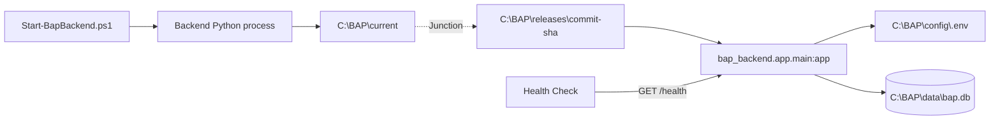

**替代方案：** Windows Service 能在開機後自動恢復，但會增加 Service wrapper、安裝與權限管理工作；Prototype 先使用普通 Python process，日後再另立 Change 評估正式服務管理方式。

### 16. Migration、切換與 rollback 共用相同部署順序

本 Change 定義可由人工操作的順序，後續自動部署 Change 必須重用，不得建立另一套語意不同的流程：

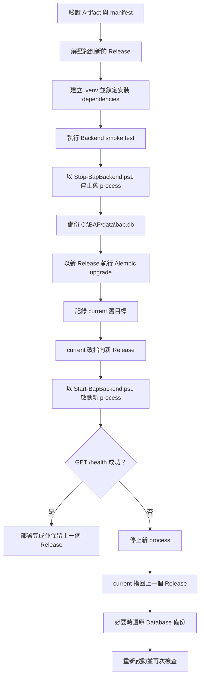

在停止 Backend process 前可完成解壓縮、dependency 安裝及不接觸正式 Database 的 smoke test，以縮短中斷時間。SQLite 備份必須在 Backend process 停止後建立，避免複製到寫入中的檔案。切換 `current\` 前要記錄舊目標；新版本健康檢查失敗時先切回舊 Release，若新 migration 與舊程式不相容，再還原剛才的 Database 備份。

GitHub Actions、`backend-v*` Tag、production environment secrets、部署核准及 concurrency 屬於後續自動部署 Change。本 Change 先由 Developer 人工執行本機發布 Script，使用相同的 SCP、SSH、遠端部署、Health Check 與 rollback 介面。

### 17. 第一次初始化與平常發布使用不同入口

遠端 Windows Server 已有 OpenSSH Server 與 `user` 帳號。Developer 電腦的 Public Key 已放入遠端 `C:\ProgramData\ssh\administrators_authorized_keys`，因此 SCP 與 SSH 使用 Public Key 驗證，不在 Script、`.env` 或 GitHub 保存 SSH 密碼。部署前仍須以 `BatchMode=yes` 驗證免密登入，並在 Developer 電腦的 `known_hosts` 固定遠端 Host Fingerprint；不得用 `StrictHostKeyChecking=no` 跳過 Server 身分檢查。

第一次建立 `C:\BAP` 時，需要具備管理員權限的人執行初始化；完成後，平常更新由 Developer 透過 `user@140.114.75.84` 執行。SSH port 預設為 `22`，但本機發布 Script 需提供參數覆寫。Python 版本依 repository 的 `.python-version` 使用 `3.12`；初始化 Script 檢查 Python、uv、OpenSSH client/server、免密登入與 ACL，缺少前置條件時清楚停止，不暗中修改 Server 的系統級軟體。

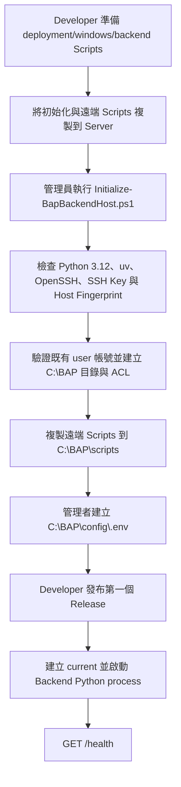

`Initialize-BapBackendHost.ps1` 必須可安全重複執行：已存在的目錄、`.env`、Database、備份、Release 與部署 Script 版本不得被刪除或覆蓋。它不建立新的 Windows 使用者、不重新設定 OpenSSH，也不覆寫 `administrators_authorized_keys`。

平常發布由 Developer 在 repository 執行 `Publish-BapBackend.ps1`。它是本機協調入口；真正會修改 `C:\BAP` 的工作由遠端 `Deploy-BapBackendRelease.ps1` 執行。

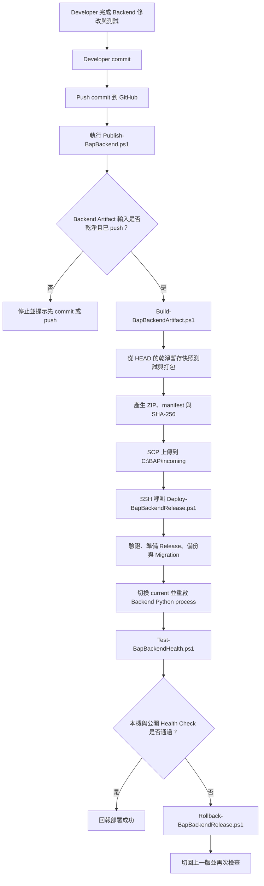

### 18. Artifact 只能代表已 commit 且可找回的 Git 快照

`Publish-BapBackend.ps1` 不得自動替 Developer commit。正式發布前，Developer 必須自行 review、commit，並將 commit push 到允許的 GitHub remote。Script 至少檢查 `bap_backend/`、`migrations/`、`pyproject.toml`、`uv.lock` 與 `deployment/windows/backend/` 是否存在未提交或未追蹤內容；任何會進入 Artifact 的 dirty file 都必須讓部署失敗。

`Build-BapBackendArtifact.ps1` 取得完整 `HEAD` commit SHA 後，從該 commit 建立乾淨暫存工作區，再執行 Backend tests、產生 manifest 與 ZIP。它不得直接從可能包含未提交修改的目前 working tree 複製檔案。如此才能保證：

```text
Artifact 檔名 SHA
= deployment-manifest.json SHA
= Release 資料夾 SHA
= GitHub 可以取得的 commit
```

只有 Desktop App 或其他不會進入 Backend Artifact 的檔案尚未提交時，Script 可以顯示警告；只要 Backend Artifact 輸入不乾淨就必須停止。未來 GitHub Actions 仍使用同一個 Build 與遠端部署介面，只把本機人工觸發換成 `backend-v*` Tag 觸發。

Backend version 的唯一來源為 `bap_backend/VERSION`，內容使用 semantic version，例如 `0.1.0`。Build Script 將該版本寫入 `deployment-manifest.json`；commit SHA 用來識別實際程式快照，Backend version 用來表達對外版本，兩者用途不同且都必須保留。

### 19. 部署 Scripts 使用獨立 Artifact 更新

Backend Artifact 不應順便覆寫正在執行的遠端部署工具，因此部署 Scripts 使用獨立發布流程：

| 檔案 | 輸入 | 輸出與用途 |
|---|---|---|
| `Publish-BapDeploymentScripts.ps1` | 已 commit 且已 push 的 repository `HEAD`、SSH host、SSH user、SSH port，以及可選的 Identity File | 從 Git 快照收集遠端部署 Scripts，產生 ZIP、manifest 與 SHA-256，透過 SCP 上傳，再以 SSH 呼叫固定的更新入口。 |
| `Update-BapDeploymentScripts.ps1` | 上傳到 `C:\BAP\incoming` 的部署 Script ZIP、checksum 與預期 commit SHA | 驗證內容後解壓縮到 `C:\BAP\scripts-releases\<commit-sha>`，再以安全切換方式更新 `C:\BAP\scripts`；失敗時保留舊 Scripts。它固定放在 `C:\BAP\bootstrap`，不得在執行途中覆寫自己。 |
| `bap-deployment-scripts-<commit-sha>.zip` | 指定 Git commit 中允許在遠端執行的 Scripts 與 manifest | 可追蹤、可驗證的部署 Script Artifact；不得包含 Backend source、Secret、Database、Log、SSH private key 或 user 資料。 |

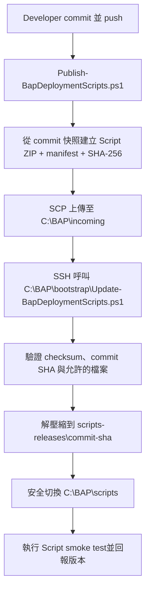

`Update-BapDeploymentScripts.ps1` 是刻意保持很小且穩定的 bootstrap。若連 bootstrap 本身也要更新，須以新的檔名並排安裝、驗證後再由管理者明確切換，不能讓它直接覆寫正在執行的檔案。

### 20. `app_releases` 由管理 CLI 建立

Backend 提供 `python -m bap_backend.tools.publish_desktop_release` 管理 CLI。管理者輸入 platform、semantic version、HTTPS download URL、SHA-256 與發布時間後，CLI 驗證資料並建立或更新 `app_releases`。CLI 不接受 HTTP request 中的一般 user Token，也不提供公開寫入 endpoint；Prototype 的 Desktop release 資料由具備 Server 權限的人在遠端 Terminal 建立。

### 21. 公開 HTTPS 與 Caddy 是外部前置條件

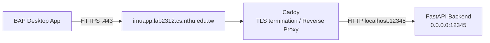

`0.0.0.0` 只代表 Backend 在 Server 上接受連線的 bind address，不是 Desktop App 使用的網址。Backend 啟動後，部署驗收依序檢查 Server 本機 `http://127.0.0.1:12345/health`，以及公開的 `https://imuapp.lab2312.cs.nthu.edu.tw/openapi.json`、`/docs` 與 `/health`。Backend 尚未啟動時公開網址回傳 `502 Bad Gateway` 是預期現象；本 Change 不修改 Caddy、DNS 或 TLS 設定。

### 22. Repository README 是 Developer 的操作入口

Repository 根目錄的 `README.md` 必須讓第一次接手 BAP 的 Developer 不必先閱讀全部 source code，就能知道每個操作在哪一台電腦執行、需要哪些前置條件、應使用哪個 Script，以及成功或失敗時會看到什麼。內容使用白話繁體中文，專有名詞保留英文；PowerShell 範例使用完整 shell 路徑、`-NoProfile` 與可直接複製的完整參數。

README 至少包含：專案用途、資料夾導覽、安裝開發相依套件、執行 tests、第一次 Initialize Server、Start／Stop／Status、Deploy Backend、Update Deployment Scripts、Rollback、公開 HTTPS 驗證、Desktop App build，以及常見錯誤。Script 名稱、預設 SSH host／user／port、`C:\BAP` 路徑及 Public API URL 必須與實作一致，不得把 Secret、Private Key 或正式 `.env` 範例值寫進文件。

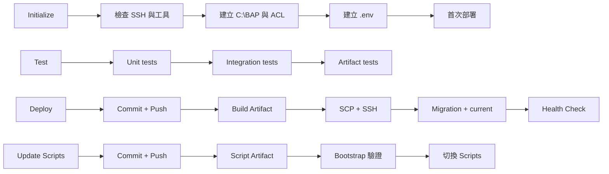

README 的 pipeline 只摘要「會做哪些事」；詳細安全檢查與實作仍以本設計及 Scripts 為準。測試必須檢查 README 提到的 repository 路徑與 Script 名稱實際存在，並執行文件中不會修改正式 Server 的本機命令範例。

## Risks / Trade-offs

- **掃描所有 Port 可能遇到非 IMU、Bluetooth virtual COM 或被占用的 Port** → 掃描只讀不寫、每個 worker 有 deadline，並把無法開啟或無法解析整理成逐 Port 結果。
- **開啟序列埠可能讓少數驅動改變 DTR／RTS 狀態** → serial adapter 明確使用不傳送資料的設定，hardware-in-the-loop 測試確認受支援 IMU；仍在說明中提醒系統會開啟所有 Port。
- **固定 921600 會忽略其他 baud rate 的正常裝置** → UI 清楚顯示固定假設與可行排查文字，不把它誤報成唯一硬體故障原因。
- **多個 Port 並行讀取可能讓 UI 或磁碟負載增加** → worker 只傳送批次進度與結構化結果，CSV 使用單一受控 writer，UI 不逐 frame 重畫。
- **SQLite 不適合高流量、多 process 寫入** → Prototype 後端先以單一 application process 執行，所有 schema 透過 SQLAlchemy/Alembic 管理，日後可遷移 PostgreSQL。
- **Refresh Token 被竊取可能維持 30 天登入** → 只保存 hash、每次 refresh 輪替、支援撤銷，Desktop App 使用 credential store。
- **未簽章 Windows installer 可能觸發 SmartScreen** → build 先產生可測試安裝檔；正式公開前另行取得 code-signing certificate 並加入簽章步驟。
- **更新檢查與登入共用同一網域，伺服器失效時兩者都不可用** → 更新檢查永不阻擋；登入顯示可重試錯誤。本機 IMU service 保持可獨立測試。
- **`current\` 切換期間若 Backend process 沒有停止，可能仍鎖住舊 Release 或讀到不一致檔案** → 使用 PID file 與 process command line 交叉確認後停止，完成 Junction 更新後才重新啟動。
- **Artifact、manifest 與 Release SHA 不一致可能部署錯誤版本** → 準備 Release 前交叉驗證三者，Release 建立後不得原地修改。
- **SQLite migration 失敗可能讓新舊 Backend 都無法使用** → 停止 Backend process 後先備份，migration 及 Health Check 任一步失敗就依相容性切回 Release 並還原備份。
- **將 repository 與 package 同時改名可能遺漏 scripts、文件或 installer metadata** → 使用不分大小寫的全 repository 搜尋、import tests、installer smoke test 與 remote URL 檢查作為完成條件。
- **Developer 忘記 commit 就發布，可能讓 Artifact SHA 與實際內容不同** → 發布 Script 拒絕 dirty Backend inputs，並只從 `HEAD` 的乾淨暫存快照打包；正式部署還要確認 commit 已 push。
- **遠端 `C:\BAP\scripts` 與 repository 版本不同可能產生不可預期結果** → repository 是唯一 source of truth，初始化及 Script 更新都有版本檢查，不允許直接在 Server 上做未回存的修改。
- **Developer 電腦在遠端部署途中斷線** → 遠端 Deploy Script 收到完整 Artifact 後自行完成或 rollback，重複呼叫同一 SHA 時回報既有狀態，不覆寫 Release。
- **普通 Python process 不會在 Windows 重開機後自行恢復** → Prototype 清楚記錄限制並提供 `Start-BapBackend.ps1`；正式自動啟動另立 Change 評估 Windows Service 或其他 process supervisor。
- **SSH Public Key 可以用管理員權限修改遠端檔案** → 發布 Script 使用 `BatchMode=yes`、固定 Host Fingerprint、限制 Artifact 內容並保存部署紀錄；Private Key 不進 repository 或 Artifact。

## Migration Plan

1. 先將 project-owned 內容中的舊名稱改為 BAP，建立 `bap_desktop/` 與 `bap_backend/` package，保留現有 CLI entry point。
2. 完成 import、文件、OpenSpec、package metadata 與 installer 命名檢查後，再將本機資料夾改為 `D:\repos\BAP`；GitHub repository 改名完成時同步更新 `origin`。
3. 為 parser adapter、Port scan core 與錯誤分類建立測試，再接上 BAP PySide6 UI。
4. 建立 Backend API、Service、Repository、Database、Security 與 Settings 分層，以及初始 Alembic migration，產生 `users`、`refresh_sessions` 與 `app_releases`。
5. 在本機啟動 Backend 與測試 Database，完成 API contract tests、Health Check、Migration tests 及 Desktop App integration tests。
6. 建立符合介面的 Backend Artifact 與 manifest，在隔離的 Windows 測試位置驗證解壓縮、鎖定 dependency 安裝、外部設定、Migration、啟動與 `/health`。
7. 在測試伺服器以既有 `user` 帳號建立 `C:\BAP`、持久資料目錄、PID 管理與第一個 `current\` Junction，以文件化的人工流程部署並驗證 process restart 與 rollback。
8. 在 Windows 建立 BAP installer，於乾淨的 Windows 測試環境驗證安裝、啟動、序列埠測試與移除。
9. 第一版由 Developer 本機發布 Script 完成 SCP、SSH、遠端切換與失敗 rollback；GitHub Actions、Tag 觸發、production secrets、部署核准與 concurrency 留給後續自動部署 Change。

若 Backend 需要 rollback，以 `Stop-BapBackend.ps1` 停止 Python process、將 `current\` 指回上一個 Release，必要時還原停止 process 後建立的 Database 備份，再以 `Start-BapBackend.ps1` 重新啟動並檢查 `/health`。Desktop App rollback 則由測試 user 移除 Prototype。既有 CLI 與研究資料 Change 的行為不受影響。

## Open Questions

- 正式公開 Windows installer 前是否能取得 code-signing certificate；這不影響 Prototype 功能與測試版安裝檔產生。
