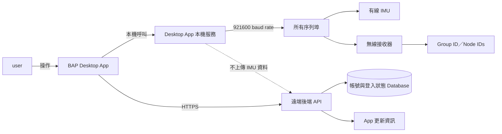

## 名詞定義

| 名詞 | 定義 |
|---|---|
| BAP | 本專案與 Desktop App 的正式名稱，全名是 Boxing Analysis Platform。 |
| BAP Desktop App | 安裝在 user 電腦上的 PySide6 桌面應用程式。 |
| 本機服務 | 在 Desktop App 所在電腦執行，負責序列埠探索、IMU 資料讀取、解析及暫存 CSV 的 Python 模組。 |
| 遠端後端 | 部署在伺服器上的 Python HTTPS API，負責帳號、登入狀態及 App 更新資訊，不接收 IMU 或拳擊測量資料。 |
| Backend Artifact | 可部署到遠端 Windows Server 的 Backend ZIP，檔名為 `bap-backend-<commit-sha>.zip`。 |
| Release | 解壓縮在 `C:\BAP\releases\<commit-sha>\` 的一個不可直接覆寫的 Backend 版本。 |
| `current\` | 位於 `C:\BAP\current\` 的 Windows Directory Junction，指向目前準備給 Backend Python process 使用的 Release。 |
| Developer 電腦 | 保存 BAP repository、執行測試、建立 Backend Artifact，並由 Developer 主動開始第一版部署的電腦。 |
| user 電腦 | 安裝 BAP Desktop App、連接 IMU，並保存本機設定、Log 與暫存 IMU CSV 的電腦。 |
| 發布 Script | Developer 在本機執行的 `Publish-BapBackend.ps1`，負責檢查 commit、測試、打包、上傳及要求遠端 Backend 更新。 |
| Backend Python process | 以一般 Python command 執行的 FastAPI Backend；Prototype 不安裝 Windows Service。 |
| 部署 Script Artifact | 將遠端部署 Scripts 打包後產生的 `bap-deployment-scripts-<commit-sha>.zip`。 |
| IMU 連線狀態 | 讓 user 查看目前所有序列埠是否能輸出可解析 IMU 資料的 Dashboard。 |
| 拳擊測量項目 | 出拳次數、出拳速度、出拳力量、出拳軌跡及拳型辨識等功能入口；本次只做到 IMU 來源選擇與「待開發」提示。 |
| Group ID | 無線接收器與無線 IMU 配對時使用的群組識別碼。 |
| Node ID | 同一個 Group ID 下，用來識別個別無線 IMU 的識別碼。 |
| Port | 作業系統提供的序列埠，例如 `COM3`。 |
| Manufacturer | 作業系統為序列埠或 USB 裝置提供的製造商資訊；沒有資料時顯示 `—`。 |

## 原因

BAP 目前只有命令列形式的 IMU 操作，還沒有一般 user 可以直接使用的桌面介面、帳號系統，以及清楚的裝置檢查流程。本變更先建立一套完整 Prototype，讓 user 能登入 App、了解 IMU 連線狀況，並預覽未來拳擊測量項目如何探索與選擇 IMU 來源。同時，本變更會補齊遠端 Backend 的程式分層、執行介面與部署介面，避免日後手動部署或自動部署各自猜測啟動方式及資料位置。

## 變更內容

- 將專案與 Desktop App 名稱從舊名稱統一改為 `BAP`，全名為 `Boxing Analysis Platform`；repository、package、installer、Backend process、文件與專案資料夾都使用新名稱。
- 將本機專案資料夾改為 `D:\repos\BAP`，並把 GitHub remote URL 更新為 `git@github.com:conan0220/BAP.git`。
- 建立以 Qt for Python（PySide6）製作的 BAP Windows Desktop App，提供登入、註冊、主畫面、IMU 連線狀態與拳擊測量項目入口。
- 建立遠端 Python API，支援開放註冊、Username 登入、Access Token、Refresh Token、記住登入狀態與登出。
- 將遠端 Backend 分成 API、Service、Repository、Database、Security、Settings 與 Migration 等清楚層次，並提供固定的啟動入口、設定方式及 Health Check。
- 定義 Backend Artifact 為 `bap-backend-<commit-sha>.zip`，遠端 Windows Server 使用 `C:\BAP` 作為根目錄，並分開保存 Release、設定、Database、Log、備份及待部署檔案。
- 使用 `C:\BAP\current\` Directory Junction 指向目前運行的 `C:\BAP\releases\<commit-sha>\`；Backend 啟動 Script 只依賴 `current\` 的固定路徑，讓後續部署流程可以切換版本及回復上一版。
- 將 `.env`、SQLite Database、Log 與備份保存在 Release 之外，避免切換或刪除 Release 時遺失持久資料。
- 明確區分 Developer 電腦、遠端 Backend Windows Server 與 user 電腦的資料夾、檔案及責任，避免把 source code、Server 持久資料與 user 本機資料混在一起。
- 提供第一版人工觸發、自動完成的發布流程：Developer 先完成 commit 與 push，再在本機執行 `Publish-BapBackend.ps1`；Script 建立 Artifact，透過 SCP 上傳，並以 `user@140.114.75.84` 的 SSH Public Key 登入方式要求遠端 Script 完成 Migration、`current\` 切換、Backend Python process 重啟、Health Check 與必要的 rollback。
- 提供 `Publish-BapDeploymentScripts.ps1`、固定放在遠端的 `Update-BapDeploymentScripts.ps1` 及 `bap-deployment-scripts-<commit-sha>.zip`，讓部署 Script 本身也能以有版本、可驗證的方式更新。
- 將既有 Caddy、DNS、TLS certificate、HTTPS termination 與 Reverse Proxy 視為 Server 外部前置條件；本 Change 只確保 Backend 監聽 `0.0.0.0:12345`，並驗證 Desktop App 可透過 `https://imuapp.lab2312.cs.nthu.edu.tw/api/` 呼叫 API。
- 發布 Script 必須從已 commit 的乾淨 Git 快照建立 Artifact；Backend 相關檔案尚未 commit、Artifact SHA 與 manifest 不一致，或正式部署的 commit 尚未 push 時，必須停止部署。
- App 啟動時以不阻擋主要操作的方式檢查更新；有新版時提示 user 自行下載，不自動安裝。
- 「IMU 連線狀態」進入頁面後，自動以固定 `921600` baud rate 同時測試所有 Port 五秒，產生暫存 CSV，並以每個 Port 一列顯示 Manufacturer、連線方式、Group ID／Node IDs、取樣率、狀態及可判斷的原因。
- 每次進入拳擊測量項目時，自動以固定 `921600` baud rate 探索所有 Port 三秒，再讓 user 從成功解析的有線 IMU 或 Group ID／Node ID 中選擇一個資料來源。
- 拳擊測量項目在本次只顯示「待開發」，不錄製拳擊資料、不執行分析，也不顯示假結果。
- App 關閉時刪除未匯出的 IMU 測試暫存 CSV，並讓本次執行期間的裝置結果失效。
- 第一版提供 Windows 安裝版本；macOS 與 Linux 保留為後續發行目標。
- 本變更定義並實作 Backend 固定部署介面與由 Developer 本機人工觸發的發布 Script；不包含由 GitHub Actions 監聽 `backend-v*` Tag、管理 production secrets、控制 deployment concurrency 及無人值守觸發的 CI/CD 流程，這部分將另立 Change。

## user 與系統關係

## 能力

### 新增能力

- `desktop-app-shell`：BAP Desktop App 的登入入口、主畫面、導覽、拳擊項目待開發狀態，以及 Windows 第一版的基本使用行為。
- `user-account-session`：Username 註冊與登入、Token 有效期、記住登入狀態及登出。
- `imu-connection-diagnostics`：自動測試所有 Port 五秒、產生暫存 CSV、計算取樣率並顯示逐 Port Report。
- `imu-source-discovery`：進入拳擊項目前自動探索所有 Port 三秒，並提供有線 Port 或 Group ID／Node ID 供 user 選擇。
- `desktop-app-update-check`：App 啟動時檢查版本並提示 user 下載新版。

### 修改能力

無。本變更不改變既有命令列工具的規定行為，而是在其上新增 Desktop App 與遠端服務能力。

## 影響

- Repository 與本機資料夾改名為 BAP；所有 project-owned 檔案中的舊專案名稱、package、installer、Service 與顯示名稱一併改為 BAP，並更新 GitHub remote URL。
- 新增 `bap_desktop/`、`bap_backend/`、Qt-independent 本機 IMU 探索服務與 Windows 包裝設定。
- 重整可重用的序列埠讀取能力，讓 CLI 與 GUI 不需要各自複製阻塞式讀取邏輯。
- 新增分層的 Python 遠端 API、帳號 Database、Token 管理、Migration、設定載入及 Desktop App API client。
- 遠端 Windows Server 新增 `C:\BAP` 執行目錄、`current\` Junction、Release、外部設定、Database、Log、PID 與備份介面，供手動部署及後續自動部署 Change 共用。
- Repository 新增 `deployment/windows/backend/`，保存 Windows Server 初始化、Artifact build、本機發布、遠端部署、Health Check 與 rollback Scripts；遠端只保存執行部署需要的 Scripts 副本，source of truth 仍在 Git repository。
- Repository 根目錄的 `README.md` 以白話說明 Developer 如何 Initialize、Test、啟動、停止、查看狀態、Deploy、更新部署 Scripts、Rollback 與驗證公開 HTTPS，並用 Mermaid 畫出各操作會執行的 pipeline。
- user 電腦使用 BAP 安裝目錄與獨立 App data 目錄；Refresh Token 放在作業系統 Credential Manager，IMU 暫存 CSV 在 App 關閉時刪除，匯出檔案保存到 user 自己選擇的位置。
- 新增 Password hashing、Token、作業系統安全憑證儲存、版本比較及 HTTP client 等相依套件。
- 需要新增 UI tests、API contract tests、序列埠模擬測試，以及必要的 hardware-in-the-loop tests。
- 不修改 `ANROT-IMU-v1.3.6-windows-x64/` 內的 vendor material。
