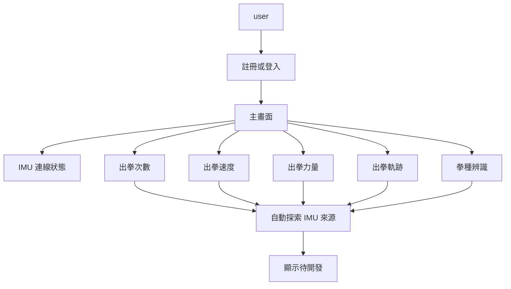

## 名詞定義

| 名詞 | 定義 |
|---|---|
| BAP | Desktop App 與本專案的正式名稱，全名為 Boxing Analysis Platform。 |
| Desktop App | 安裝在 user 電腦上的 BAP 桌面應用程式。 |
| 主畫面 | user 登入後看到的第一個功能頁面。 |
| 拳擊測量項目 | 出拳次數、出拳速度、出拳力量、出拳軌跡及拳種辨識。 |
| 待開發 | 畫面入口與前置設定已存在，但本次不會錄製拳擊資料或產生分析結果。 |
| Windows 安裝版本 | user 不需要先安裝 Python，就能在支援的 Windows 電腦安裝及啟動的應用程式版本。 |
| Public API URL | Desktop App 呼叫遠端後端時使用的公開 HTTPS 網址：`https://imuapp.lab2312.cs.nthu.edu.tw/api/`。 |
| 拳種辨識 | 根據量測資料辨識出拳種類的分析項目；舊介面曾稱為「拳型辨識」。 |
| 項目頁面 | user 從主畫面或側邊導覽選擇單一拳擊測量項目後看到的頁面。 |

## Purpose

提供一般 user 可以安裝及操作的 BAP（Boxing Analysis Platform）桌面介面，讓帳號、IMU 檢查與拳擊測量項目都有清楚入口，同時明確區分已可使用與仍待開發的功能。

## user 與 Desktop App 關係

## Requirements

### Requirement: App 使用 BAP 正式名稱
Desktop App、Windows installer 與已安裝應用程式 MUST 使用 `BAP` 作為產品名稱，並 MUST 在適合說明完整名稱的位置顯示 `Boxing Analysis Platform`，不得再顯示舊專案名稱。

#### Scenario: user 查看 App 與安裝資訊
- **WHEN** user 查看 Windows installer、已安裝應用程式名稱或 Desktop App 的產品資訊
- **THEN** 系統顯示產品名稱 `BAP`
- **AND** 產品資訊提供完整名稱 `Boxing Analysis Platform`
- **AND** 畫面不顯示舊專案名稱

### Requirement: 登入後顯示主畫面
Desktop App MUST 在 user 完成登入或成功恢復登入狀態後顯示主畫面，並提供 IMU 連線狀態與各拳擊測量項目的清楚入口。

#### Scenario: 登入後進入主畫面
- **WHEN** user 成功登入
- **THEN** Desktop App 顯示主畫面
- **AND** 主畫面顯示「IMU 連線狀態」及所有拳擊測量項目入口

#### Scenario: 成功恢復登入狀態
- **WHEN** Desktop App 啟動並成功恢復 user 的登入狀態
- **THEN** Desktop App 不要求 user 再輸入密碼
- **AND** Desktop App 顯示主畫面

### Requirement: 拳擊測量項目分開呈現
Desktop App MUST 將出拳次數、出拳速度、出拳力量、出拳軌跡及拳種辨識分成五個獨立入口，不得提供同時選擇兩個以上項目的量測流程；所有 user 可見位置 MUST 使用「拳種辨識」，不得再顯示「拳型辨識」。

#### Scenario: 查看拳擊測量項目
- **WHEN** user 查看主畫面或拳擊測量導覽
- **THEN** Desktop App 分別顯示五個拳擊測量項目
- **AND** 每個項目都標示「待開發」
- **AND** 第五個項目顯示為「拳種辨識」

#### Scenario: 進入單一拳擊項目
- **WHEN** user 點選一個拳擊測量項目
- **THEN** Desktop App 只為該項目啟動 IMU 來源探索流程
- **AND** Desktop App 不要求 user 同時選擇其他拳擊測量項目
- **AND** 項目頁面標題與 user 所選的項目一致

### Requirement: 待開發項目不得假裝已有分析功能
Desktop App MUST 在完成 IMU 來源選擇後顯示該拳擊測量項目仍待開發，且不得開始拳擊資料錄製、產生分析數值或顯示假結果。

#### Scenario: 完成 IMU 來源選擇
- **WHEN** user 為一個拳擊測量項目選好 IMU 來源
- **THEN** Desktop App 顯示該項目「待開發」
- **AND** Desktop App 不開始拳擊資料錄製
- **AND** Desktop App 不顯示力量、速度、次數、軌跡或拳種結果

### Requirement: 介面使用白話繁體中文
Desktop App MUST 以繁體中文及容易理解的文字呈現主要操作、狀態與錯誤；Port、Baud rate、Group ID、Node ID 等專有名詞可以保留英文。

#### Scenario: 顯示操作與錯誤
- **WHEN** Desktop App 顯示主要操作說明、進度、結果或錯誤
- **THEN** user 能看到白話的繁體中文內容
- **AND** 專有名詞的用法在同一流程中保持一致

### Requirement: 提供可獨立安裝的 Windows Prototype
系統 MUST 提供 Windows 安裝版本，讓 user 不需要自行安裝 Python 或開發工具即可安裝及啟動 Desktop App。

#### Scenario: 在支援的 Windows 電腦安裝
- **WHEN** user 在支援的 Windows 電腦執行安裝程式並完成安裝
- **THEN** user 可以從已安裝的應用程式啟動 BAP
- **AND** 啟動過程不要求 user 另外安裝 Python

### Requirement: Desktop App 使用公開 HTTPS 網址呼叫後端
Desktop App MUST 使用 `https://imuapp.lab2312.cs.nthu.edu.tw/api/` 呼叫帳號與更新 API，不得把 Server-side bind address `0.0.0.0:12345` 當成 user 電腦可連線的 API 網址。

#### Scenario: Desktop App 呼叫遠端 API
- **WHEN** Desktop App 傳送註冊、登入、Token 或更新資訊 request
- **THEN** request 使用 `https://imuapp.lab2312.cs.nthu.edu.tw/api/` 作為公開 API base URL
- **AND** Desktop App 不直接連線到 `0.0.0.0:12345`
