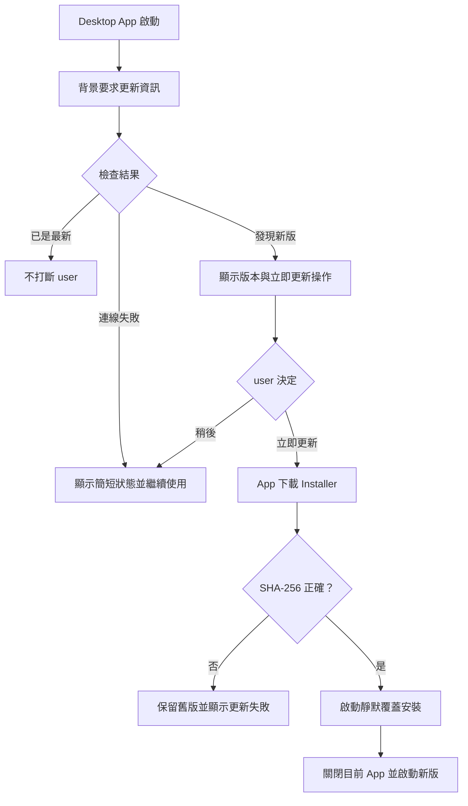

## 名詞定義

| 名詞 | 定義 |
|---|---|
| 目前版本 | user 電腦上已安裝的 Desktop App 版本。 |
| 最新版本 | 遠端後端回報，目前適用於 user 作業系統的最新公開版本。 |
| 更新檢查 | Desktop App 啟動後，比較目前版本與最新版本的背景流程。 |
| 更新提示 | 發現新版時顯示的版本與「立即更新」操作。 |
| 更新資訊 | 最新版本號、適用作業系統、下載位置及必要的完整性資訊。 |
| SHA-256 | Backend 提供的安裝檔雜湊值，用來確認下載內容完整且沒有被替換。 |
| 覆蓋安裝 | 不要求 user 先解除安裝，直接以新版 Installer 更新既有的 BAP 安裝目錄。 |
| Desktop 版本來源 | `bap_desktop/VERSION`，Installer、GitHub Release 與 App 執行時都以此為準。 |

## Purpose

讓 Desktop App 在啟動後自動得知是否有新版，並讓 user 直接在 App 內下載、驗證及啟動覆蓋安裝，不需要先解除安裝，也不需要自行前往 GitHub Release。

## 更新檢查流程

## Requirements

### Requirement: App 啟動時在背景檢查更新
Desktop App MUST 在每次啟動後透過 HTTPS 要求適用於目前作業系統的更新資訊，且更新檢查不得阻擋登入、主畫面或本機 IMU 功能。

#### Scenario: 更新服務正常回應
- **WHEN** Desktop App 啟動且遠端後端成功回傳更新資訊
- **THEN** Desktop App 比較目前版本與最新版本
- **AND** user 可以在檢查期間繼續操作 App

#### Scenario: 更新服務無法連線
- **WHEN** Desktop App 啟動但無法取得更新資訊
- **THEN** Desktop App 顯示不影響操作的簡短更新檢查狀態
- **AND** Desktop App 不因更新檢查失敗而阻擋登入或本機 IMU 功能

### Requirement: 發現新版時由 user 決定是否立即更新
當最新版本高於目前版本時，Desktop App MUST 顯示目前版本、最新版本及「立即更新」操作；不得在未取得 user 操作的情況下自動下載或安裝。

#### Scenario: 發現適用的 Windows 新版
- **WHEN** 遠端後端回報的 Windows 最新版本高於目前版本
- **THEN** Desktop App 顯示更新提示、目前版本、最新版本及「立即更新」操作
- **AND** user 可以選擇稍後處理

#### Scenario: user 選擇下載更新
- **WHEN** user 在更新提示中選擇「立即更新」
- **THEN** Desktop App 在背景下載遠端後端提供的 Windows Installer
- **AND** user 不需要開啟 GitHub Release 或手動解除安裝目前版本

### Requirement: App 必須先驗證 Installer 再覆蓋安裝
Desktop App MUST 使用更新資訊中的 SHA-256 驗證下載完成的 Installer；只有驗證成功才能啟動靜默覆蓋安裝。

#### Scenario: Installer 通過完整性驗證
- **WHEN** Installer 下載完成且實際 SHA-256 等於更新資訊中的 SHA-256
- **THEN** Desktop App 啟動 Installer 覆蓋目前版本
- **AND** Desktop App 關閉目前程序
- **AND** Installer 安裝完成後啟動新版 BAP

#### Scenario: Installer checksum 不符
- **WHEN** Installer 的實際 SHA-256 不等於更新資訊中的 SHA-256
- **THEN** Desktop App 刪除未通過驗證的下載檔
- **AND** Desktop App 不啟動 Installer
- **AND** 現有版本可以繼續使用

#### Scenario: 更新下載或啟動失敗
- **WHEN** Installer 無法下載、寫入或啟動
- **THEN** Desktop App 顯示簡短的更新失敗訊息
- **AND** 現有版本與 user 資料不受影響

### Requirement: Desktop 只能有一個版本來源
Desktop App 的 Installer 版本、GitHub Release tag 與 App 執行時回報的目前版本 MUST 全部讀取 `bap_desktop/VERSION`，不得在其他 Desktop source code 內另外寫死版本號。Backend Release MUST 繼續使用 Git SHA 識別，不得拿 Desktop 版本號當成 Backend Release ID。

#### Scenario: Build 與 Runtime 使用相同版本
- **WHEN** PR CI 建立 Desktop Installer
- **THEN** Installer filename、Installer metadata 與 App Runtime 版本都等於 `bap_desktop/VERSION`

### Requirement: 沒有新版時不打斷 user
當目前版本等於或高於遠端後端回報的最新版本時，Desktop App MUST 將狀態視為已是最新版本，且不得顯示要求 user 處理的彈出視窗。

#### Scenario: 已安裝最新版本
- **WHEN** 目前版本等於最新版本
- **THEN** Desktop App 不顯示需要 user 回應的更新提示
- **AND** App 可以在非阻擋位置顯示「已是最新版本」

### Requirement: 更新資訊必須對應作業系統
遠端後端 MUST 只把具有可用下載位置的版本回報為該作業系統的最新版本，Desktop App MUST 拒絕下載不適用於目前作業系統的更新位置。

#### Scenario: Windows App 要求更新資訊
- **WHEN** Windows Desktop App 要求更新資訊
- **THEN** 遠端後端回傳 Windows 版本資訊與 Windows 安裝檔下載位置

#### Scenario: 更新資訊缺少適用下載位置
- **WHEN** Desktop App 收到的更新資訊沒有目前作業系統可用的 HTTPS 下載位置
- **THEN** Desktop App 不顯示可執行的「立即更新」操作
- **AND** Desktop App 將這次更新檢查顯示為無法取得有效更新資訊
