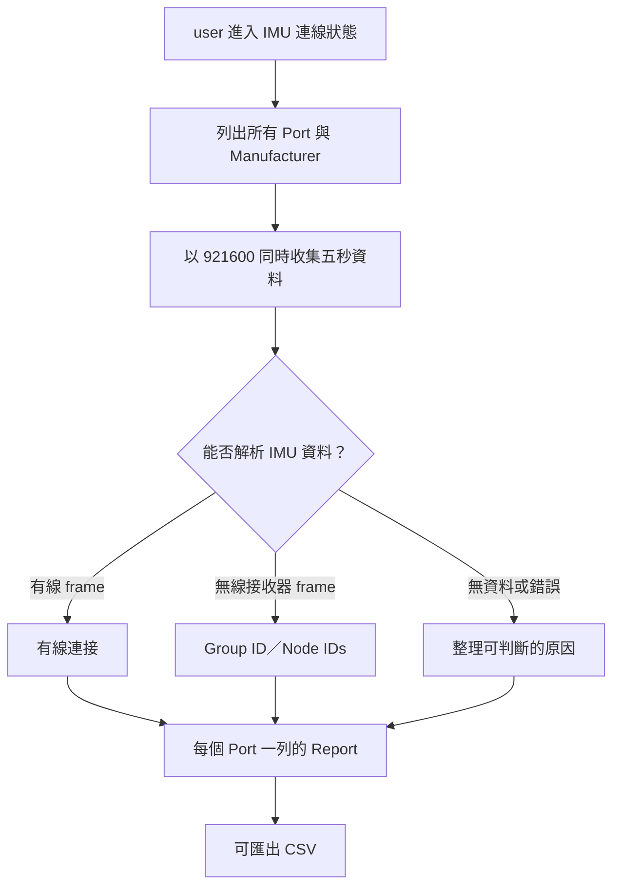

## 名詞定義

| 名詞 | 定義 |
|---|---|
| IMU 連線狀態 | 自動測試目前電腦所有序列埠，並顯示逐 Port 結果的 Dashboard。 |
| 測試 | 以 `921600` baud rate 同時從所有 Port 收集五秒資料並嘗試解析。 |
| 資料列 | 成功解析並寫入暫存 CSV 的一筆 IMU 測量資料，不包含 CSV header。 |
| 取樣率 | `資料列數 ÷ 實際收集秒數`，以 Hz 顯示。 |
| 連線方式 | `有線連接`或`無線接收器連接`；無法判斷時顯示 `—`。 |
| Manufacturer | 作業系統回報的序列埠或 USB 裝置製造商；沒有資料時顯示 `—`。 |
| 暫存 CSV | 測試期間由 App 建立，App 關閉時刪除，除非 user 已另行匯出的 CSV。 |
| 整體摘要 | Report 上方整理 Port 數量或連線數量的簡短資訊。 |
| 逐 Port 取樣率 | 使用單一 Port 成功解析的資料列數除以該 Port 實際收集秒數得到的取樣率。 |
| 全部 Port 平均取樣率 | 將多個 Port 的取樣率再計算平均的數值；不同 Port 代表不同資料來源，因此本介面不顯示此數值。 |
| Report | IMU 連線狀態測試完成後，每個 Port 顯示一列的結果表格。 |
| Gateway packet | 無線接收器在同一個取樣時間送出的資料包，可同時包含一顆以上的 Node。 |
| 無線 CSV 資料列 | 一個 Gateway packet 寫成的一列資料；同一列包含該 packet 的所有 Node。 |
| 有線 CSV 資料列 | 有線 IMU 成功解析的一個 frame 寫成的一列資料。 |

## Purpose

讓 user 不必猜測該測試哪些 Port，就能一次查看電腦上所有序列埠的 IMU 連線狀況、可解析資料的取樣率，以及系統能合理判斷的失敗原因。

## IMU 連線狀態流程

## Requirements

### Requirement: 進入 Dashboard 後自動測試所有 Port
Desktop App MUST 在 user 進入「IMU 連線狀態」後，自動列出當下所有序列埠，並以固定 `921600` baud rate 同時收集每個 Port 五秒資料；不得要求 user 選擇 Port、Baud rate 或另外按下開始測試。

#### Scenario: 電腦有多個 Port
- **WHEN** user 進入「IMU 連線狀態」，且作業系統列出多個序列埠
- **THEN** Desktop App 自動以 `921600` baud rate 測試所有列出的 Port
- **AND** 多個 Port 的五秒收集可以同時進行，不因 Port 數量變成逐一等待五秒

#### Scenario: 電腦沒有 Port
- **WHEN** user 進入「IMU 連線狀態」，但作業系統沒有列出任何序列埠
- **THEN** Desktop App 顯示「找不到可用的 Port」
- **AND** Desktop App 提供重新測試操作

### Requirement: 測試期間顯示清楚進度
Desktop App MUST 在五秒測試及後續分析期間顯示「IMU 測試中，請稍後。」以及目前階段，且測試不得讓 App 介面失去回應。

#### Scenario: 正在收集資料
- **WHEN** 所有 Port 正在進行五秒資料收集
- **THEN** Desktop App 顯示測試中的提示與五秒進度
- **AND** App 視窗仍可正常重繪及回應關閉操作

#### Scenario: 正在產生 Report
- **WHEN** 五秒資料收集已完成但結果仍在整理
- **THEN** Desktop App 顯示正在分析資料
- **AND** Desktop App 不提前顯示尚未完成的 Report

### Requirement: 系統必須逐 Port 判斷連線結果
系統 MUST 對每個 Port 分別判斷是否成功解析至少一筆 IMU 測量資料；成功時顯示「已連線」，沒有成功解析任何資料時顯示「未連線」。

#### Scenario: 成功解析有線 IMU
- **WHEN** 某個 Port 在測試期間成功解析至少一筆有線 IMU 測量資料
- **THEN** Report 將該 Port 標示為「已連線」
- **AND** 連線方式顯示「有線連接」
- **AND** Group ID／Node IDs 顯示 `—`

#### Scenario: 成功解析無線接收器資料
- **WHEN** 某個 Port 在測試期間成功解析至少一筆無線接收器資料
- **THEN** Report 將該 Port 標示為「已連線」
- **AND** 連線方式顯示「無線接收器連接」
- **AND** Report 顯示該 Port 觀察到的 Group ID 與所有 Node IDs

#### Scenario: 沒有成功解析資料
- **WHEN** 某個 Port 在五秒內沒有成功解析任何 IMU 測量資料
- **THEN** Report 將該 Port 標示為「未連線」
- **AND** 該 Port 的取樣率顯示 `0 Hz`

### Requirement: Report 必須每個 Port 顯示一列
Desktop App MUST 以每個 Port 一列顯示 Report，欄位依序包含 Port、Manufacturer、連線方式、Baud rate、Group ID／Node IDs、取樣率、連線狀態及說明。

#### Scenario: Manufacturer 可以取得
- **WHEN** 作業系統為 Port 提供 Manufacturer
- **THEN** Report 在該 Port 的 Manufacturer 欄顯示作業系統提供的文字

#### Scenario: Manufacturer 無法取得
- **WHEN** 作業系統沒有為 Port 提供 Manufacturer
- **THEN** Report 在該 Port 的 Manufacturer 欄顯示 `—`

#### Scenario: 無線接收器有多個 Node
- **WHEN** 同一個 Port 的無線接收器在一個 Group ID 下觀察到多個 Node ID
- **THEN** Report 仍只顯示一列該 Port
- **AND** Group ID／Node IDs 欄列出該 Group ID 與所有觀察到的 Node ID

### Requirement: 取樣率依實際收集時間計算
系統 MUST 使用成功寫入該 Port CSV 的資料列數除以實際收集秒數計算取樣率，排除 CSV header，並以一位小數的 Hz 顯示。有線連接 MUST 將每個成功解析的 frame 算成一列；無線接收器 MUST 將同一個 Gateway packet 內的所有 Node 合併成一列，不得把 Node 數量重複算進取樣率。

#### Scenario: 五秒內寫入 2000 筆資料
- **WHEN** 某個 Port 的實際收集時間為 5.0 秒，且暫存 CSV 有 2000 筆資料列
- **THEN** Report 顯示取樣率 `400.0 Hz`

#### Scenario: 資料內容重複
- **WHEN** 暫存 CSV 的資料列內容重複，但總共有成功解析的資料列
- **THEN** 系統仍以資料列數除以實際收集時間計算 Prototype 取樣率
- **AND** 系統不在本次變更中計算排除重複資料後的有效取樣率

#### Scenario: 同一個無線封包包含多個 Node
- **WHEN** 無線接收器在 2.0 秒內收到 10 個 Gateway packet，且每個 packet 都包含兩顆 Node
- **THEN** 無線 CSV 寫入 10 筆資料列
- **AND** Report 顯示取樣率 `5.0 Hz`
- **AND** Report 不會因為每個 packet 有兩顆 Node 而顯示 `10.0 Hz`

### Requirement: Report 必須顯示可合理判斷的說明
Desktop App MUST 優先顯示系統能從 Port 開啟、讀取及解析結果直接判斷的原因；無法確定時 MUST 使用「可能」描述，不得把非 IMU Port 誤判成故障 IMU。

#### Scenario: Port 正被使用
- **WHEN** 作業系統回報 Port 因被其他程式占用而無法開啟
- **THEN** Report 顯示「未連線」
- **AND** 說明顯示「Port 正在使用中」

#### Scenario: 沒有 Port 權限
- **WHEN** 作業系統拒絕 App 開啟 Port
- **THEN** Report 顯示「未連線」
- **AND** 說明顯示「沒有權限開啟此 Port」

#### Scenario: 測試期間 Port 消失
- **WHEN** Port 在五秒測試期間被拔除或從作業系統清單消失
- **THEN** Report 顯示「未連線」
- **AND** 說明顯示「測試期間裝置已中斷」

#### Scenario: 五秒內沒有收到 bytes
- **WHEN** Port 可以開啟，但五秒內沒有讀到任何 bytes
- **THEN** Report 顯示「未連線」
- **AND** 說明指出可能不是 IMU、裝置未開啟，或波特率不是 `921600`

#### Scenario: 收到 bytes 但無法解析
- **WHEN** Port 收到 bytes，但沒有任何資料能解析成支援的 IMU 格式
- **THEN** Report 顯示「未連線」
- **AND** 說明指出收到不支援的資料，可能不是 IMU 或波特率設定不正確

### Requirement: user 可以重新測試
Report MUST 提供「重新測試」操作；重新測試時系統 MUST 重新列出當下所有 Port，並用新的五秒測試結果取代畫面上的舊 Report。

#### Scenario: 按下重新測試
- **WHEN** user 在 Report 畫面按下「重新測試」
- **THEN** Desktop App 重新列出所有 Port 並自動執行五秒測試
- **AND** 完成後只顯示最新一次 Report

### Requirement: 暫存 CSV 可以匯出但不會永久留存
系統 MUST 為每個成功連線的 Port 建立自己的暫存 CSV。無線接收器 CSV MUST 使用 `ts_ms(ms)`、`UnixTimeStamp(sec)` 加上固定 16 組 Node 欄位的 schema；有線 IMU CSV MUST 使用 `UnixTimeStamp(sec)`、`Time(ms)`、壓力、溫度、加速度、角速度、磁力、姿態角與四元數的 schema。檔名 MUST 包含錄製時間、Port 與連線類型，且同一秒重新測試不得覆蓋本次執行期間先前使用過的檔名。

#### Scenario: 產生無線接收器 CSV
- **WHEN** 某個 Port 成功解析無線接收器 Gateway packet
- **THEN** 該 Port 的 CSV header 與無線固定 16 Node schema 完全一致
- **AND** 每個 Gateway packet 只寫入一列

#### Scenario: 產生有線 IMU CSV
- **WHEN** 某個 Port 成功解析有線 IMU frame
- **THEN** 該 Port 的 CSV header 與有線 IMU schema 完全一致
- **AND** 每個成功解析的 frame 寫入一列

#### Scenario: 同時測試多個已連線 Port
- **WHEN** 本次測試有兩個以上的 Port 成功解析資料
- **THEN** 系統為每個 Port 分別保留符合其連線方式的 CSV
- **AND** user 匯出時可以把本次所有 Port 的 CSV 複製到選擇的資料夾

#### Scenario: 匯出 CSV
- **WHEN** user 在 Report 畫面按下「匯出 CSV」並選擇有效位置
- **THEN** Desktop App 匯出本次測試產生的逐 Port CSV
- **AND** 檔名包含可辨認來源的 Port

#### Scenario: App 關閉時存在未匯出的暫存 CSV
- **WHEN** Desktop App 關閉
- **THEN** 系統刪除由 IMU 連線測試建立的所有未匯出暫存 CSV
- **AND** 下次啟動 App 時不顯示上一次執行的 Report

### Requirement: IMU 測試資料只留在本機
Desktop App MUST 在本機完成序列埠讀取、CSV 暫存、解析及 Report 計算，不得將 IMU bytes、解析後資料或測試 CSV 傳送到遠端後端。

#### Scenario: 完成 IMU 連線測試
- **WHEN** Desktop App 完成一次五秒 IMU 連線測試
- **THEN** 所有 IMU 測試資料只存在 user 電腦或 user 主動選擇的匯出位置
- **AND** 遠端後端沒有收到該次測試的 IMU 資料

### Requirement: 整體摘要不得顯示全部 Port 平均取樣率
「IMU 連線狀態」頁面的整體摘要 MUST NOT 計算或顯示全部 Port 平均取樣率；系統 MUST 保留 Report 中每個 Port 各自的取樣率。

#### Scenario: 多個 Port 有不同取樣率
- **WHEN** IMU 連線測試找到兩個以上具有不同取樣率的 Port
- **THEN** 整體摘要不顯示合併或平均後的取樣率
- **AND** Report 仍在每個 Port 的資料列顯示該 Port 自己的取樣率

#### Scenario: 只有一個 Port 成功連線
- **WHEN** IMU 連線測試只有一個 Port 成功解析資料
- **THEN** 整體摘要仍不顯示平均取樣率
- **AND** Report 在該 Port 的資料列顯示其取樣率
