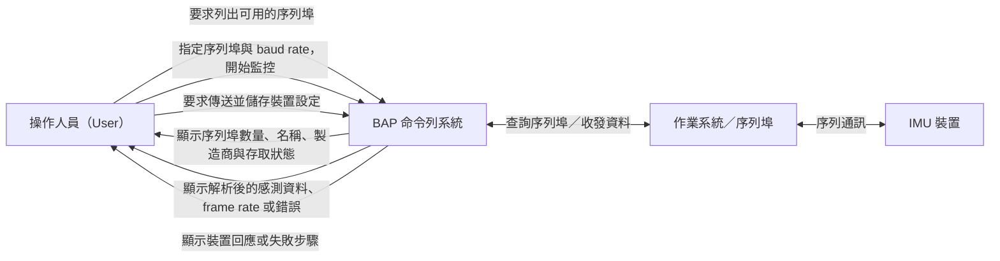

# imu-device-communication 規格

## 名詞定義

| 名詞 | 定義 |
|---|---|
| Requirement | 系統必須做到的一項需求，而且必須能夠驗證。 |
| Scenario | 用具體條件和預期結果說明如何驗證 Requirement；英文標題同時是 pytest 使用的追溯識別符。 |
| `SHALL` | OpenSpec 的關鍵字，表示系統「必須」做到。 |
| `WHEN` | Scenario 發生的條件、事件或輸入。 |
| `THEN` | 在該條件下，應該能觀察到的系統結果。 |
| serial port（序列埠） | 電腦用來和 IMU 等外接裝置收發資料的通訊端點，例如 `COM3`。 |
| serial port discovery（序列埠探索） | 向作業系統查詢目前有哪些序列埠可用。 |
| device name（裝置名稱） | 作業系統用來識別序列埠的名稱，例如 `COM3`。 |
| manufacturer（製造商） | 作業系統或驅動程式提供的裝置製造商資訊。 |
| access-permission status（存取權限狀態） | 目前執行命令的程式是否有權限開啟及使用該序列埠。 |
| baud rate | 序列通訊的傳輸速率設定；命令只接受正整數。 |
| live serial monitoring（即時序列監控） | 持續讀取序列埠資料，並定期更新畫面上的最新解析結果。 |
| ANROT binary frame | 裝置依 ANROT 協定送出的一筆完整二進位資料。 |
| NMEA sentence | 裝置以文字格式送出的一筆資料，內容包含類型、欄位及 checksum，並以換行字元結束。 |
| parsed measurement（解析後的量測資料） | 系統將 ANROT binary frame 或 NMEA sentence 解碼後得到的感測資料。 |
| frame rate | 系統每秒成功解析的 frame 數量。 |
| 8-N-1 | 序列埠使用 8 個 data bits、不使用 parity，並使用 1 個 stop bit 的設定。 |
| device output（裝置輸出） | 裝置透過序列埠持續送出的量測資料或狀態訊息。 |
| operator command（操作人員指令） | 操作人員要求系統傳送給裝置的設定指令。 |
| acknowledgement（確認回應） | 裝置用來表示指令已成功處理的回應；本規格以回應是否包含 `OK` 判斷成功。 |
| CRLF | Carriage Return 與 Line Feed 兩個字元的組合，用來表示裝置指令已結束。 |
| saved device command sequence（儲存設定的指令流程） | 依序停止裝置輸出、傳送設定指令、儲存設定，再重新啟動裝置輸出的流程。 |
| serial-access error（序列埠存取錯誤） | 開啟、讀取或寫入序列埠時發生的錯誤。 |
| permission error（權限錯誤） | 因作業系統權限不足而無法使用序列埠的錯誤。 |
| failure status（失敗狀態） | 命令因錯誤而終止時回傳的非成功狀態。 |

## Purpose

本規格說明系統透過命令列支援哪些 IMU 裝置操作，包括查看電腦目前可用的序列埠、即時顯示裝置傳回並解析後的感測資料，以及傳送設定指令並將設定儲存在裝置中。

### 使用者與系統關係圖

## Requirements

### Requirement: 列出可用的序列埠
系統 SHALL 提供一個命令，列出電腦目前可用的序列埠。若作業系統有提供相關資訊，系統也必須顯示每個序列埠的裝置名稱、製造商及存取權限狀態。

#### Scenario: Serial ports are available
- **WHEN** 操作人員執行列出序列埠的命令，而且作業系統找到一個或多個序列埠
- **THEN** 系統會顯示找到的序列埠數量，並逐一列出每個序列埠

#### Scenario: No serial ports are available
- **WHEN** 操作人員執行列出序列埠的命令，但作業系統沒有找到任何序列埠
- **THEN** 系統會告知操作人員目前找不到可用的序列埠

### Requirement: 即時查看裝置資料
系統 SHALL 接受操作人員指定的序列埠和正整數 baud rate，並持續讀取該序列埠收到的資料，直到操作人員中斷監控或發生存取錯誤。監控期間，系統必須顯示最新解析出的 ANROT 與 NMEA 感測資料，以及每秒成功解析的 frame 數量。

#### Scenario: Monitor valid mixed device output
- **WHEN** 選取的序列埠收到系統支援的 ANROT binary frame 或 NMEA sentence
- **THEN** 系統會定期更新畫面，顯示最新解析出的感測資料，以及每秒成功解析的 frame 數量

#### Scenario: Reject an invalid monitoring baud rate
- **WHEN** 操作人員提供的 baud rate 不是正整數
- **THEN** 系統會拒絕該值，而且不會開啟序列埠

#### Scenario: Serial monitoring cannot access the port
- **WHEN** 系統無法開啟或讀取選取的序列埠，例如發生序列埠存取錯誤或權限錯誤
- **THEN** 系統會顯示錯誤訊息，並以失敗狀態結束監控命令

### Requirement: 傳送並儲存裝置設定
系統 SHALL 提供一個命令，以 8-N-1 設定開啟選取的序列埠，依序停止裝置輸出、傳送操作人員指定的設定指令、要求裝置儲存設定，再重新啟動裝置輸出。如果要傳送的指令結尾沒有 CRLF，系統必須自動補上 CRLF。

#### Scenario: Send and save a command successfully
- **WHEN** 裝置依序對停止輸出指令、操作人員指令、儲存設定指令及重新啟動輸出指令傳回包含 `OK` 的確認回應
- **THEN** 系統會依照該順序完成全部操作，並顯示操作人員指令的裝置回應

#### Scenario: Device output does not stop initially
- **WHEN** 裝置沒有以包含 `OK` 的回應確認 `AT+EOUT=0`
- **THEN** 系統最多會嘗試傳送該指令三次；如果三次都失敗，系統會顯示錯誤並停止後續操作

#### Scenario: A later command is not acknowledged
- **WHEN** 操作人員指令、`SAVECONFIG` 或 `AT+EOUT=1` 的回應不包含 `OK`
- **THEN** 系統會指出哪個步驟失敗，並停止執行剩餘步驟

#### Scenario: Reject an invalid command baud rate
- **WHEN** 操作人員提供的 baud rate 不是正整數
- **THEN** 系統會拒絕該值，而且不會開啟序列埠
