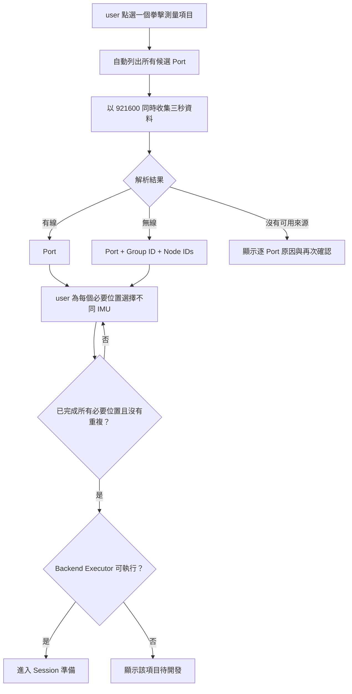

## 名詞定義

| 名詞 | 定義 |
|---|---|
| IMU 來源探索 | 進入拳擊測量項目後，自動從所有 Port 收集三秒資料並找出可用 IMU 來源的流程。 |
| 有線來源 | 直接由某個 Port 輸出可解析 IMU 資料的來源，以 Port 識別。 |
| 無線來源 | 經由無線接收器 Port 輸出的 IMU 來源，以 Port、Group ID 與 Node ID 一起識別。 |
| 候選 Port | 作業系統在探索開始時列出的所有序列埠。 |
| 可用來源 | 在本次三秒探索中至少成功解析一筆相符資料的有線來源或無線 Node。 |
| 拳擊測量項目 | user 一次進入並操作的一個拳擊分析功能。 |
| IMU 來源 | 本次三秒探索找到的一顆可用 IMU；有線來源以 Port 識別，無線來源以 Port、Group ID 與 Node ID 一起識別。 |
| IMU 位置 | 測量項目要求放置 IMU 的身體或器材位置。 |
| IMU 分配 | user 把一顆探索到的 IMU 指定給一個 IMU 位置。 |
| 有效分配 | 每個必要 Input Role 都分配到一顆本次探索找到的可用 IMU，且不違反該 Analysis Specification 的重複使用規則。 |
| 手把背面 | 持把人握住的拳靶或手把背面，用來安裝拳種辨識需要的 IMU。 |
| Registered Analysis | Desktop App 與 Backend 支援相同 Analysis Specification，而且 Backend 已提供可執行 Executor 的分析項目。 |
| Session 準備 | 完成 IMU 分配後、正式錄製開始前，用來確認分析能力與本次設定的畫面。 |
| 待開發 | Analysis Specification 或 Executor 尚未提供，因此不能開始正式測量的狀態。 |

## Purpose

讓系統在每次進入單一拳擊測量項目時自行取得當下可用的 Port、Group ID 與 Node ID，不把判斷是否需要重新掃描的責任交給 user。

## 自動探索與選擇流程

## Requirements

### Requirement: 每次進入拳擊項目都自動重新探索
Desktop App MUST 在 user 每次點選一個拳擊測量項目後，自動重新列出所有候選 Port，並以固定 `921600` baud rate 同時收集三秒資料；不得要求 user 先進入「IMU 連線狀態」或自行判斷是否需要重新掃描。

#### Scenario: 先前已查看 IMU 連線狀態
- **WHEN** user 已在本次 App 執行期間查看過「IMU 連線狀態」，之後點選拳擊測量項目
- **THEN** Desktop App 仍執行新的三秒 IMU 來源探索
- **AND** 不直接沿用先前五秒 Report 的來源清單

#### Scenario: 先前沒有執行 IMU 測試
- **WHEN** user 啟動 App 後直接點選拳擊測量項目
- **THEN** Desktop App 自動執行三秒 IMU 來源探索
- **AND** user 不需要先前往「IMU 連線狀態」

### Requirement: 探索期間顯示進度且介面保持可用
Desktop App MUST 在三秒探索期間顯示「正在確認 IMU，請稍後。」及進度，且不得讓 App 介面失去回應。

#### Scenario: 正在探索多個 Port
- **WHEN** Desktop App 同時從多個候選 Port 收集三秒資料
- **THEN** 畫面顯示探索中的提示與三秒進度
- **AND** App 視窗仍可正常重繪及回應關閉操作

### Requirement: 系統只提供本次成功觀察到的來源
探索完成後，Desktop App MUST 只把本次三秒內成功解析的有線 Port 或無線 Group ID／Node ID 列為可用來源；不得只因 Port 存在就把它列為 IMU。

#### Scenario: 發現有線 IMU
- **WHEN** 某個 Port 在三秒內成功解析有線 IMU 資料
- **THEN** Desktop App 將該 Port 顯示為一個可選擇的「有線連接」來源
- **AND** 不要求 user 選擇 Group ID 或 Node ID

#### Scenario: 發現無線接收器與多個 Node
- **WHEN** 某個 Port 在三秒內成功解析一個 Group ID 及多個 Node ID
- **THEN** Desktop App 以該 Port 和 Group ID 分組顯示所有觀察到的 Node ID
- **AND** 每個 Node ID 都能作為獨立來源供 user 選擇

#### Scenario: 相同 ID 出現在不同 Port
- **WHEN** 兩個 Port 都觀察到相同 Group ID 與 Node ID
- **THEN** Desktop App 將它們顯示為兩個不同來源
- **AND** 每個來源都保留自己的 Port

### Requirement: 無法找到來源時提供逐 Port 說明
若三秒探索沒有找到可用來源，Desktop App MUST 顯示「找不到可用的 IMU」、每個候選 Port 能合理判斷的簡化原因，以及「再次確認」操作。

#### Scenario: 所有 Port 都沒有可解析資料
- **WHEN** 三秒探索完成且所有候選 Port 都沒有成功解析 IMU 資料
- **THEN** Desktop App 不顯示空白的來源選擇畫面
- **AND** Desktop App 顯示每個 Port 的簡化原因及「再次確認」

#### Scenario: user 按下再次確認
- **WHEN** user 在找不到來源的畫面按下「再次確認」
- **THEN** Desktop App 重新列出所有候選 Port 並執行新的三秒探索

### Requirement: 完成選擇後必須依分析能力決定下一步
Desktop App MUST 在 user 完成目前拳擊項目的有效 IMU 分配後，確認相同版本的 Analysis Specification 與 Backend Executor 是否可用。可執行時 MUST 進入 Session 準備流程；不可執行時 MUST 顯示待開發，且不得錄製或上傳正式測量資料。三秒探索資料在來源確認完成後 MUST 清除，不得混入正式 Session CSV。

#### Scenario: 已註冊分析完成有效分配
- **WHEN** user 已為 Registered Analysis 的所有 Input Roles 完成有效 IMU 分配並執行「繼續」
- **THEN** Desktop App 進入 Session 準備畫面
- **AND** 正式錄製尚未開始

#### Scenario: 分析 Executor 尚未提供
- **WHEN** user 完成 IMU 分配，但 Backend 沒有該 Analysis Type 與版本的 Executor
- **THEN** Desktop App 顯示該項目待開發或目前無法分析
- **AND** Desktop App 不錄製或上傳正式測量資料

#### Scenario: 探索資料與正式資料分離
- **WHEN** Desktop App 使用三秒探索資料完成 IMU 來源確認
- **THEN** Desktop App 在不再需要後清除探索暫存資料
- **AND** user 按下「開始測量」後才建立正式 Session CSV

#### Scenario: 尚有必要 Input Role 未分配
- **WHEN** 目前項目仍有至少一個必要 Input Role 尚未選擇 IMU
- **THEN** 「繼續」操作保持不可使用
- **AND** Desktop App 不進入 Session 準備畫面

### Requirement: user 必須依測量項目需要分配 IMU 來源
Desktop App MUST 在三秒探索完成後，依目前拳擊測量項目顯示所需的 IMU 位置，並讓 user 為每個位置各自選擇一顆可用 IMU；同一顆 IMU MUST NOT 同時分配給同一項目的兩個位置。

#### Scenario: 設定出拳次數的 IMU
- **WHEN** user 進入出拳次數且三秒探索找到可用來源
- **THEN** Desktop App 顯示「左手腕」與「右手腕」兩個 IMU 位置
- **AND** user 可以分別為兩個位置選擇不同的 IMU

#### Scenario: 設定出拳速度的 IMU
- **WHEN** user 進入出拳速度且三秒探索找到可用來源
- **THEN** Desktop App 顯示「左手腕」與「右手腕」兩個 IMU 位置
- **AND** user 可以分別為兩個位置選擇不同的 IMU

#### Scenario: 設定出拳軌跡的 IMU
- **WHEN** user 進入出拳軌跡且三秒探索找到可用來源
- **THEN** Desktop App 顯示「左手腕」與「右手腕」兩個 IMU 位置
- **AND** user 可以分別為兩個位置選擇不同的 IMU

#### Scenario: 設定拳種辨識的 IMU
- **WHEN** user 進入拳種辨識且三秒探索找到可用來源
- **THEN** Desktop App 顯示持把人的「左手把背面」與「右手把背面」兩個 IMU 位置
- **AND** user 可以分別為兩個位置選擇不同的 IMU

#### Scenario: user 將同一顆 IMU 分配給兩個位置
- **WHEN** user 在同一測量項目的兩個位置選擇相同 IMU 來源
- **THEN** Desktop App 顯示同一顆 IMU 不能重複分配的提示
- **AND** 「繼續」操作保持不可使用

#### Scenario: 可用 IMU 少於項目需求
- **WHEN** 三秒探索找到的不同 IMU 數量少於目前項目要求的數量
- **THEN** Desktop App 顯示已找到的可用來源
- **AND** Desktop App 說明可用 IMU 數量不足
- **AND** 「繼續」操作保持不可使用

### Requirement: 出拳力量配置未決定前不得繼續
Desktop App MUST 在出拳力量所需的 IMU 數量與位置尚未定案期間，顯示「IMU 配置待決定」，且 MUST NOT 顯示可提交的 IMU 分配或允許 user 繼續。

#### Scenario: user 進入出拳力量
- **WHEN** user 進入出拳力量且三秒探索完成
- **THEN** Desktop App 顯示出拳力量的 IMU 數量與位置尚未決定
- **AND** 畫面不要求 user 猜測應選擇哪些 IMU
- **AND** 「繼續」操作保持不可使用
