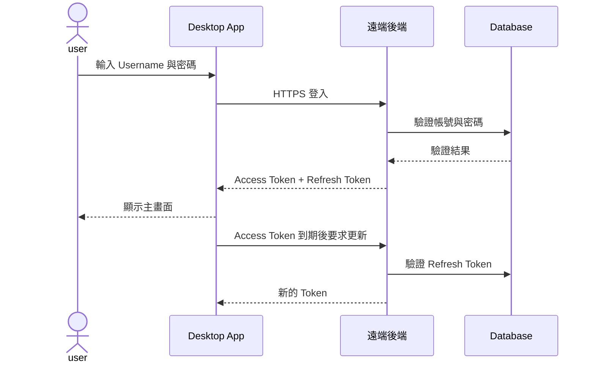

## 名詞定義

| 名詞 | 定義 |
|---|---|
| Username | user 註冊及登入時使用的帳號名稱。 |
| Access Token | Desktop App 呼叫需要登入的 API 時使用，有效期 30 分鐘的憑證。 |
| Refresh Token | Access Token 到期後用來取得新 Token，有效期 30 天的憑證。 |
| 記住登入狀態 | App 重新啟動後，嘗試使用仍有效的 Refresh Token 恢復登入。 |
| 一般使用者 | Prototype 唯一提供的帳號角色。 |
| 遠端後端 | 提供註冊、登入、Token 更新及登出 API 的伺服器。 |

## Purpose

讓任何人都能建立一般使用者帳號，並用 Username 安全登入 Desktop App；同時以短效 Access Token 與可撤銷的 Refresh Token 維持登入狀態。

## 帳號與 Token 流程

## Requirements

### Requirement: 任何人都能註冊一般使用者帳號
遠端後端 MUST 開放一般使用者註冊，且 Prototype 不得要求邀請碼、管理員核准或其他角色選擇。

#### Scenario: 成功註冊
- **WHEN** user 提交尚未被使用且符合規則的 Username，以及符合規則的密碼
- **THEN** 遠端後端建立一個一般使用者帳號
- **AND** Desktop App 告知 user 註冊成功並可進行登入

#### Scenario: Username 已被使用
- **WHEN** user 提交已存在的 Username
- **THEN** 遠端後端不建立重複帳號
- **AND** Desktop App 告知 user 該 Username 已被使用

### Requirement: Username 必須符合固定格式
系統 MUST 使用 `^[A-Za-z0-9._-]{5,64}$` 驗證 Username，且 Username MUST 區分英文大小寫。

#### Scenario: Username 格式正確
- **WHEN** user 輸入 5 到 64 個英文字母、數字、句點、底線或連字號
- **THEN** 系統接受該 Username 格式

#### Scenario: Username 格式錯誤
- **WHEN** Username 含有中文、空白、未允許的符號，或長度不在 5 到 64 個字元內
- **THEN** 系統拒絕提交
- **AND** Desktop App 顯示 Username 格式規則

#### Scenario: Username 英文大小寫不同
- **WHEN** 已存在 Username `Boxer01`，而 user 註冊或登入時輸入 `boxer01`
- **THEN** 系統將兩者視為不同的 Username

### Requirement: 密碼必須符合 Prototype 規則
系統 MUST 要求密碼至少 8 個字元、最多 128 個字元，並至少包含一個英文字母及一個數字。

#### Scenario: 密碼符合規則
- **WHEN** user 輸入長度 8 到 128 個字元，且至少包含一個英文字母與一個數字的密碼
- **THEN** 系統接受該密碼格式

#### Scenario: 密碼不符合規則
- **WHEN** 密碼太短、太長、沒有英文字母或沒有數字
- **THEN** 系統拒絕提交
- **AND** Desktop App 顯示尚未符合的密碼規則

### Requirement: user 可以使用 Username 登入
遠端後端 MUST 使用區分大小寫的 Username 與密碼驗證 user；成功時 MUST 發出 Access Token 與 Refresh Token，失敗時不得透露是 Username 或密碼哪一項錯誤。

#### Scenario: 登入成功
- **WHEN** user 輸入正確且大小寫相符的 Username 與密碼
- **THEN** 遠端後端回傳 Access Token 與 Refresh Token
- **AND** Desktop App 顯示主畫面

#### Scenario: 登入資料錯誤
- **WHEN** Username 不存在、大小寫不符或密碼錯誤
- **THEN** 遠端後端拒絕登入
- **AND** Desktop App 顯示「Username 或密碼不正確」

#### Scenario: 登入時無法連線到後端
- **WHEN** Desktop App 無法連線到遠端後端
- **THEN** Desktop App 保留 user 已輸入的 Username
- **AND** Desktop App 顯示目前無法連線並提供再次登入的操作

### Requirement: Token 具有固定有效期
Access Token MUST 在發出 30 分鐘後失效，Refresh Token MUST 在發出 30 天後失效；有效的 Refresh Token MUST 能換取新的 Access Token 與新的 Refresh Token。

#### Scenario: Access Token 到期後自動更新
- **WHEN** Access Token 已到期且 Refresh Token 仍有效
- **THEN** Desktop App 自動向遠端後端要求新的 Token
- **AND** 成功更新時 user 可以繼續操作，不需要重新輸入密碼

#### Scenario: Refresh Token 已到期
- **WHEN** Desktop App 嘗試使用已超過 30 天有效期的 Refresh Token
- **THEN** 遠端後端拒絕更新 Token
- **AND** Desktop App 清除本機登入憑證並顯示登入畫面

### Requirement: user 可以選擇記住登入狀態
Desktop App MUST 在登入畫面提供「記住登入狀態」選項；勾選時可在 App 重新啟動後使用仍有效的 Refresh Token 恢復登入，未勾選時不得跨 App 執行期間保留登入狀態。

#### Scenario: 記住登入狀態並重新啟動 App
- **WHEN** user 勾選「記住登入狀態」、成功登入，並在 Refresh Token 仍有效時重新啟動 App
- **THEN** Desktop App 嘗試恢復登入狀態
- **AND** 成功時直接顯示主畫面

#### Scenario: 未選擇記住登入狀態
- **WHEN** user 未勾選「記住登入狀態」並關閉 Desktop App
- **THEN** Desktop App 結束本次登入狀態
- **AND** 下次啟動時顯示登入畫面

### Requirement: user 可以登出目前裝置
Desktop App MUST 提供登出操作；登出時遠端後端 MUST 撤銷目前裝置使用的 Refresh Token，Desktop App MUST 清除本機 Token 並回到登入畫面。

#### Scenario: 登出成功
- **WHEN** user 按下登出且遠端後端可連線
- **THEN** 遠端後端撤銷目前的 Refresh Token
- **AND** Desktop App 清除本機 Token 並顯示登入畫面

#### Scenario: 離線時登出
- **WHEN** user 按下登出但遠端後端無法連線
- **THEN** Desktop App 仍清除本機 Token 並顯示登入畫面
- **AND** 已排程的後端撤銷失敗不得讓 App 自動恢復該登入狀態
